# Inventory Management System Documentation

## Table of Contents

1. [Overview](#overview)
2. [System Architecture](#system-architecture)
3. [Core Classes and Components](#core-classes-and-components)
4. [Database Schema](#database-schema)
5. [Inventory Lifecycle](#inventory-lifecycle)
6. [Stock Allocation and Consumption](#stock-allocation-and-consumption)
7. [Warehouse Management](#warehouse-management)
8. [Visual Inventory Management](#visual-inventory-management)
9. [Color-Coded Status System](#color-coded-status-system)
10. [Lot Number and Expiration Handling](#lot-number-and-expiration-handling)
11. [Stock Adjustments and Corrections](#stock-adjustments-and-corrections)
12. [Integration with Other Modules](#integration-with-other-modules)
13. [NFe Integration](#nfe-integration)
14. [Process Flowcharts](#process-flowcharts)
15. [Error Handling and Validation](#error-handling-and-validation)
16. [Method Reference](#method-reference)

---

## Overview

The ERP Staccato inventory management system is a comprehensive solution designed for Brazilian businesses, providing complete control over stock movements from receipt to consumption. The system integrates with NFe (Nota Fiscal Eletrônica) for fiscal compliance and includes visual warehouse management capabilities.

### Key Features

- Real-time inventory tracking
- Visual warehouse layout management with drag-and-drop functionality
- Lot number and expiration date tracking
- Integration with purchase and sales modules
- NFe-compliant inventory movements
- Cost allocation and consumption tracking
- Color-coded status indicators
- Automated stock adjustments

### Files Overview

- **Core Files**: `C:\Users\Torres\Dropbox\Projeto_Staccato\erp-staccato\src\estoque.cpp`, `estoqueitem.cpp`
- **Proxy Models**: `estoqueproxymodel.cpp`, `estoqueprazoproxymodel.cpp`
- **Widget Classes**: `widgetestoques.cpp`, `widgetestoqueproduto.cpp`
- **Warehouse Management**: `widgetgalpao.cpp`, `palletitem.cpp`
- **Database Queries**: `sql.cpp` (view_estoque, queryEstoque functions)

---

## System Architecture

The inventory management system follows Qt's Model-View-Controller pattern with specialized components:

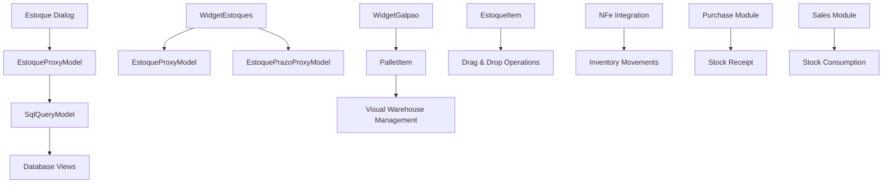

### Component Relationships

- **Estoque**: Main inventory dialog for detailed stock management
- **WidgetEstoques**: Overview widget for inventory browsing
- **WidgetEstoqueProduto**: Product-centric inventory view
- **WidgetGalpao**: Visual warehouse management interface
- **PalletItem**: Graphical representation of warehouse locations

---

## Core Classes and Components

### 1. Estoque Class (`estoque.h`, `estoque.cpp`)

Primary inventory management dialog providing detailed view of individual stock items.

**Key Properties:**

```cpp
class Estoque final : public QDialog {
    // Color-coded status enumeration
    enum class FieldColors {
        White = 0,     // Não processado (Not processed)
        Green = 1,     // Ok
        Yellow = 2,    // Quant difere (Quantity differs)
        Red = 3,       // Não encontrado (Not found)
        DarkGreen = 4, // Consumo (Consumption)
        Cyan = 5       // Devolução (Return)
    };

private:
    QString const idEstoque;           // Stock ID
    SqlQueryModel modelEstoque;        // Stock data model
    SqlTableModel modelConsumo;        // Consumption model
};
```

**Primary Methods:**

- `criarConsumo(idVendaProduto2, quant)`: Creates consumption record
- `desfazerConsumo(idVendaProduto2)`: Reverses consumption
- `dividirCompra(idVendaProduto2, quant)`: Splits purchase orders
- `on_pushButtonAjustarQuant_clicked()`: Handles quantity adjustments

### 2. EstoqueItem Class (`estoqueitem.h`, `estoqueitem.cpp`)

Graphical item for drag-and-drop operations in warehouse management.

```cpp
class EstoqueItem : public QObject, public QGraphicsSimpleTextItem {
    Q_OBJECT

private:
    int const idVendaProduto2;  // Product sale ID

signals:
    void startDragSignal();     // Emitted when drag starts
};
```

### 3. Proxy Models

#### EstoqueProxyModel (`estoqueproxymodel.h`, `estoqueproxymodel.cpp`)

Provides color-coding for inventory status visualization.

```cpp
enum class Status {
    Ok = 1,
    QuantDifere = 2,
    NaoEncontrado = 3,
    Consumo = 4,
    Devolucao = 5
};
```

#### EstoquePrazoProxyModel (`estoqueprazoproxymodel.h`, `estoqueprazoproxymodel.cpp`)

Highlights overdue delivery dates in red.

### 4. Widget Classes

#### WidgetEstoques (`widgetestoques.h`, `widgetestoques.cpp`)

Main inventory browsing interface with filtering and reporting capabilities.

**Key Features:**

- Real-time search and filtering
- Excel export functionality
- Accounting reports generation
- NCM export for tax compliance

#### WidgetEstoqueProduto (`widgetestoqueproduto.h`, `widgetestoqueproduto.cpp`)

Product-centric view showing inventory levels by product.

#### WidgetGalpao (`widgetgalpao.h`, `widgetgalpao.cpp`)

Visual warehouse management with interactive floor plan.

### 5. PalletItem Class (`palletitem.h`, `palletitem.cpp`)

Graphical representation of warehouse storage locations.

```cpp
class PalletItem final : public QGraphicsObject {
private:
    bool flagHighlight = false;    // Highlight flag for search results
    bool selected = false;         // Selection state
    QRectF size;                  // Physical dimensions
    QString idBloco;              // Block/location ID
    QString label;                // Display label
};
```

---

## Database Schema

### Core Tables

#### estoque

Primary inventory table storing stock items.

**Key Fields:**

- `idEstoque` (PRIMARY KEY): Unique stock identifier
- `idNFe`: Link to fiscal document
- `idProduto`: Product reference
- `idBloco`: Warehouse location (links to galpao.idBloco)
- `status`: Inventory status (ESTOQUE, CANCELADO, etc.)
- `quant`: Original quantity
- `restante`: Remaining quantity
- `ajuste`: Manual adjustments
- `lote`: Batch/lot number
- `local`: Storage location description
- `valorUnid`: Unit cost
- `created`: Creation timestamp

#### estoque_has_consumo

Tracks inventory consumption for sales orders.

**Key Fields:**

- `idConsumo` (PRIMARY KEY): Consumption record ID
- `idEstoque`: Stock item reference
- `idVendaProduto2`: Sales order product line
- `status`: Consumption status (CONSUMO, AJUSTE, DEVOLUCAO)
- `quant`: Consumed quantity (negative for consumption)
- `created`: Consumption timestamp

#### estoque_has_compra

Links inventory to purchase orders.

**Key Fields:**

- `idEstoque`: Stock item reference
- `idPedido2`: Purchase order line reference

#### galpao

Warehouse location definitions for visual management.

**Key Fields:**

- `idBloco` (PRIMARY KEY): Location identifier
- `label`: Display name
- `posicao`: Physical coordinates (x,y format)
- `tamanho`: Dimensions (width,height format)

### Database Views

#### view_estoque

Complete stock item details with product and location information.

```sql
SELECT
    e.idEstoque, e.status, e.fornecedor, e.descricao,
    e.restante, e.un, e.lote, e.local,
    g.label, e.codComercial, p.quantCaixa,
    -- Tax and fiscal fields
    e.ncm, e.cstICMS, e.valorUnid
FROM estoque e
LEFT JOIN galpao g ON e.idBloco = g.idBloco
LEFT JOIN produto p ON e.idProduto = p.idProduto
```

#### view_estoque_consumo

Consumption history with sales order details.

#### view_estoque_contabil

Accounting view for fiscal reporting with consumption calculations.

#### view_galpao

Warehouse contents by location with type classification.

```sql
SELECT
    g.idBloco, g.label,
    'EST. LOJA' AS tipo,     -- For stock items
    'CLIENTE' AS tipo,       -- For allocated items
    e.caixas, e.descricao, v.idVenda
FROM galpao g
LEFT JOIN estoque e ON g.idBloco = e.idBloco
LEFT JOIN estoque_has_consumo ehc ON g.idBloco = ehc.idBloco
```

---

## Inventory Lifecycle

### 1. Receipt Process

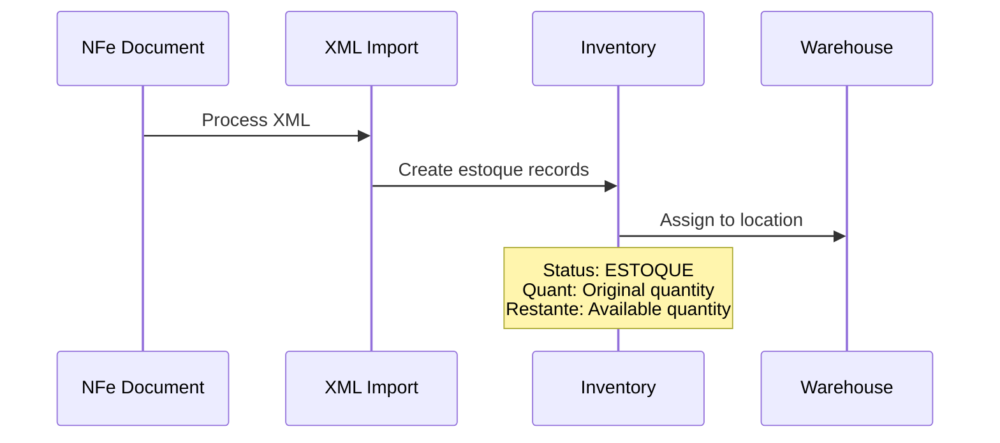

**Process Steps:**

1. **NFe Processing**: Import fiscal document via `importarxml.cpp`
2. **Stock Creation**: Generate inventory records with full product details
3. **Location Assignment**: Assign to warehouse location (galpao.idBloco)
4. **Quality Check**: Set quantUpd status for verification

### 2. Stock Allocation

When a sales order requires inventory:

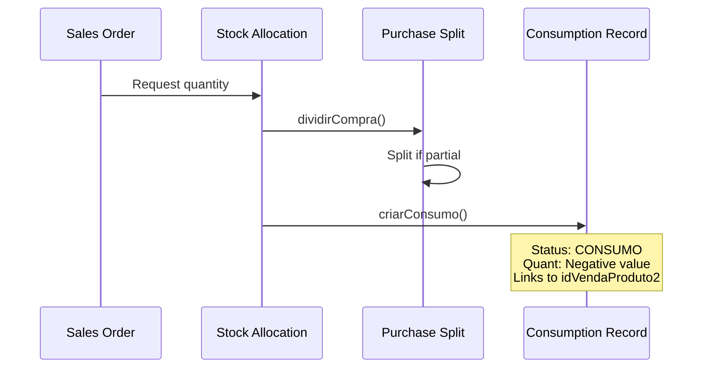

### 3. Consumption Tracking

**Creation Process** (from `estoque.cpp:186-278`):

```cpp
void Estoque::criarConsumo(const int idVendaProduto2, const double quant) {
    // Validate available quantity
    if (quant > ui->doubleSpinBoxQuantRestante->value()) {
        throw RuntimeException("Quantidade insuficiente do estoque " + idEstoque + "!");
    }

    // Split purchase order if needed
    dividirCompra(idVendaProduto2, quant);

    // Create consumption record
    SqlTableModel modelConsumo;
    modelConsumo.setTable("estoque_has_consumo");

    const int rowConsumo = modelConsumo.insertRowAtEnd();
    modelConsumo.setData(rowConsumo, "idEstoque", idEstoque);
    modelConsumo.setData(rowConsumo, "idVendaProduto2", idVendaProduto2);
    modelConsumo.setData(rowConsumo, "status", "CONSUMO");
    modelConsumo.setData(rowConsumo, "quant", quant * -1);  // Negative for consumption

    // Copy all fiscal and cost data with proportional calculations
    const double proporcao = quant / quantEstoque;
    // ... detailed field copying with proportional tax calculations

    modelConsumo.submitAll();
}
```

### 4. Stock Reversal

**Reversal Process** (from `estoque.cpp:358-404`):

```cpp
void Estoque::desfazerConsumo(const int idVendaProduto2) {
    // Remove consumption records
    SqlQuery queryDelete;
    queryDelete.exec("DELETE FROM estoque_has_consumo WHERE idVendaProduto2 = " +
                     QString::number(idVendaProduto2));

    // Reset purchase order allocation
    SqlQuery queryCompra;
    queryCompra.exec("UPDATE pedido_fornecedor_has_produto2 SET idVenda = NULL, "
                     "idVendaProduto2 = NULL WHERE idVendaProduto2 = " +
                     QString::number(idVendaProduto2));

    // Reset sales order status
    SqlQuery queryVenda;
    queryVenda.exec("UPDATE venda_has_produto2 SET status = CASE "
                    "WHEN reposicaoEntrega THEN 'REPO. ENTREGA' "
                    "WHEN reposicaoReceb THEN 'REPO. RECEB.' "
                    "ELSE 'PENDENTE' END WHERE idVendaProduto2 = " +
                    QString::number(idVendaProduto2));
}
```

---

## Stock Allocation and Consumption

### Allocation Algorithm

The system uses a First-In-First-Out (FIFO) approach with intelligent splitting:

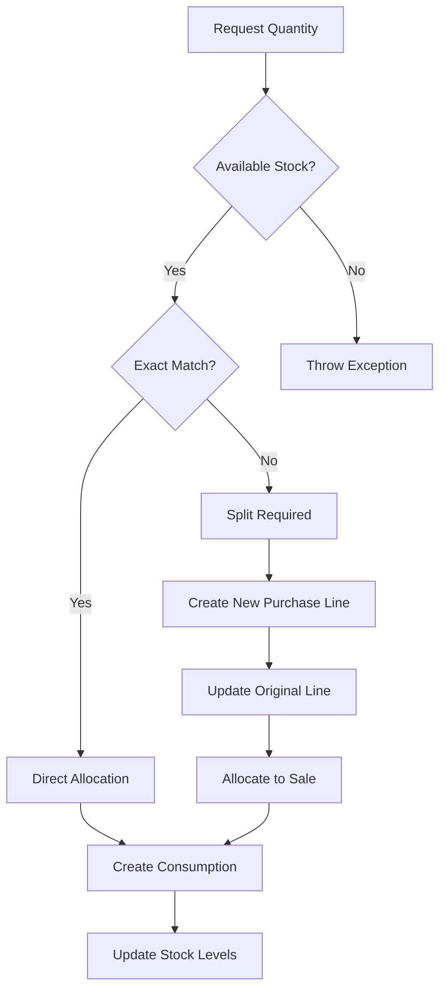

### Purchase Order Splitting

**Algorithm** (from `estoque.cpp:280-356`):

```cpp
void Estoque::dividirCompra(const int idVendaProduto2, const double quant) {
    // Find suitable purchase order line
    SqlTableModel modelCompra;
    modelCompra.setTable("pedido_fornecedor_has_produto2");
    modelCompra.setFilter("idVenda IS NULL AND quant >= " + QString::number(quant));

    const double quantCompra = modelCompra.data(0, "quant").toDouble();

    if (qFuzzyCompare(quant, quantCompra)) {
        // Exact match - direct allocation
        modelCompra.setData(0, "idVenda", idVenda);
        modelCompra.setData(0, "idVendaProduto2", idVendaProduto2);
    } else if (quant < quantCompra) {
        // Split required
        const double proporcaoNovo = quant / quantCompra;
        const double proporcaoAntigo = (quantCompra - quant) / quantCompra;

        // Update original line
        modelCompra.setData(0, "quant", quantCompra - quant);
        modelCompra.setData(0, "caixas", caixas * proporcaoAntigo);

        // Create new line for allocation
        const int newRow = modelCompra.insertRowAtEnd();
        // Copy all fields and set allocation
        modelCompra.setData(newRow, "idVenda", idVenda);
        modelCompra.setData(newRow, "idVendaProduto2", idVendaProduto2);
        modelCompra.setData(newRow, "quant", quant);
        modelCompra.setData(newRow, "caixas", caixas * proporcaoNovo);
    }
}
```

### Cost Allocation

Costs are allocated proportionally based on consumed quantities:

```cpp
// Proportional calculations for tax and cost fields
const double proporcao = quantConsumo / quantTotal;

modelConsumo.setData(rowConsumo, "quantTrib",
    modelEstoque.data(0, "quantTrib").toDouble() * proporcao);
modelConsumo.setData(rowConsumo, "vBC",
    modelEstoque.data(0, "vBC").toDouble() * proporcao);
modelConsumo.setData(rowConsumo, "vICMS",
    modelEstoque.data(0, "vICMS").toDouble() * proporcao);
// ... additional tax fields
```

---

## Warehouse Management

### Visual Layout System

The warehouse management system provides an interactive graphical interface:

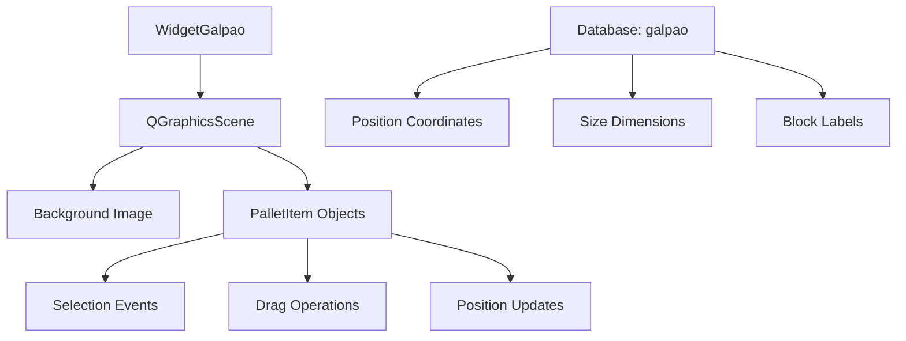

### PalletItem Management

**Pallet Creation and Updates** (from `widgetgalpao.cpp:297-312`):

```cpp
void WidgetGalpao::inserirPallet(PalletItem *pallet) {
    SqlQuery query;
    if (not query.exec("INSERT INTO galpao (label, posicao, tamanho) VALUES ('" +
                       pallet->getLabel() + "', '" +
                       pallet->getPosicao() + "', '" +
                       pallet->getTamanho() + "')")) {
        throw RuntimeError("Erro salvando dados do galpão: " + query.lastError().text());
    }
}

void WidgetGalpao::atualizarPallet(PalletItem *pallet) {
    SqlQuery query;
    if (not query.exec("UPDATE galpao SET label = '" + pallet->getLabel() +
                       "', posicao = '" + pallet->getPosicao() +
                       "', tamanho = '" + pallet->getTamanho() +
                       "' WHERE idBloco = " + pallet->getIdBloco())) {
        throw RuntimeError("Erro salvando dados do galpão: " + query.lastError().text());
    }
}
```

### Location Tracking

**Inventory Movement** (from `widgetgalpao.cpp:522-542`):

```cpp
void WidgetGalpao::on_pushButtonMover_clicked() {
    const auto selection = ui->tablePallet->selectionModel()->selectedRows();
    const QString idBloco = ui->comboBoxMoverParaPallet->currentData().toString();

    for (auto index : selection) {
        const QString tipo = modelPallet.data(index.row(), "tipo").toString();
        const QString id = modelPallet.data(index.row(), "idEstoque_idConsumo").toString();

        SqlQuery query;
        if (tipo == "EST. LOJA") {
            // Move stock item
            query.exec("UPDATE estoque SET idBloco = " + idBloco +
                      " WHERE idEstoque = " + id);
        } else if (tipo == "CLIENTE") {
            // Move consumption record
            query.exec("UPDATE estoque_has_consumo SET idBloco = " + idBloco +
                      " WHERE idConsumo = " + id);
        }
    }
}
```

### Background Map Integration

The system supports background warehouse maps via WebDAV:

```cpp
// Load warehouse background map
const QString url = "https://" + ip + "/webdav/MAPA GALPAO/mapa.png";
auto *manager = new QNetworkAccessManager(this);
auto *reply = manager->get(QNetworkRequest(QUrl(url)));

connect(reply, &QNetworkReply::finished, this, [=, this] {
    QByteArray imageData = reply->readAll();
    QPixmap pixmap;
    pixmap.loadFromData(imageData);

    if (!pixmap.isNull()) {
        auto *pixmapBackground = new QGraphicsPixmapItem(pixmap);
        pixmapBackground->setZValue(-1);
        scene->addItem(pixmapBackground);
        ui->graphicsGalpao->setSceneRect(pixmapBackground->boundingRect());
    }
});
```

---

## Visual Inventory Management

### Drag and Drop Operations

The EstoqueItem class supports drag-and-drop for warehouse organization:

```cpp
void EstoqueItem::startDrag(QPointF pos) {
    emit startDragSignal();

    QPixmap pixmap = QPixmap("://box_medium.png");
    auto *mimeData = new QMimeData;
    mimeData->setText(text());  // Contains product info and ID

    auto *drag = new QDrag(this);
    drag->setMimeData(mimeData);
    drag->setPixmap(pixmap);
    drag->exec();
}
```

### Interactive Pallet Management

**Selection System** (from `palletitem.cpp:136-154`):

```cpp
void PalletItem::select() {
    if (not selected) { unselectAll(); }  // Single selection mode
    selected = not selected;

    if (selected) {
        emit selectBloco(this);
    } else {
        emit unselectBloco();
    }

    update();  // Trigger repaint
}
```

**Visual Rendering** (from `palletitem.cpp:21-54`):

```cpp
void PalletItem::paint(QPainter *painter, const QStyleOptionGraphicsItem *option, QWidget *widget) {
    // Highlight for search results
    if (flagHighlight) {
        painter->setPen(QColor(Qt::blue));
        painter->setBrush(QBrush(QColor(Qt::black)));
        painter->drawRect(size);
    }

    // Selection indicator
    if (selected) {
        painter->setBrush(QBrush(QColor(Qt::black), Qt::SolidPattern));
        painter->drawRect(size);
    }

    // Label rendering with dynamic font sizing
    if (not label.isEmpty()) {
        QFont font = painter->font();
        font.setPixelSize((size.size().width() < 20 or size.size().height() < 20) ? 7 : 14);
        painter->setFont(font);

        // Center the text
        QFontMetrics fm(painter->font());
        const auto xOffset = fm.boundingRect(label).width() / 2;
        const auto yOffset = fm.boundingRect(label).height() / 2;
        const auto xCenter = size.center().x();
        const auto yCenter = size.center().y();

        painter->setPen(QColor(Qt::red));
        painter->drawText(xCenter - xOffset, yCenter + yOffset, label);
    }
}
```

### Real-time Warehouse Updates

**Content Highlighting** (from `widgetgalpao.cpp:330-358`):

```cpp
void WidgetGalpao::on_tableTranspAgend_selectionChanged() {
    // Clear all highlights
    const auto items = scene->items();
    for (auto *item : items) {
        if (auto *pallet = dynamic_cast<PalletItem *>(item)) {
            pallet->setFlagHighlight(false);
        }
    }

    // Get selected product IDs
    const auto selection = ui->tableTranspAgend->selectionModel()->selectedRows();
    if (selection.isEmpty()) { return scene->update(); }

    QStringList ids;
    for (const auto &index : selection) {
        ids << modelTranspAgend.data(index.row(), "idVendaProduto2").toString();
    }

    // Find and highlight containing pallets
    SqlQuery query;
    query.exec("SELECT DISTINCT idBloco FROM estoque_has_consumo WHERE idVendaProduto2 IN (" +
               ids.join(", ") + ")");

    while (query.next()) {
        const QString idBloco = query.value("idBloco").toString();
        for (auto *item : items) {
            if (auto *pallet = dynamic_cast<PalletItem *>(item);
                pallet and pallet->getIdBloco() == idBloco) {
                pallet->setFlagHighlight(true);
            }
        }
    }

    scene->update();
}
```

---

## Color-Coded Status System

### Status Enumeration

The system uses a comprehensive color-coding system for inventory status:

```cpp
// From EstoqueProxyModel
enum class Status {
    Ok = 1,           // Green - Verified correct
    QuantDifere = 2,  // Yellow - Quantity discrepancy
    NaoEncontrado = 3,// Red - Not found
    Consumo = 4,      // Dark Green - Consumption record
    Devolucao = 5     // Cyan - Return/refund
};

// From Estoque dialog
enum class FieldColors {
    White = 0,     // Não processado - Not processed
    Green = 1,     // Ok - Verified
    Yellow = 2,    // Quant difere - Quantity differs
    Red = 3,       // Não encontrado - Not found
    DarkGreen = 4, // Consumo - Consumption
    Cyan = 5       // Devolução - Return
};
```

### Visual Implementation

**Color Application** (from `estoqueproxymodel.cpp:12-49`):

```cpp
QVariant EstoqueProxyModel::data(const QModelIndex &proxyIndex, const int role) const {
    if (quantUpdColumn != -1 and (role == Qt::BackgroundRole or role == Qt::ForegroundRole)) {
        const Status quantUpd = static_cast<Status>(
            proxyIndex.siblingAtColumn(quantUpdColumn).data().toInt());

        if (quantUpd == Status::Ok) {
            if (role == Qt::BackgroundRole) { return QBrush(Qt::green); }
            if (role == Qt::ForegroundRole) { return QBrush(Qt::black); }
        }

        if (quantUpd == Status::QuantDifere) {
            if (role == Qt::BackgroundRole) { return QBrush(Qt::yellow); }
            if (role == Qt::ForegroundRole) { return QBrush(Qt::black); }
        }

        if (quantUpd == Status::NaoEncontrado) {
            if (role == Qt::BackgroundRole) { return QBrush(Qt::red); }
            if (role == Qt::ForegroundRole) { return QBrush(Qt::black); }
        }

        if (quantUpd == Status::Consumo) {
            if (role == Qt::BackgroundRole) { return QBrush(QColor(0, 190, 0)); }
            if (role == Qt::ForegroundRole) { return QBrush(Qt::black); }
        }

        if (quantUpd == Status::Devolucao) {
            if (role == Qt::BackgroundRole) { return QBrush(Qt::cyan); }
            if (role == Qt::ForegroundRole) { return QBrush(Qt::black); }
        }
    }

    // Dark theme support
    if (role == Qt::ForegroundRole) {
        const QString tema = User::getSetting("User/tema").toString();
        return (tema == "escuro") ? QBrush(Qt::white) : QBrush(Qt::black);
    }

    return SortFilterProxyModel::data(proxyIndex, role);
}
```

### Delivery Date Highlighting

**Overdue Detection** (from `estoqueprazoproxymodel.cpp:12-32`):

```cpp
QVariant EstoquePrazoProxyModel::data(const QModelIndex &proxyIndex, const int role) const {
    if (role == Qt::BackgroundRole or role == Qt::ForegroundRole) {
        if (proxyIndex.column() == prazoEntregaColumn) {
            const QDate prazo = proxyIndex.siblingAtColumn(prazoEntregaColumn).data().toDate();
            const bool atrasado = (not prazo.isNull() and prazo < qApp->serverDate());

            if (atrasado) {
                if (role == Qt::BackgroundRole) { return QBrush(Qt::red); }
                if (role == Qt::ForegroundRole) { return QBrush(Qt::black); }
            }
        }
    }

    return QIdentityProxyModel::data(proxyIndex, role);
}
```

---

## Lot Number and Expiration Handling

### Lot Number Tracking

Lot numbers are copied from inventory to sales orders during consumption:

```cpp
// From estoque.cpp:268-278
const QString lote = modelEstoque.data(rowEstoque, "lote").toString();

if (not lote.isEmpty() and lote != "N/D") {
    SqlQuery queryProduto;
    queryProduto.prepare("UPDATE venda_has_produto2 SET lote = :lote WHERE idVendaProduto2 = :idVendaProduto2");
    queryProduto.bindValue(":lote", modelEstoque.data(rowEstoque, "lote"));
    queryProduto.bindValue(":idVendaProduto2", idVendaProduto2);

    if (not queryProduto.exec()) {
        throw RuntimeException("Erro salvando lote: " + queryProduto.lastError().text());
    }
}
```

### Database Storage

**Lot Information Fields:**

- `estoque.lote`: Primary lot number storage
- `estoque_has_consumo.lote`: Lot tracking in consumption records
- `venda_has_produto2.lote`: Lot assignment to sales orders

### Expiration Date Management

While not explicitly shown in the provided code, the system architecture supports expiration date tracking through:

- Integration with product master data
- Custom validation rules in consumption algorithms
- Reporting capabilities for near-expiry stock

---

## Stock Adjustments and Corrections

### Manual Quantity Adjustments

**Adjustment Process** (from `estoque.cpp:414-449`):

```cpp
void Estoque::on_pushButtonAjustarQuant_clicked() {
    const double quantCx = modelEstoque.data(0, "quantCaixa").toDouble();

    // User input for adjustment quantity
    bool ok = false;
    const double ajusteCx = QInputDialog::getDouble(this, "Ajuste", "Ajustar caixas: ",
                                                   0, ui->doubleSpinBoxCaixasRestante->value() * -1,
                                                   INT_MAX, 4, &ok);

    if (not ok or qFuzzyIsNull(ajusteCx)) { return; }

    // Mandatory observation
    QString observacao = QInputDialog::getText(this, "Observação", "Digite a observação: ",
                                             QLineEdit::Normal, QString(), &ok);

    if (not ok or observacao.isEmpty()) {
        throw RuntimeError("É necessário preencher a observação!", this);
    }

    // Add user and timestamp to observation
    observacao.prepend("Ajuste feito por " + User::usuario + ". Obs: ");

    // Create adjustment consumption record
    SqlQuery queryConsumo;
    QString quant = QString::number(ajusteCx * quantCx);
    QString caixas = QString::number(ajusteCx);

    if (not queryConsumo.exec("INSERT INTO estoque_has_consumo (idEstoque, status, descricao, quant, caixas) VALUES (" +
                              idEstoque + ", 'AJUSTE', '" + observacao.toUpper() + "', " +
                              quant + ", " + caixas + ")")) {
        throw RuntimeException("Erro criando consumo de ajuste: " + queryConsumo.lastError().text());
    }

    // Refresh displays
    setupTables();
    preencherRestante();

    qApp->enqueueInformation("Ajuste feito com sucesso!");
}
```

### Adjustment Types

1. **Positive Adjustments**: Increase stock (e.g., found inventory)
2. **Negative Adjustments**: Decrease stock (e.g., breakage, theft)
3. **Zero Adjustments**: Reconciliation entries

### Audit Trail

All adjustments create consumption records with:

- **Status**: 'AJUSTE'
- **User Information**: Automatic user and timestamp logging
- **Observations**: Mandatory reason description
- **Quantity**: Positive or negative adjustment amount

---

## Integration with Other Modules

### Purchase Module Integration

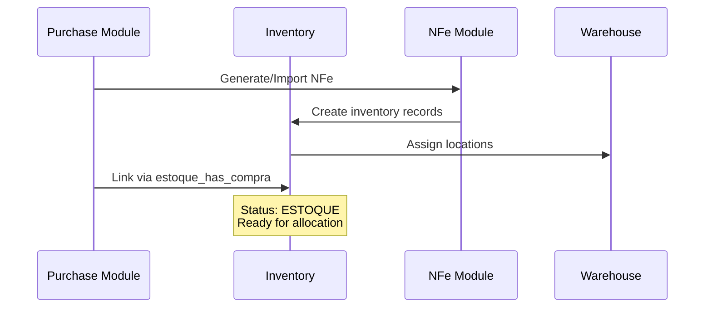

**Database Linkage:**

- `estoque_has_compra` links inventory to purchase orders
- `pedido_fornecedor_has_produto2.idVendaProduto2` tracks sales allocation
- Cost and tax information flows from purchase to inventory

### Sales Module Integration

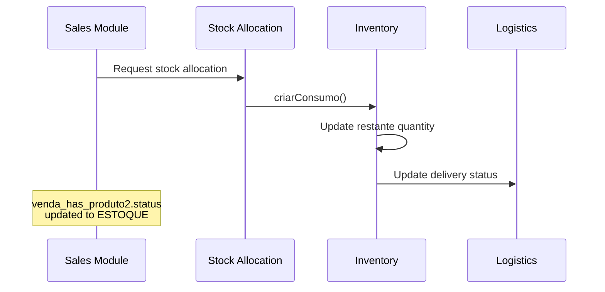

**Status Flow:**

- `PENDENTE` → `ESTOQUE` (after allocation)
- `ESTOQUE` → `EM ENTREGA` (during shipping)
- `EM ENTREGA` → `ENTREGUE` (delivery complete)

### Financial Module Integration

**Cost Allocation:**

- Unit costs flow from `estoque.valorUnid` to consumption records
- Proportional tax calculations maintain fiscal accuracy
- Integration with accounts payable for purchase costs

---

## NFe Integration

### NFe Import Process

The system integrates with Brazilian NFe (Nota Fiscal Eletrônica) for fiscal compliance:

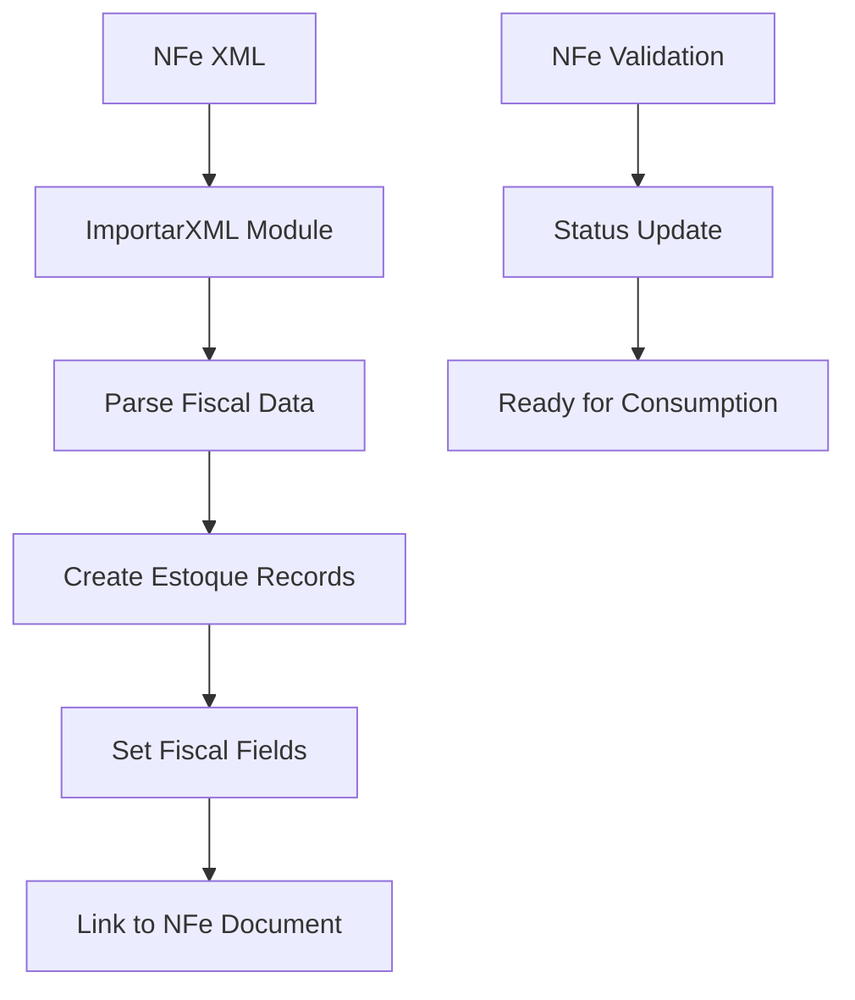

### Fiscal Field Mapping

**Key NFe Fields in Inventory:**

- `estoque.ncm`: NCM tax classification
- `estoque.cfop`: Fiscal operation code
- `estoque.cstICMS`: ICMS tax situation
- `estoque.pICMS`: ICMS percentage
- `estoque.vICMS`: ICMS value
- `estoque.cstPIS`: PIS tax situation
- `estoque.cstCOFINS`: COFINS tax situation

### NFe Document Display

**XML Viewer Integration** (from `estoque.cpp:174-184`):

```cpp
void Estoque::exibirNota() {
    SqlQuery query;
    query.prepare("SELECT xml FROM nfe WHERE idNFe = :idNFe");
    query.bindValue(":idNFe", modelEstoque.data(0, "idNFe"));

    if (not query.exec()) {
        throw RuntimeException("Erro buscando NF-e: " + query.lastError().text(), this);
    }

    if (not query.first()) {
        return qApp->enqueueWarning("Não encontrou NF-e associada!", this);
    }

    // Generate DANFE (fiscal document) for display
    ACBrLib::gerarDanfe(query.value("xml").toString(), true);
}
```

### Export Functionality

**NCM Export for Tax Compliance** (from `widgetestoques.cpp:221-249`):

```cpp
void WidgetEstoques::on_pushButtonExportarNCM_clicked() {
    QString fileName = "ncm_estoque.xlsx";

    QXlsx::Document xlsx(fileName, this);
    xlsx.write("A1", "Fornecedor");
    xlsx.write("B1", "CNPJ");
    xlsx.write("C1", "UF");
    xlsx.write("D1", "Produto");
    xlsx.write("E1", "NCM");
    xlsx.write("F1", "CST");

    SqlQueryModel tempModel;
    tempModel.setQuery(Sql::queryExportarNCM());
    tempModel.select();

    for (int row = 0; row < tempModel.rowCount(); ++row) {
        xlsx.write("A" + QString::number(row + 2), tempModel.data(row, "fornecedor"));
        xlsx.write("B" + QString::number(row + 2), tempModel.data(row, "cnpj"));
        xlsx.write("C" + QString::number(row + 2), tempModel.data(row, "uf"));
        xlsx.write("D" + QString::number(row + 2), tempModel.data(row, "descricao"));
        xlsx.write("E" + QString::number(row + 2), tempModel.data(row, "ncm"));
        xlsx.write("F" + QString::number(row + 2), tempModel.data(row, "cst"));
    }

    if (not xlsx.saveAs(fileName)) {
        throw RuntimeException("Erro ao salvar arquivo!");
    }

    QDesktopServices::openUrl(QUrl::fromLocalFile(fileName));
    qApp->enqueueInformation("Arquivo salvo como " + fileName, this);
}
```

---

## Process Flowcharts

### Complete Inventory Lifecycle

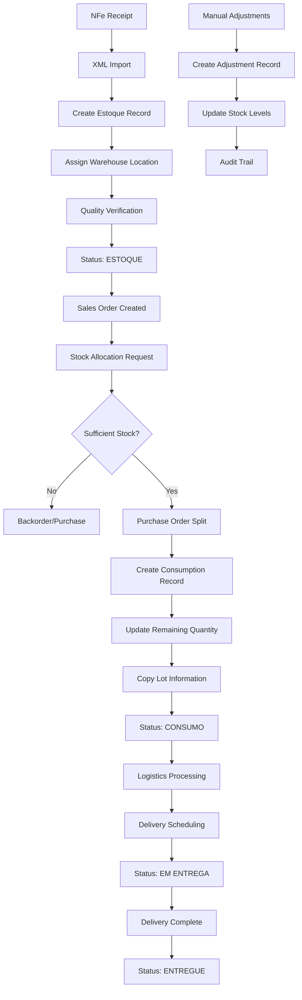

### Warehouse Movement Process

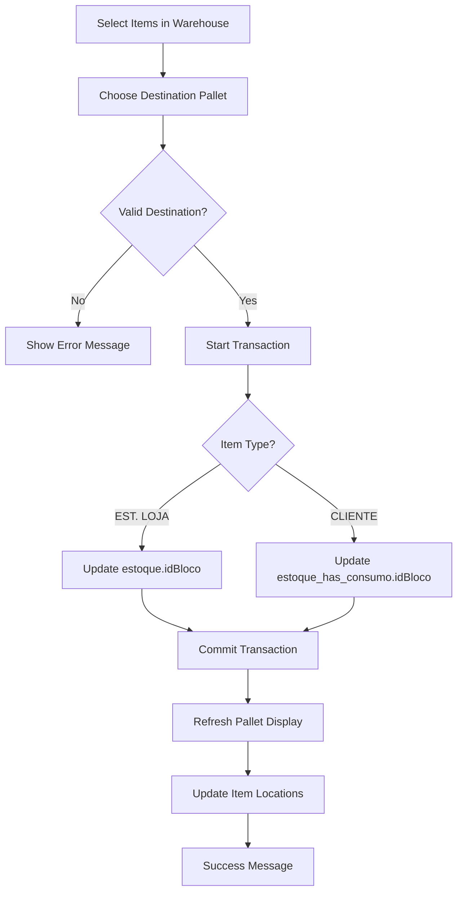

### Stock Allocation Algorithm

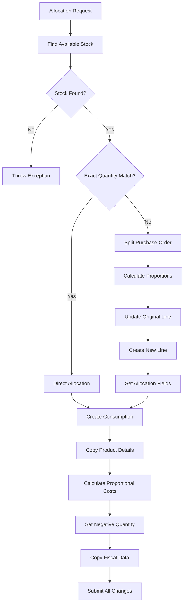

### Adjustment Process Flow

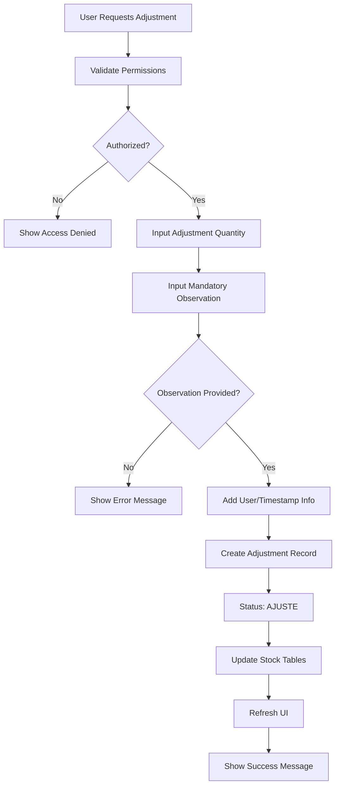

---

## Error Handling and Validation

### Exception Hierarchy

The system uses Qt's exception handling with custom exception types:

```cpp
// Common exception patterns
throw RuntimeException("Error message", parent_widget);
throw RuntimeError("User error message", parent_widget);
```

### Validation Rules

#### Stock Allocation Validation

```cpp
// Quantity validation
if (quant > ui->doubleSpinBoxQuantRestante->value()) {
    throw RuntimeException("Quantidade insuficiente do estoque " + idEstoque + "!");
}

// Purchase order validation
if (modelCompra.rowCount() == 0) { return; }

// Split validation
if (quant > quantCompra) {
    throw RuntimeException("Erro quant > quantCompra");
}
```

#### Warehouse Management Validation

```cpp
// Pallet name validation
if (pallet->getLabel().isEmpty()) {
    pallet->select();
    ui->graphicsGalpao->centerOn(pallet);
    throw RuntimeError("Pallet sem nome! Cadastre um nome antes de salvar!");
}

// Product allocation validation
if (ui->comboBoxPalletAtual->currentText() == "EM RECEBIMENTO") {
    throw RuntimeError("Não pode mover produtos ainda não recebidos!");
}

// Selection validation
if (selection.isEmpty()) {
    throw RuntimeError("Nenhum item selecionado!");
}
```

#### Database Operation Validation

```cpp
// SQL execution validation
if (not query.exec()) {
    throw RuntimeException("Erro buscando dados: " + query.lastError().text());
}

// Required field validation
if (observacao.isEmpty()) {
    throw RuntimeError("É necessário preencher a observação!", this);
}
```

### Transaction Management

**Database Consistency:**

```cpp
// Transaction wrapper for complex operations
qApp->startTransaction("WidgetGalpao::salvarPallets");

try {
    // Perform multiple database operations
    for (auto *item : items) {
        if (auto *pallet = dynamic_cast<PalletItem *>(item)) {
            pallet->getIdBloco().isEmpty() ? inserirPallet(pallet) : atualizarPallet(pallet);
        }
    }

    qApp->endTransaction();  // Commit
} catch (...) {
    qApp->rollbackTransaction();  // Rollback on error
    throw;
}
```

### User Permission Validation

```cpp
// Administrative function access
if (not User::isAdministrativo()) {
    ui->pushButtonExibirNfe->hide();
    ui->pushButtonAjustarQuant->hide();
}

// Warehouse editing permissions
if (checked and not User::temPermissao("ajusteFrete")) {
    qApp->enqueueInformation("Necessário autorização do administrativo!", this);

    LoginDialog dialog(LoginDialog::Tipo::Autorizacao, this);
    if (dialog.exec() != QDialog::Accepted) { return; }
}
```

---

## Method Reference

### Estoque Class Methods

#### Core Methods

- `Estoque(const QVariant &idEstoque, QWidget *parent)`: Constructor with stock ID
- `~Estoque()`: Destructor
- `criarConsumo(const int idVendaProduto2, const double quant = 0)`: Create consumption record
- `static desfazerConsumo(const int idVendaProduto2)`: Reverse consumption

#### Private Methods

- `dividirCompra(const int idVendaProduto2, const double quant)`: Split purchase orders
- `exibirNota()`: Display NFe document
- `limitarAlturaTabela()`: Auto-size table height
- `preencherRestante()`: Update remaining quantity display
- `setConnections()`: Setup signal-slot connections
- `setupTables()`: Initialize data models and views

#### Event Handlers

- `on_pushButtonAjustarQuant_clicked()`: Handle quantity adjustments
- `on_pushButtonExibirNfe_clicked()`: Show NFe document
- `on_tableConsumo_doubleClicked(const QModelIndex &index)`: Handle consumption table interaction

### EstoqueItem Class Methods

#### Core Methods - EstoqueItem

- `EstoqueItem(const QString &text, QGraphicsItem *parent = nullptr)`: Constructor
- `getIdVendaProduto2() const`: Get associated product sale ID

#### Event Handlers - EstoqueItem

- `mousePressEvent(QGraphicsSceneMouseEvent *event)`: Handle mouse press
- `startDrag(QPointF pos)`: Initiate drag operation

### WidgetEstoques Class Methods

#### Core Methods - WidgetEstoques

- `WidgetEstoques(QWidget *parent)`: Constructor
- `~WidgetEstoques()`: Destructor
- `resetTables()`: Reset table models
- `updateTables()`: Update table data

#### Private Methods - WidgetEstoques

- `escolheFiltro()`: Choose appropriate filter
- `gerarExcel(const QString &arquivoModelo, const QString &fileName, const SqlQueryModel &modelContabil)`: Generate Excel reports
- `gerarRelatorio(const QString &data)`: Generate accounting reports
- `getMatch() const`: Build search filter
- `montaFiltro()`: Build inventory filter
- `montaFiltroContabil()`: Build accounting filter
- `setConnections()`: Setup connections
- `setHeaderData()`: Configure column headers
- `setupTables()`: Initialize tables

#### Event Handlers - WidgetEstoques

- `on_pushButtonExportarNCM_clicked()`: Export NCM data
- `on_pushButtonFollowup_clicked()`: Show followup dialog
- `on_pushButtonRelatorio_clicked()`: Generate current report
- `on_pushButtonRelatorioContabil_clicked()`: Generate accounting report
- `on_table_activated(const QModelIndex &index)`: Handle table activation

### WidgetGalpao Class Methods

#### Core Methods - WidgetGalpao

- `WidgetGalpao(QWidget *parent)`: Constructor
- `~WidgetGalpao()`: Destructor
- `resetTables()`: Reset table models
- `updateTables()`: Update table data

#### Private Methods - WidgetGalpao

- `atualizarPallet(PalletItem *pallet)`: Update pallet in database
- `carregarPallets()`: Load pallets from database
- `inserirPallet(PalletItem *pallet)`: Insert new pallet
- `salvarPallets()`: Save all pallet changes
- `selectBloco(PalletItem *const palletPtr)`: Handle pallet selection
- `setConnections()`: Setup signal-slot connections
- `setFilter()`: Apply transport filter
- `setupTables()`: Initialize data models
- `unselectBloco()`: Handle pallet deselection
- `unsetConnections()`: Disconnect signals

#### Event Handlers - WidgetGalpao

- `on_checkBoxCriarPallet_toggled(const bool checked)`: Toggle pallet creation mode
- `on_checkBoxEdicao_toggled(const bool checked)`: Toggle edit mode
- `on_checkBoxMoverPallet_toggled(const bool checked)`: Toggle move mode
- `on_pushButtonBuscar_clicked()`: Search warehouse contents
- `on_pushButtonFollowup_clicked()`: Show followup dialog
- `on_pushButtonImprimir_clicked()`: Print pallet labels
- `on_pushButtonMover_clicked()`: Move selected items
- `on_pushButtonRemoverPallet_clicked()`: Remove pallet
- `on_pushButtonSalvarPallets_clicked()`: Save all changes
- `on_tablePallet_doubleClicked(const QModelIndex &index)`: Handle pallet table interaction
- `on_tableTranspAgend_doubleClicked(const QModelIndex &index)`: Handle transport table interaction
- `on_tableTranspAgend_selectionChanged()`: Update pallet highlighting

### PalletItem Class Methods

#### Core Methods - PalletItem

- `PalletItem(const QString &idBloco, const QString &label, const QPointF posicao, const QRectF &size, QGraphicsItem *parent = nullptr)`: Constructor
- `boundingRect() const`: Get bounding rectangle
- `paint(QPainter *painter, const QStyleOptionGraphicsItem *option, QWidget *widget)`: Custom painting

#### Getters/Setters - PalletItem

- `getIdBloco() const`: Get block ID
- `getLabel() const`: Get display label
- `getPosicao() const`: Get position coordinates
- `getTamanho() const`: Get size dimensions
- `setFlagHighlight(const bool value)`: Set highlight flag
- `setLabel(const QString &value)`: Set display label
- `setSize(const QRectF &newSize)`: Set dimensions

#### Selection Methods - PalletItem

- `select()`: Select this pallet
- `unselect()`: Deselect this pallet

#### Event Handlers - PalletItem

- `mousePressEvent(QGraphicsSceneMouseEvent *event)`: Handle mouse press
- `mouseReleaseEvent(QGraphicsSceneMouseEvent *event)`: Handle mouse release

### SQL Class Methods

#### View Methods

- `static view_estoque(const QString &idEstoque)`: Get stock item details
- `static view_estoque_contabil(const QString &match, const QString &data = currentDate)`: Accounting view
- `static view_galpao(const QString &idBloco, const QString &filtroText = {})`: Warehouse contents
- `static queryEstoque(const QString &match, const QString &having)`: Stock query with filters
- `static queryExportarNCM()`: NCM export query

#### Update Methods

- `static updateVendaStatus(const QString &idVendas)`: Update sales status
- `static updateFornecedoresVenda(const QString idVenda)`: Update suppliers

---

## Conclusion

The ERP Staccato inventory management system provides a comprehensive solution for stock control with the following key strengths:

### Technical Excellence

- **Robust Architecture**: Qt Model-View pattern with custom proxy models
- **Database Integration**: Comprehensive SQL views and stored procedures
- **Visual Management**: Interactive warehouse layout with drag-and-drop
- **Real-time Updates**: Live status tracking and color-coded indicators

### Business Compliance

- **Brazilian NFe Integration**: Full fiscal document compliance
- **Lot Tracking**: Complete traceability from receipt to delivery
- **Cost Allocation**: Proportional tax and cost calculations
- **Audit Trail**: Complete history of all inventory movements

### Operational Efficiency

- **Automated Allocation**: Intelligent FIFO-based stock allocation
- **Visual Warehouse**: Interactive floor plan management
- **Error Prevention**: Comprehensive validation and exception handling
- **Flexible Adjustments**: Manual corrections with mandatory documentation

### Scalability Features

- **Modular Design**: Clean separation between inventory, warehouse, and visualization components
- **Extensible Status System**: Configurable color-coding and status tracking
- **Integration Points**: Well-defined interfaces with purchase, sales, and financial modules
- **Performance Optimization**: Efficient database queries and caching strategies

The system demonstrates excellent software engineering practices while meeting the complex requirements of Brazilian commercial operations, providing a solid foundation for inventory management in enterprise environments.
