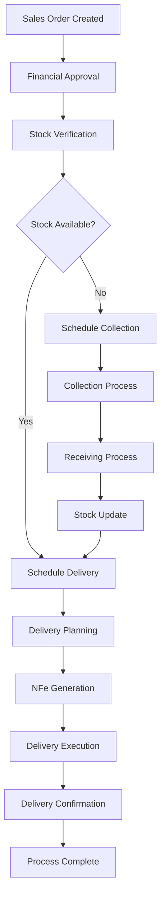
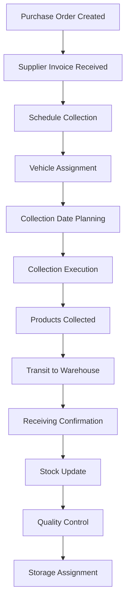
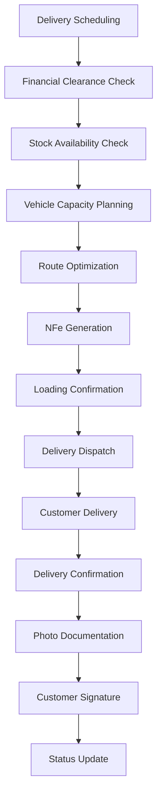
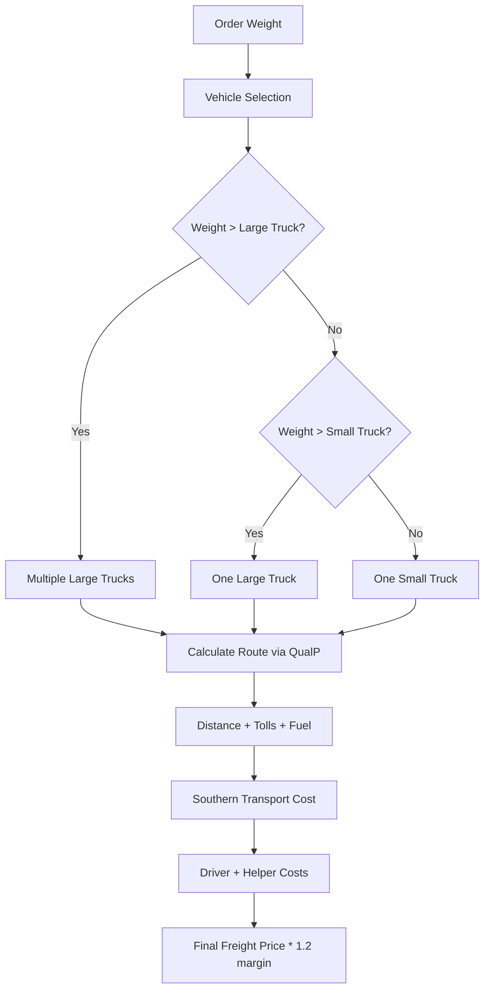
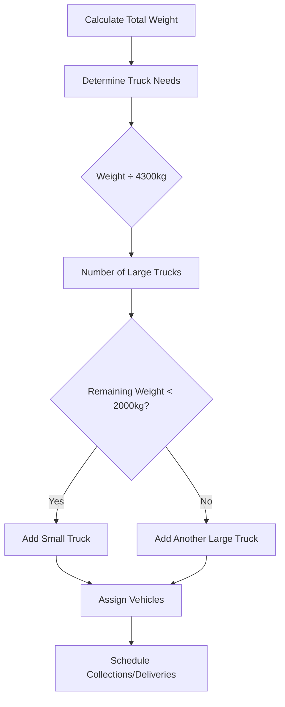
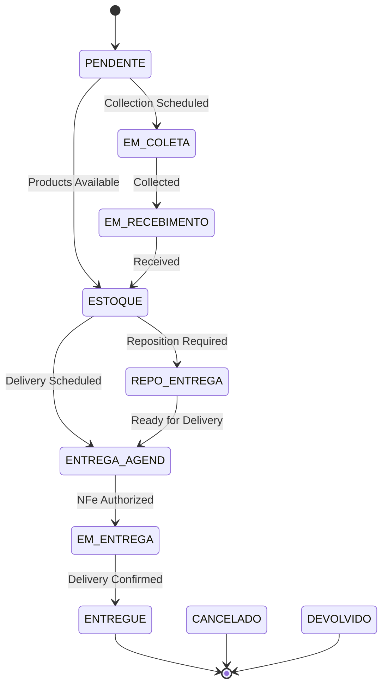
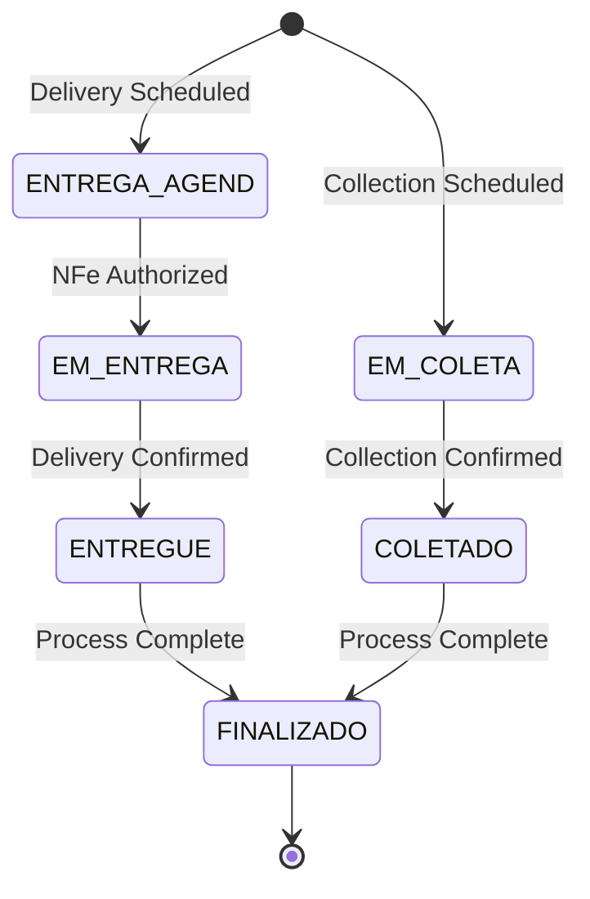

# Logistics Process Documentation - ERP Staccato

## Overview

The ERP Staccato logistics system is a comprehensive Brazilian logistics management solution that handles the complete flow from sales order to delivery confirmation. It manages collection scheduling, freight calculation, delivery planning, transportation management, and full Brazilian compliance requirements including NFe integration.

## Architecture Overview

### Core Components

The logistics system is organized around the following key modules:

- **TabLogistica**: Main logistics tab container
- **WidgetLogisticaAgendarEntrega**: Schedule deliveries and manage delivery planning
- **WidgetLogisticaEntregas**: Manage active deliveries and delivery execution
- **WidgetLogisticaAgendarColeta**: Schedule collections from suppliers
- **WidgetLogisticaColeta**: Manage active collections
- **WidgetLogisticaRecebimento**: Handle receiving operations
- **WidgetLogisticaCaminhao**: Vehicle and transportation management
- **WidgetLogisticaCalendario**: Calendar-based logistics coordination
- **WidgetLogisticaEntregues**: Completed deliveries management
- **WidgetLogisticaRepresentacao**: Representative/agent deliveries
- **CalculoFrete**: Freight calculation and route optimization

### Database Schema

#### Core Tables

**veiculo_has_produto** - Central logistics tracking table
```sql
- id (int) - Primary key
- idEvento (int) - Event grouping ID for logistics operations
- idVeiculo (int) - Vehicle ID (FK to transportadora_has_veiculo)
- idVendaProduto2 (int) - Sales product ID (FK to venda_has_produto2)
- idEstoque (int) - Stock ID (FK to estoque)
- idCompra (int) - Purchase ID (FK to pedido_fornecedor_has_produto2)
- idNFeSaida (int) - Outbound NFe ID (FK to nfe)
- data (datetime) - Scheduled date/time
- status (varchar) - Status: ENTREGA AGEND., EM ENTREGA, ENTREGUE, EM COLETA, COLETADO
- observacao (text) - Observations and notes
- fotoEntrega (blob) - Delivery photo
```

**transportadora_has_veiculo** - Vehicle management
```sql
- idVeiculo (int) - Primary key
- idTransportadora (int) - Transportation company ID
- modelo (varchar) - Vehicle model
- capacidade (decimal) - Vehicle capacity in kg
- placa (varchar) - License plate
- desativado (boolean) - Deactivated flag
```

**cliente_has_endereco** - Customer addresses with logistics data
```sql
- idEndereco (int) - Primary key
- idCliente (int) - Customer ID
- logradouro (varchar) - Street address
- numero (varchar) - Number
- complemento (varchar) - Complement
- bairro (varchar) - Neighborhood
- cidade (varchar) - City
- uf (varchar) - State
- cep (varchar) - ZIP code
- qualpJson (text) - QualP API cached response
- qualpData (date) - QualP cache date
```

#### Key Views

**view_calendario_entrega** - Delivery calendar view
```sql
- Aggregates delivery data by date and vehicle
- Shows weight, transportation company, and delivery details
- Used by calendar widget for logistics planning
```

**view_calendario_carga** - Cargo/load view
```sql
- Shows detailed cargo information for deliveries
- Includes NFe data, customer info, and delivery status
- Links to products and delivery scheduling
```

**view_calendario_produto** - Product delivery view
```sql
- Product-level delivery tracking
- Includes stock information, quantities, and delivery details
- Supports inventory tracking for deliveries
```

**view_entrega_pendente** - Pending deliveries
```sql
- Lists all deliveries awaiting scheduling or execution
- Includes customer data, deadlines, and financial status
- Supports filtering by stock status and delivery zones
```

**view_agendar_entrega** - Delivery scheduling view
```sql
- Products ready for delivery scheduling
- Includes stock status, financial clearance, and delivery requirements
- Supports complex filtering for logistics planning
```

## Complete Logistics Workflow

### 1. Sales Order to Logistics Flow



### 2. Collection Process (Supplier → Warehouse)



### 3. Delivery Process (Warehouse → Customer)



## Detailed Class Analysis

### TabLogistica Class

**Purpose**: Main container for all logistics operations
**Location**: `src/tablogistica.cpp`

#### Key Methods:
```cpp
void TabLogistica::updateTables() -> void
// Updates all logistics widgets based on current tab
// Manages lazy loading of logistics components

void TabLogistica::resetTables() -> void  
// Resets all logistics table models
// Used for data refresh operations

void TabLogistica::on_tabWidgetLogistica_currentChanged() -> void
// Handles tab switching and component activation
// Optimizes performance by updating only active tabs
```

#### Tab Structure:
- **Agendar Coleta**: Collection scheduling
- **Coleta**: Active collections
- **Recebimento**: Receiving operations  
- **Agendar Entrega**: Delivery scheduling
- **Entregas**: Active deliveries
- **Caminhões**: Vehicle management
- **Representação**: Representative deliveries
- **Entregues**: Completed deliveries
- **Calendário**: Calendar overview
- **Devolução**: Returns management

### WidgetLogisticaAgendarEntrega Class

**Purpose**: Manages delivery scheduling and planning
**Location**: `src/widgetlogisticaagendarentrega.cpp`

#### Key Methods:

```cpp
void WidgetLogisticaAgendarEntrega::adicionarProduto(const QModelIndexList &list) -> void
// Adds products to delivery schedule
// Validates stock availability and financial clearance
// Updates vehicle load calculations

void WidgetLogisticaAgendarEntrega::processRows() -> void  
// Processes scheduled deliveries
// Updates database status and creates logistics events
// Generates event IDs for tracking

void WidgetLogisticaAgendarEntrega::calcularPeso() -> void
// Calculates total weight for selected products
// Validates against vehicle capacity
// Updates UI weight indicators

void WidgetLogisticaAgendarEntrega::dividirVenda(int row, double caixasAgendar, double caixasTotal, int novoIdVendaProduto2) -> void
// Handles partial delivery scheduling
// Splits sales orders for partial deliveries
// Maintains financial and inventory integrity

void WidgetLogisticaAgendarEntrega::calcularDisponivel() -> void
// Calculates available vehicle capacity
// Considers existing scheduled loads
// Updates real-time capacity indicators
```

#### Business Logic:
- **Financial Validation**: Checks payment status before allowing delivery scheduling
- **Stock Verification**: Validates product availability in warehouse
- **Capacity Planning**: Manages vehicle load optimization
- **Partial Deliveries**: Supports splitting orders across multiple deliveries
- **Route Planning**: Integrates with mapping services for delivery optimization

### WidgetLogisticaEntregas Class

**Purpose**: Manages active deliveries and execution
**Location**: `src/widgetlogisticaentregas.cpp`

#### Key Methods:

```cpp
void WidgetLogisticaEntregas::confirmarEntrega(QDate dataRealEnt, QString entregou, QString recebeu) -> void
// Confirms delivery completion
// Updates all related database tables
// Records delivery personnel and recipient

void WidgetLogisticaEntregas::reagendar(const QModelIndexList &list, QDateTime dataVeiculo, int idVeiculo) -> void
// Reschedules deliveries to different dates/vehicles
// Updates delivery predictions and customer notifications
// Maintains delivery history and audit trail

void WidgetLogisticaEntregas::cancelarEntrega(const QModelIndexList &list) -> void
// Cancels scheduled deliveries
// Reverses stock allocations and scheduling
// Updates sales order status appropriately

QString WidgetLogisticaEntregas::gerarProtocolo(QString folderKey, QString idEvento, QString idVenda, QString cliente, QString telefones, QString endereco, QString cep, const SqlQueryModel &modelProdutosAgrupado) -> QString
// Generates delivery protocol Excel documents
// Creates customer-specific delivery documentation
// Includes all product details and delivery instructions

QString WidgetLogisticaEntregas::gerarChecklist(QString folderKey, QString idEvento, QString idVenda, QString cliente, QString endereco, QString cep, const SqlQueryModel &modelProdutosAgrupado) -> QString
// Generates delivery checklist for drivers
// Ensures all products are accounted for
// Provides quality control documentation

void WidgetLogisticaEntregas::processarConsultaNFe(int idNFe, QString xml) -> void
// Processes NFe consultation responses
// Updates delivery status based on tax authority validation
// Enables delivery execution after NFe authorization
```

#### Features:
- **NFe Integration**: Complete Brazilian tax document management
- **Delivery Confirmation**: Photo capture and signature collection
- **Real-time Tracking**: Status updates throughout delivery process
- **Document Generation**: Automatic protocol and checklist creation
- **Route Management**: Integration with Google Maps for navigation

### CalculoFrete Class

**Purpose**: Freight calculation and route optimization
**Location**: `src/calculofrete.cpp`

#### Key Methods:

```cpp
void CalculoFrete::qualp() -> void
// Integrates with QualP API for route calculation
// Calculates distance, tolls, and fuel costs
// Caches results for performance optimization

void CalculoFrete::setOrcamento(QVariant idEndereco, double pesoSul, double pesoTotal) -> void
// Sets up freight calculation for specific order
// Calculates vehicle requirements based on weight
// Determines optimal truck configuration

double CalculoFrete::getFrete() -> double
// Returns calculated freight cost
// Includes all transportation expenses
// Applies Brazilian logistics regulations

double CalculoFrete::getDistancia() -> double
// Returns calculated route distance
// Used for delivery time estimation
// Supports route optimization
```

#### Freight Calculation Algorithm:



#### Cost Components:
1. **Southern Transport**: R$220/ton for products from southern suppliers
2. **Vehicle Costs**: Driver and helper daily rates
3. **Route Costs**: Fuel, tolls, and distance via QualP API
4. **Capacity Planning**: Optimal truck size selection
5. **Markup**: 20% margin on total costs

### WidgetLogisticaCaminhao Class

**Purpose**: Vehicle and transportation management
**Location**: `src/widgetlogisticacaminhao.cpp`

#### Key Methods:

```cpp
void WidgetLogisticaCaminhao::setupTables() -> void
// Configures vehicle management tables
// Shows vehicle details and capacity information
// Links to transportation companies

void WidgetLogisticaCaminhao::on_table_selectionChanged() -> void
// Filters cargo view by selected vehicle
// Shows current and scheduled loads
// Updates capacity utilization display
```

### Collection Management Classes

#### WidgetLogisticaAgendarColeta

**Purpose**: Schedules collections from suppliers
**Key Features**:
- Supplier-based filtering and planning
- Vehicle capacity management
- Collection date optimization
- Direct receipt processing for immediate availability

#### WidgetLogisticaColeta  

**Purpose**: Manages active collections
**Key Features**:
- Collection status tracking
- Supplier coordination
- Receiving date planning
- Collection confirmation processing

### Calendar Integration

#### WidgetLogisticaCalendario

**Purpose**: Visual calendar planning for all logistics operations
**Location**: `src/widgetlogisticacalendario.cpp`

#### Key Features:
- **Weekly View**: Shows 7-day logistics planning
- **Vehicle Filtering**: Filter by transportation company and vehicle
- **Load Visualization**: Shows morning/afternoon schedules
- **Route Integration**: Google Maps links for delivery routes
- **Capacity Management**: Real-time vehicle utilization

```cpp
void WidgetLogisticaCalendario::updateCalendar(QDate startDate) -> void
// Updates calendar with logistics data for specified week
// Shows deliveries, collections, and vehicle assignments
// Provides interactive planning interface

void WidgetLogisticaCalendario::listarVeiculos() -> void
// Populates vehicle filter checkboxes
// Enables selective calendar views
// Supports multi-vehicle planning
```

## Transportation Management

### Vehicle Types and Capacity

**Large Truck (Caminhão Grande)**:
- Capacity: 4,300 kg (configurable)
- Driver cost: R$ variable per day
- Helper cost: R$ variable per day  
- Fuel consumption: configurable km/L

**Small Truck (Caminhão Pequeno)**:
- Capacity: 2,000 kg (configurable)
- Lower operating costs
- Single driver operation
- Better urban maneuverability

### Vehicle Assignment Logic



### Route Optimization with QualP

The system integrates with QualP API for Brazilian route optimization:

1. **API Integration**: Real-time route calculation
2. **Cost Factors**: Distance, tolls, fuel consumption
3. **Vehicle Specifications**: Weight, axles, fuel type
4. **Caching**: Results cached by address and date
5. **Fallback**: Manual calculation for excluded cities

## Brazilian Logistics Compliance

### NFe (Nota Fiscal Eletrônica) Integration

**Electronic Invoice Requirements**:
- Mandatory for all deliveries
- Real-time tax authority validation
- Electronic signature and authentication
- Delivery authorization dependent on NFe approval

**NFe Types in Logistics**:
- **NFe Saída**: Standard outbound invoice
- **NFe Futura**: Future dated invoice for advanced planning
- **NFe Após Futura**: Invoice generated after future invoice

### Delivery Documentation

**Required Documents**:
1. **Delivery Protocol**: Excel-based delivery confirmation
2. **Delivery Checklist**: Driver verification document
3. **NFe DANFE**: Printed tax document
4. **Photo Documentation**: Delivery proof
5. **Customer Signature**: Delivery confirmation

### Geographic Coverage

**Service Areas**:
- Full coverage within operational states
- Excluded cities list (cidadesSemQualp) for special handling
- Route optimization for Brazilian road network
- Interstate delivery authorization requirements

## Status Workflow Management

### Product Status Flow



### Vehicle Event Status



## Integration Points

### Sales Module Integration

**Data Flow**:
- Sales orders trigger logistics planning
- Financial status controls delivery authorization
- Product availability drives collection scheduling
- Customer addresses determine delivery zones

**Key Integration Points**:
```cpp
// Update sales status based on logistics operations
Sql::updateVendaStatus(const QStringList &idVendas) -> void

// Link sales products to logistics events  
venda_has_produto2.idVendaProduto2 -> veiculo_has_produto.idVendaProduto2
```

### Inventory Module Integration

**Stock Management**:
- Real-time stock allocation for deliveries
- Collection planning based on stock requirements
- Warehouse location tracking (CD vs Store)
- Quality control integration

**Key Integration Points**:
```cpp
// Stock consumption tracking
estoque_has_consumo -> veiculo_has_produto

// Stock location management
estoque.idBloco -> galpao.idBloco
```

### Financial Module Integration

**Financial Controls**:
- Payment verification before delivery scheduling
- Freight cost calculation and approval
- Transportation cost tracking
- GARE tax payment scheduling

**Financial Status Types**:
- **PENDENTE**: Payment pending
- **CONFERIDO**: Payment verified but not authorized
- **LIBERADO**: Authorized for delivery

## Reporting and Analytics

### Delivery Performance Metrics

1. **On-Time Delivery Rate**: % of deliveries completed within promised timeframe
2. **Vehicle Utilization**: Capacity usage vs. available capacity
3. **Route Efficiency**: Actual vs. planned delivery times
4. **Cost per Delivery**: Total logistics cost divided by deliveries
5. **Customer Satisfaction**: Delivery confirmation feedback

### Route Optimization Reports

1. **Distance Analysis**: Planned vs. actual delivery distances
2. **Fuel Consumption**: Actual vs. calculated fuel usage
3. **Toll Costs**: Route toll analysis and optimization opportunities
4. **Vehicle Performance**: Delivery capacity and efficiency by vehicle

### Collection Performance

1. **Supplier Reliability**: On-time collection rates by supplier
2. **Collection Costs**: Transportation costs for supplier collections
3. **Lead Times**: Collection to warehouse to customer delivery times
4. **Quality Issues**: Product condition upon receipt

## API Integrations

### QualP Route Optimization API

**Purpose**: Brazilian route calculation and optimization
**Features**:
- Real-time distance calculation
- Toll cost estimation
- Fuel consumption calculation
- Multi-stop route optimization

**API Configuration**:
```sql
-- Stored in loja table
apiQualp: API endpoint URL with parameters
cabecalhosQualp: HTTP headers for authentication
precoCombustivel: Current fuel price
eixosCaminhaoGrande: Large truck axle configuration
consumoCaminhaoGrande: Large truck fuel consumption
```

### Google Maps Integration

**Purpose**: Navigation and route visualization
**Features**:
- Turn-by-turn navigation for drivers
- Real-time traffic information
- Route alternatives
- Customer location verification

## Error Handling and Recovery

### Collection Process Errors

1. **Supplier Unavailability**: Automatic rescheduling with notifications
2. **Vehicle Breakdown**: Alternative vehicle assignment
3. **Route Changes**: Dynamic route recalculation
4. **Documentation Issues**: Hold process until resolution

### Delivery Process Errors

1. **Customer Unavailability**: Delivery rescheduling options
2. **Address Issues**: Customer contact and verification
3. **NFe Problems**: Tax authority resolution process
4. **Vehicle Problems**: Emergency vehicle replacement

### System Recovery Procedures

1. **Transaction Rollback**: Automatic rollback on database errors
2. **Status Synchronization**: Periodic status verification and correction
3. **Cache Refresh**: QualP cache invalidation and refresh
4. **Document Regeneration**: Automatic protocol and checklist recreation

## Performance Optimization

### Database Optimization

1. **Index Strategy**: Optimized indexes on logistics tables
2. **View Caching**: Materialized views for complex logistics queries
3. **Connection Pooling**: Efficient database connection management
4. **Query Optimization**: Optimized SQL for logistics operations

### User Interface Optimization

1. **Lazy Loading**: Tables loaded only when accessed
2. **Progressive Loading**: Large datasets loaded incrementally
3. **Caching Strategy**: UI data caching for improved responsiveness
4. **Real-time Updates**: Efficient change notification system

### API Performance

1. **QualP Caching**: Route calculations cached by address and date
2. **Batch Operations**: Multiple logistics operations in single transactions
3. **Async Processing**: Non-blocking operations for better user experience
4. **Rate Limiting**: API call optimization to respect service limits

## Configuration Management

### System Parameters

**Vehicle Configuration** (stored in loja table):
```sql
capacidadeCaminhaoGrande: Large truck capacity (kg)
capacidadeCaminhaoPequeno: Small truck capacity (kg)
custoMotoristaCaminhaoGrande: Large truck driver daily cost
custoMotoristaCaminhaoPequeno: Small truck driver daily cost
custoAjudantesCaminhaoGrande: Large truck helper daily cost
custoAjudantesCaminhaoPequeno: Small truck helper daily cost
consumoCaminhaoGrande: Large truck fuel consumption (km/L)
consumoCaminhaoPequeno: Small truck fuel consumption (km/L)
precoCombustivel: Current fuel price per liter
custoTransporteTon: Southern transport cost per ton
cidadesSemQualp: Excluded cities for route calculation
```

**QualP Integration**:
```sql
apiQualp: QualP API endpoint with parameter placeholders
cabecalhosQualp: HTTP headers for API authentication
eixosCaminhaoGrande: Vehicle axle configuration for QualP
```

### User Permissions

**Logistics Roles**:
- **Logistics Manager**: Full access to all logistics operations
- **Logistics Operator**: Delivery and collection scheduling
- **Driver**: Delivery confirmation and status updates
- **Warehouse**: Receiving and shipping operations

## Future Enhancements

### Planned Features

1. **Mobile App**: Driver mobile application for delivery management
2. **Customer Portal**: Real-time delivery tracking for customers
3. **AI Route Optimization**: Machine learning for route optimization
4. **IoT Integration**: Vehicle tracking and monitoring
5. **Predictive Analytics**: Delivery time and cost prediction

### Integration Opportunities

1. **Telematics**: Vehicle performance and location tracking
2. **Weather API**: Weather-based delivery planning
3. **Traffic API**: Real-time traffic integration
4. **Customer Communication**: Automated delivery notifications

### Process Improvements

1. **Automated Scheduling**: AI-based delivery scheduling
2. **Dynamic Pricing**: Real-time freight cost adjustment
3. **Customer Self-Service**: Delivery rescheduling by customers
4. **Sustainability**: Route optimization for reduced emissions

## Conclusion

The ERP Staccato logistics system provides comprehensive management of the complete logistics lifecycle from supplier collection to customer delivery. With Brazilian compliance built-in, advanced route optimization, and integrated financial controls, it supports efficient and compliant logistics operations for Brazilian businesses.

The system's modular architecture, robust error handling, and extensive integration capabilities make it suitable for businesses of various sizes while maintaining the flexibility to adapt to changing business requirements and regulatory demands.

Key strengths include:
- Complete Brazilian compliance (NFe, tax requirements)
- Advanced route optimization with QualP integration
- Comprehensive vehicle and capacity management
- Real-time status tracking and confirmation
- Integrated document generation and management
- Flexible delivery scheduling and rescheduling
- Complete audit trail and reporting capabilities

This documentation provides the foundation for understanding, maintaining, and extending the logistics capabilities of the ERP Staccato system.