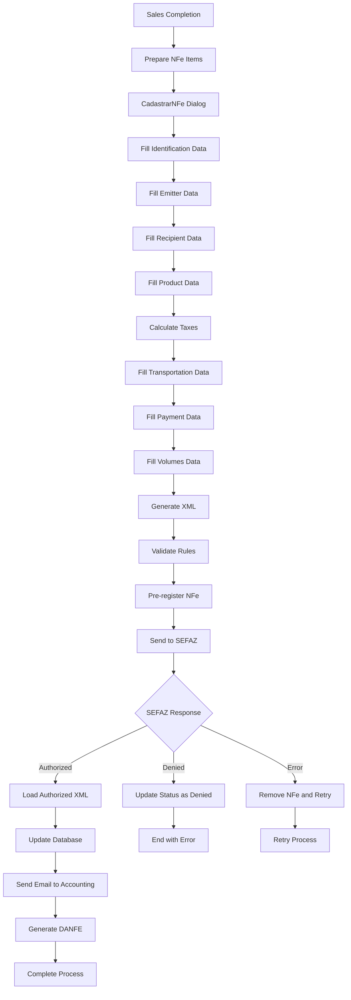
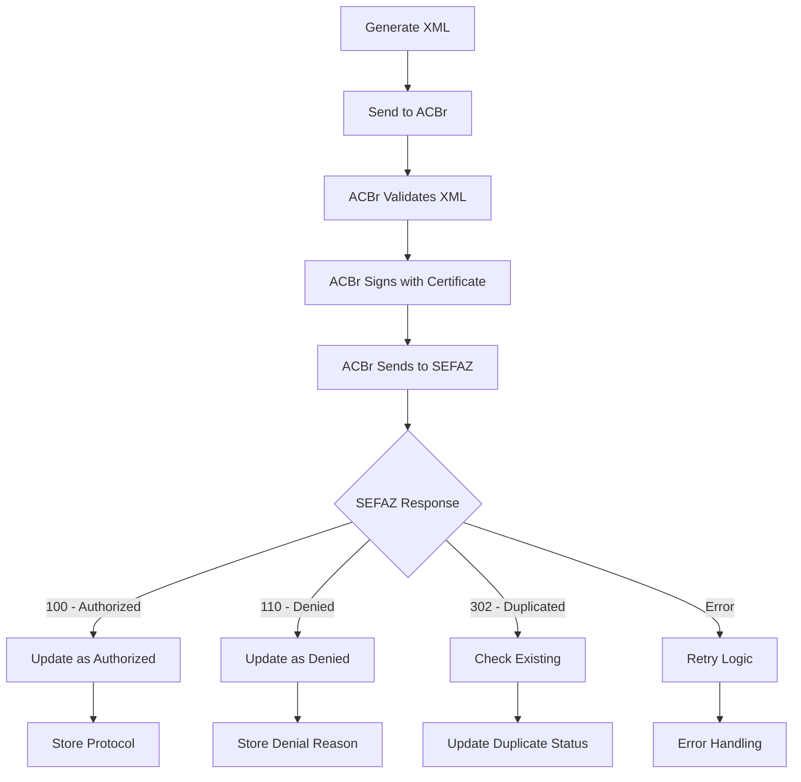
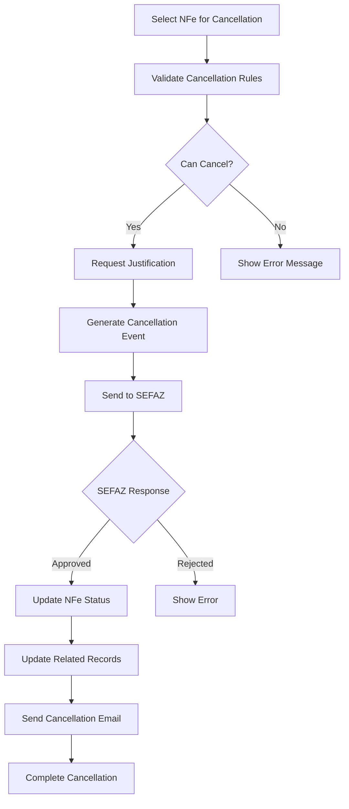
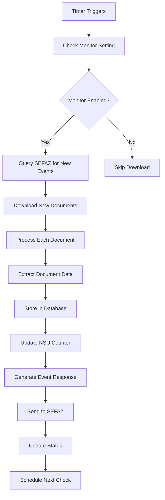

# NFe (Nota Fiscal Eletrônica) Process Documentation

## Overview

The ERP Staccato NFe system provides comprehensive Brazilian electronic invoice management, including generation, transmission, authorization, cancellation, and distribution. The system integrates with SEFAZ (Secretaria da Fazenda) for legal compliance and uses the ACBr library for NFe operations.

## System Architecture

### Core Components

1. **TabNFe** - Main NFe interface with three tabs:
   - `WidgetNfeEntrada` - Incoming invoices
   - `WidgetNfeSaida` - Outgoing invoices
   - `WidgetNfeDistribuicao` - DFe distribution

2. **CadastrarNFe** - NFe creation and management dialog
3. **ACBr** - TCP communication with ACBr Monitor
4. **ACBrLib** - Direct ACBr library integration for DANFE generation
5. **NFeProxyModel** - Data filtering and presentation

### Database Schema

#### Main NFe Table

```sql
CREATE TABLE `nfe` (
  `idNFe` INT(10) UNSIGNED NOT NULL AUTO_INCREMENT,
  `idVenda` VARCHAR(30) NULL DEFAULT NULL,
  `idFollowup` INT(11) NULL DEFAULT NULL,
  `numeroNFe` VARCHAR(9) NULL DEFAULT NULL,
  `tipo` VARCHAR(45) NOT NULL,
  `xml` MEDIUMTEXT NULL DEFAULT NULL,
  `status` VARCHAR(45) NOT NULL DEFAULT 'AUTORIZADA',
  `dataHoraEmissao` TIMESTAMP NULL DEFAULT NULL,
  `emitente` VARCHAR(450) NULL DEFAULT NULL,
  `chaveAcesso` VARCHAR(44) NULL DEFAULT NULL,
  `valor` DECIMAL(15,4) NULL DEFAULT NULL,
  `nsu` INT(11) NULL DEFAULT NULL,
  `statusDistribuicao` VARCHAR(45) NULL DEFAULT NULL,
  `dataDistribuicao` TIMESTAMP NULL DEFAULT NULL,
  `utilizada` TINYINT(1) NULL DEFAULT '0',
  `ciencia` TINYINT(1) NULL DEFAULT '0',
  `confirmar` TINYINT(1) NULL DEFAULT '0',
  `desconhecer` TINYINT(1) NULL DEFAULT '0',
  `naoRealizar` TINYINT(1) NULL DEFAULT '0',
  PRIMARY KEY (`idNFe`),
  UNIQUE INDEX `chaveAcesso_UNIQUE` (`chaveAcesso` ASC),
  INDEX `fk_nfe_venda` (`idVenda` ASC),
  CONSTRAINT `fk_nfe_venda` FOREIGN KEY (`idVenda`) REFERENCES `venda` (`idVenda`)
);
```

#### NFe Follow-up Table

```sql
CREATE TABLE `nfe_has_followup` (
  `idFollowup` INT(11) NOT NULL AUTO_INCREMENT,
  `idNFe` INT(11) NOT NULL,
  `idLoja` INT(10) UNSIGNED NOT NULL,
  `idUsuario` INT(10) UNSIGNED NOT NULL,
  `tipoOperacao` VARCHAR(200) NULL DEFAULT NULL,
  `observacao` MEDIUMTEXT NOT NULL,
  `dataFollowup` DATETIME NOT NULL,
  `dataProxFollowup` DATETIME NULL DEFAULT NULL,
  PRIMARY KEY (`idFollowup`),
  INDEX `nfe_f_idx` (`idNFe` ASC)
);
```

## NFe Types and Workflow

### NFe Types (CadastrarNFe::Tipo)

- **Entrada** - Incoming invoices from suppliers
- **Saida** - Outgoing invoices to customers
- **Futura** - Future invoices (pre-authorization)
- **SaidaAposFutura** - Final invoice after future invoice

### Complete NFe Workflow



## Tax Calculation Algorithms

### ICMS (Imposto sobre Circulação de Mercadorias e Serviços)

```cpp
void CadastrarNFe::calculaIcms() {
  // Base calculation: vICMS = vBC * pICMS / 100
  double baseCalculo = ui->doubleSpinBoxICMSvbc->value();
  double aliquota = ui->doubleSpinBoxICMSpicms->value();
  double valorIcms = baseCalculo * aliquota / 100;
  ui->doubleSpinBoxICMSvicms->setValue(valorIcms);
}
```

**ICMS Rules:**

- Base de Cálculo (vBC): Product value + IPI + freight
- Aliquota (pICMS): State-dependent rate (7%, 12%, 18%, etc.)
- Valor ICMS (vICMS): vBC × pICMS ÷ 100

### ICMS-ST (Substituição Tributária)

```cpp
void CadastrarNFe::calculaSt() {
  // ST calculation: vICMSST = vBCST * pICMSST / 100
  double baseCalculoSt = ui->doubleSpinBoxICMSvbcst->value();
  double aliquotaSt = ui->doubleSpinBoxICMSpicmsst->value();
  double valorIcmsSt = baseCalculoSt * aliquotaSt / 100;
  ui->doubleSpinBoxICMSvicmsst->setValue(valorIcmsSt);
}
```

**ICMS-ST Rules:**

- MVA (Margem de Valor Agregado): Product-specific markup
- vBCST = (vBC + vIPI) × (1 + pMVAST/100)
- vICMSST = vBCST × pICMSST / 100 - vICMS

### PIS (Programa de Integração Social)

```cpp
void CadastrarNFe::calculaPis() {
  // PIS calculation: vPIS = vBC * pPIS / 100
  double baseCalculo = ui->doubleSpinBoxPISvbc->value();
  double aliquota = ui->doubleSpinBoxPISppis->value();
  double valorPis = baseCalculo * aliquota / 100;
  ui->doubleSpinBoxPISvpis->setValue(valorPis);
}
```

**PIS Rules:**

- Standard rate: 1.65% (cumulative) or 0.65% (non-cumulative)
- Base: Product value
- CST determines calculation method

### COFINS (Contribuição para o Financiamento da Seguridade Social)

```cpp
void CadastrarNFe::calculaCofins() {
  // COFINS calculation: vCOFINS = vBC * pCOFINS / 100
  double baseCalculo = ui->doubleSpinBoxCOFINSvbc->value();
  double aliquota = ui->doubleSpinBoxCOFINSpcofins->value();
  double valorCofins = baseCalculo * aliquota / 100;
  ui->doubleSpinBoxCOFINSvcofins->setValue(valorCofins);
}
```

**COFINS Rules:**

- Standard rate: 7.6% (cumulative) or 3.0% (non-cumulative)
- Base: Product value
- CST determines calculation method

### Tax Totalization

```cpp
void CadastrarNFe::updateTotais() {
  double totalProdutos = 0;
  double totalIcms = 0;
  double totalIpi = 0;
  double totalPis = 0;
  double totalCofins = 0;
  double baseIcms = 0;

  for (int row = 0; row < modelProduto.rowCount(); ++row) {
    totalProdutos += modelProduto.data(row, "total").toDouble();
    totalIcms += modelProduto.data(row, "vICMS").toDouble();
    totalIpi += modelProduto.data(row, "vIPI").toDouble();
    totalPis += modelProduto.data(row, "vPIS").toDouble();
    totalCofins += modelProduto.data(row, "vCOFINS").toDouble();
    baseIcms += modelProduto.data(row, "vBC").toDouble();
  }

  double valorFrete = ui->checkBoxFrete->isChecked() ? ui->doubleSpinBoxValorFrete->value() : 0;
  double valorNota = totalProdutos + totalIpi + valorFrete;

  ui->doubleSpinBoxValorProdutos->setValue(totalProdutos);
  ui->doubleSpinBoxValorICMS->setValue(totalIcms);
  ui->doubleSpinBoxValorIPI->setValue(totalIpi);
  ui->doubleSpinBoxValorPIS->setValue(totalPis);
  ui->doubleSpinBoxValorCOFINS->setValue(totalCofins);
  ui->doubleSpinBoxBaseICMS->setValue(baseIcms);
  ui->doubleSpinBoxValorNota->setValue(valorNota);
}
```

## XML Generation Process

### XML Structure Generation

The NFe XML is generated through a series of specialized write functions:

```cpp
QString CadastrarNFe::montarXML() {
  QString nfe;
  QTextStream stream(&nfe);

  stream << R"(NFE.CriarNFe(")";

  writeIdentificacao(stream);    // Identification data
  writeEmitente(stream);         // Emitter data
  writeDestinatario(stream);     // Recipient data
  writeProduto(stream);          // Product data
  writeTotal(stream);            // Tax totals
  writeTransportadora(stream);   // Transportation
  writePagamento(stream);        // Payment
  writeVolume(stream);           // Volumes
  writeComplemento(stream);      // Additional info

  stream << R"(",1))"; // return xml

  return nfe;
}
```

### Identification Section

```cpp
void CadastrarNFe::writeIdentificacao(QTextStream &stream) {
  stream << "[Identificacao]\n";
  stream << "NaturezaOperacao = " + ui->comboBoxNatureza->currentText() + "\n";
  stream << "Modelo = " + ui->lineEditModelo->text() + "\n";          // 55 for NFe
  stream << "Serie = " + ui->lineEditSerie->text() + "\n";            // Series number
  stream << "Codigo = " << ui->lineEditCodigo->text() + "\n";         // Random code
  stream << "Numero = " << ui->lineEditNumero->text() + "\n";         // Sequential number
  stream << "Emissao = " + qApp->serverDate().toString("dd/MM/yyyy") + "\n";
  stream << "Saida = " + qApp->serverDate().toString("dd/MM/yyyy") + "\n";
  stream << "Tipo = " + ui->comboBoxTipo->currentText().left(1) + "\n"; // 0=Entrada, 1=Saída
  stream << "finNFe = " + ui->comboBoxFinalidade->currentText().left(1) + "\n";
  stream << "FormaPag = " + ui->lineEditFormatoPagina->text() + "\n";
  stream << "idDest = " + ui->comboBoxDestinoOperacao->currentText().left(1) + "\n";
  stream << "indPres = 1\n";    // Buyer presence indicator
  stream << "indFinal = 1\n";   // Final consumer indicator
}
```

### Digital Signature and Access Key

```cpp
void CadastrarNFe::criarChaveAcesso() {
  // Access key format: UF + AAMM + CNPJ + MOD + SER + NNF + TPEMIS + COD + DV
  QString chave = ui->lineEditEmitenteUF->text();           // UF code (2 digits)
  chave += qApp->serverDate().toString("yyMM");             // Year/Month (4 digits)
  chave += clearStr(ui->lineEditEmitenteCNPJ->text());      // CNPJ (14 digits)
  chave += ui->lineEditModelo->text().rightJustified(2, '0'); // Model (2 digits)
  chave += ui->lineEditSerie->text().rightJustified(3, '0'); // Series (3 digits)
  chave += ui->lineEditNumero->text().rightJustified(9, '0'); // Number (9 digits)
  chave += "1";                                             // Emission type (1 digit)
  chave += ui->lineEditCodigo->text().rightJustified(8, '0'); // Random code (8 digits)

  // Calculate verification digit
  calculaDigitoVerificador();
  chave += QString::number(digitoVerificador);

  chaveAcesso = chave;
}

void CadastrarNFe::calculaDigitoVerificador() {
  // Module 11 algorithm for verification digit
  QString sequence = "4329876543298765432987654329876543298765432";
  int sum = 0;

  for (int i = 0; i < 43; ++i) {
    sum += chaveAcesso.mid(i, 1).toInt() * sequence.mid(i, 1).toInt();
  }

  int remainder = sum % 11;
  digitoVerificador = (remainder < 2) ? 0 : 11 - remainder;
}
```

## SEFAZ Communication

### ACBr TCP Communication

The system communicates with SEFAZ through ACBr Monitor via TCP socket:

```cpp
class ACBr : public QObject {
private:
  QTcpSocket socket;
  QString servidor;     // ACBr server address
  QString porta;        // ACBr server port
  QString resposta;     // Response buffer
  bool conectado = false;
  bool enviado = false;
  bool pronto = false;
  bool recebido = false;
};
```

### Command Sending Protocol

```cpp
QString ACBr::enviarComando(const QString &comando, const QString &labelText) {
  // Reset state
  recebido = false;
  enviado = false;
  resposta.clear();

  // Connect to ACBr Monitor
  if (not conectado) {
    socket.connectToHost(servidor, porta.toUShort());
  }

  // Wait for ready state
  while (not pronto) {
    QCoreApplication::processEvents(QEventLoop::AllEvents, 100);
    QThread::msleep(10);
  }

  // Send command
  socket.write(comando.toUtf8() + "\r\n.\r\n");

  // Wait for response
  while (not recebido and conectado) {
    QCoreApplication::processEvents(QEventLoop::AllEvents, 100);
    QThread::msleep(10);
  }

  return resposta;
}
```

### NFe Transmission Process



### Response Processing

```cpp
void CadastrarNFe::processarResposta(const QString &resposta, const QString &filePath,
                                     const int idNFe, ACBr &acbr) {
  if (resposta.contains("Erro Interno", Qt::CaseInsensitive)) {
    removerNota(idNFe);
    manterAberto = true;
    throw RuntimeException("Erro interno na SEFAZ, tente enviar novamente!");
  }

  if (resposta.contains("Autorizado o uso da NF-e", Qt::CaseInsensitive) or
      resposta.contains("Uso Denegado", Qt::CaseInsensitive)) {
    return carregarArquivo(acbr, filePath);
  }

  if (resposta.contains("Duplicidade de NF-e", Qt::CaseInsensitive)) {
    // Handle duplicate NFe
    QString chaveExistente = extractChaveFromResponse(resposta);
    updateDuplicateStatus(idNFe, chaveExistente);
    return;
  }

  // Log error and remove invalid NFe
  removerNota(idNFe);
  throw RuntimeException("SEFAZ: " + resposta);
}
```

## NFe Cancellation Process

### Cancellation Workflow



### Cancellation Implementation

```cpp
void WidgetNfeSaida::on_pushButtonCancelarNFe_clicked() {
  const auto selection = ui->table->selectionModel()->selectedRows();

  if (selection.isEmpty()) {
    throw RuntimeError("Nenhuma linha selecionada!", this);
  }

  const int row = selection.first().row();
  const QString status = model.data(row, "status").toString();

  // Validation rules
  if (status != "AUTORIZADA") {
    throw RuntimeError("Apenas NF-es autorizadas podem ser canceladas!", this);
  }

  // Check 24-hour rule
  const QDateTime emissao = model.data(row, "dataHoraEmissao").toDateTime();
  if (emissao.secsTo(QDateTime::currentDateTime()) > 86400) { // 24 hours
    throw RuntimeError("NF-e pode ser cancelada apenas dentro de 24 horas!", this);
  }

  // Request justification
  bool ok;
  QString justificativa = QInputDialog::getText(this, "Cancelamento",
                                               "Justificativa (mín. 15 caracteres):",
                                               QLineEdit::Normal, "", &ok);

  if (not ok or justificativa.length() < 15) {
    throw RuntimeError("Justificativa deve ter pelo menos 15 caracteres!", this);
  }

  // Send cancellation to SEFAZ
  ACBr acbr;
  const int idNFe = model.data(row, "idNFe").toInt();
  const QString chaveAcesso = model.data(row, "chaveAcesso").toString();

  QString comando = QString("NFE.CancelarNFe(%1, %2, %3)")
                    .arg(chaveAcesso)
                    .arg(justificativa)
                    .arg("1"); // Protocol number

  QString resposta = acbr.enviarComando(comando, "Cancelando NF-e...");

  if (resposta.contains("Cancelamento registrado", Qt::CaseInsensitive)) {
    // Update database
    SqlQuery queryCancel;
    queryCancel.prepare("UPDATE nfe SET status = 'CANCELADA' WHERE idNFe = :idNFe");
    queryCancel.bindValue(":idNFe", idNFe);
    queryCancel.exec();

    // Update related records
    updateRelatedRecords(idNFe);

    qApp->enqueueInformation("NF-e cancelada com sucesso!");
    updateTables();
  } else {
    throw RuntimeException("Erro no cancelamento: " + resposta);
  }
}
```

## DFe Distribution System

### NSU (Número Sequencial Único) Management

```cpp
void WidgetNFeDistribuicao::buscarNSU() {
  const QString idLoja = ui->itemBoxLoja->getId().toString();

  SqlQuery queryLoja;
  queryLoja.exec("SELECT cnpj, ultimoNSU, maximoNSU FROM loja WHERE idLoja = " + idLoja);

  if (queryLoja.first()) {
    maximoNSU = queryLoja.value("maximoNSU").toInt();
    ultimoNSU = queryLoja.value("ultimoNSU").toInt();
    cnpjDest = queryLoja.value("cnpj").toString().remove(".").remove("/").remove("-");
  }
}
```

### Automatic Distribution Download

```cpp
void WidgetNFeDistribuicao::downloadAutomatico() {
  if (not User::getSetting("User/monitorarNFe").toBool()) { return; }

  timer.stop();
  qApp->setSilent(true);

  try {
    consultarSefaz();
  } catch (std::exception &) {
    qApp->setSilent(false);
    timer.start(tempoTimer);
    throw;
  }

  qApp->setSilent(false);
  timer.start(tempoTimer);
}
```

### Distribution Event Processing



## DANFE Generation

### Windows Implementation (ACBrLib)

```cpp
void ACBrLib::gerarDanfe(const int idNFe) {
  // Load ACBr library
  HMODULE nHandler = LoadLibraryW(L"ACBrNFe32.dll");

  // Initialize library
  NFE_Inicializar method_inicializar =
    reinterpret_cast<NFE_Inicializar>(GetProcAddress(nHandler, "NFE_Inicializar"));
  int ret = method_inicializar("", "");
  check_result(nHandler, ret);

  // Load XML
  NFE_CarregarXML method_carregar_xml =
    reinterpret_cast<NFE_CarregarXML>(GetProcAddress(nHandler, "NFE_CarregarXML"));
  ret = method_carregar_xml(fileContent.toUtf8());
  check_result(nHandler, ret);

  // Generate PDF
  NFE_ImprimirPDF method_imprimir_pdf =
    reinterpret_cast<NFE_ImprimirPDF>(GetProcAddress(nHandler, "NFE_ImprimirPDF"));
  ret = method_imprimir_pdf();
  check_result(nHandler, ret);

  // Clean up
  NFE_Finalizar method_finalizar =
    reinterpret_cast<NFE_Finalizar>(GetProcAddress(nHandler, "NFE_Finalizar"));
  method_finalizar();
  FreeLibrary(nHandler);

  // Open generated PDF
  const QString chaveAcesso = fileContent.mid(fileContent.indexOf("Id=") + 7, 44);
  const QString filePath = QDir::currentPath() + "/pdf/" + chaveAcesso + "-nfe.pdf";
  QDesktopServices::openUrl(QUrl::fromLocalFile(filePath));
}
```

### Non-Windows Implementation

```cpp
void ACBrLib::gerarDanfe(const int idNFe) {
  SqlQuery query;
  query.prepare("SELECT xml FROM nfe WHERE idNFe = :idNFe");
  query.bindValue(":idNFe", idNFe);
  query.exec();

  if (query.first()) {
    auto *viewer = new XML_Viewer(query.value("xml").toString(), nullptr);
    viewer->setAttribute(Qt::WA_DeleteOnClose);
    viewer->show();
  }
}
```

## Email Distribution

### Automatic Email Sending

```cpp
void ACBr::enviarEmail(const QString &emailDestino, const QString &emailCopia,
                       const QString &assunto, const QString &filePath) {
  const QString respostaEmail = enviarComando(
    "NFE.EnviarEmail(" + emailDestino + "," + filePath + ",1,'" + assunto + "')",
    "Enviando e-mail..."
  );

  if (not respostaEmail.contains("OK: E-mail enviado com sucesso!", Qt::CaseInsensitive)) {
    throw RuntimeException(respostaEmail);
  }

  qApp->enqueueInformation(respostaEmail);
}
```

### Email Integration Points

1. **After Authorization**: Send to accounting department
2. **After Cancellation**: Notify relevant parties
3. **Customer Delivery**: Send DANFE to customer
4. **Error Notifications**: Alert system administrators

## Integration with Other Modules

### Sales Integration

```cpp
// Link NFe with sales products
UPDATE venda_has_produto2 SET
  idNFeSaida = :idNFe,
  status = 'ENTREGA AGEND.'
WHERE idVendaProduto2 IN (:items);
```

### Inventory Integration

```cpp
// Update inventory with NFe reference
UPDATE estoque SET
  idNFe = :idNFe,
  status = 'CONFIRMADO'
WHERE idEstoque IN (SELECT idEstoque FROM estoque_has_consumo
                   WHERE idVendaProduto2 IN (:items));
```

### Financial Integration

```cpp
// Create tax obligations
INSERT INTO conta_a_pagar_has_pagamento (
  idLoja, contraParte, valor, tipo, status, idNFe, dataEmissao, dataPagamento
) VALUES (
  :idLoja, 'SEFAZ', :valorIcms, 'ICMS', 'PENDENTE GARE', :idNFe, NOW(), :vencimento
);
```

## Digital Certificate Management

### Certificate Types

- **A1**: Software certificate (stored in file/database)
- **A3**: Hardware certificate (stored in token/card)

### Certificate Configuration

Certificates are configured through the ACBr Monitor settings and must be properly installed and accessible to the ACBr service.

## Error Handling and Retry Mechanisms

### Common SEFAZ Errors

1. **Internal Error (999)**: Retry after delay
2. **Duplicate NFe (204)**: Check existing record
3. **Certificate Error (280)**: Verify certificate
4. **Validation Error (225)**: Fix XML structure

### Retry Logic

```cpp
int retryCount = 0;
const int maxRetries = 3;

while (retryCount < maxRetries) {
  try {
    QString resposta = acbr.enviarComando(comando, "Tentativa " + QString::number(retryCount + 1));
    if (resposta.contains("OK")) {
      break; // Success
    }
  } catch (const std::exception &e) {
    retryCount++;
    if (retryCount >= maxRetries) {
      throw; // Final failure
    }
    QThread::sleep(2); // Wait before retry
  }
}
```

## Compliance Requirements

### Brazilian NFe Standards

- **NT 2016.002**: Technical note for NFe 4.00
- **Manual de Orientação**: SEFAZ implementation guide
- **Schemas XSD**: XML validation schemas
- **Certificate ICP-Brasil**: Digital signature requirements

### Validation Rules

- Maximum 24 hours for cancellation
- Minimum 15 characters for cancellation justification
- Proper CFOP (Código Fiscal de Operações) for each operation
- Correct tax calculations according to state rules
- Valid recipient data (CPF/CNPJ format)

## Performance Considerations

### Database Optimization

- Indexed columns: `chaveAcesso`, `numeroNFe`, `status`, `nsu`
- Partitioning by date for large volumes
- Regular cleanup of old temporary records

### Network Optimization

- Connection pooling for ACBr communication
- Retry logic with exponential backoff
- Timeout configurations for SEFAZ calls

### Memory Management

- Stream processing for large XML files
- Proper resource cleanup in ACBr library calls
- Connection management for TCP sockets

## Monitoring and Logging

### System Monitoring

- NFe processing status dashboard
- SEFAZ communication health checks
- Certificate expiration alerts
- Queue depth monitoring

### Audit Trail

- Complete NFe lifecycle logging
- User action tracking
- Error occurrence patterns
- Performance metrics collection

This comprehensive documentation covers all aspects of the NFe system in ERP Staccato, from basic tax calculations to complex SEFAZ integration protocols, providing a complete reference for understanding and maintaining the Brazilian electronic invoice functionality.
