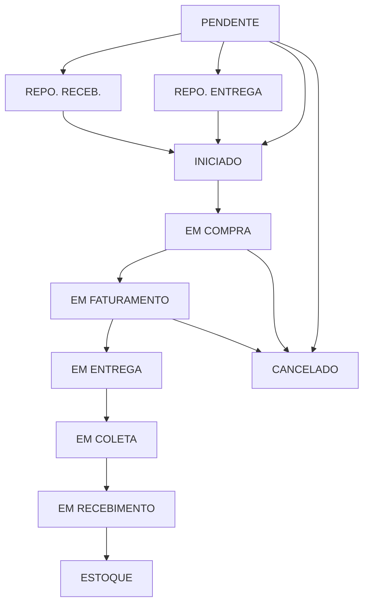
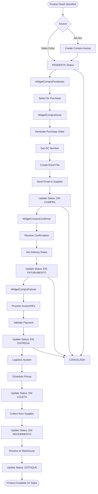
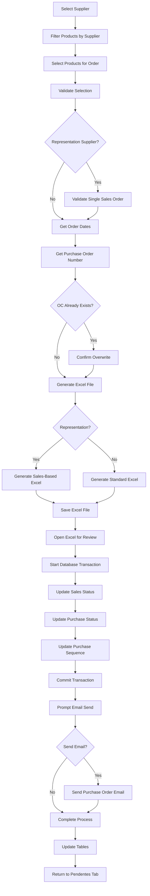
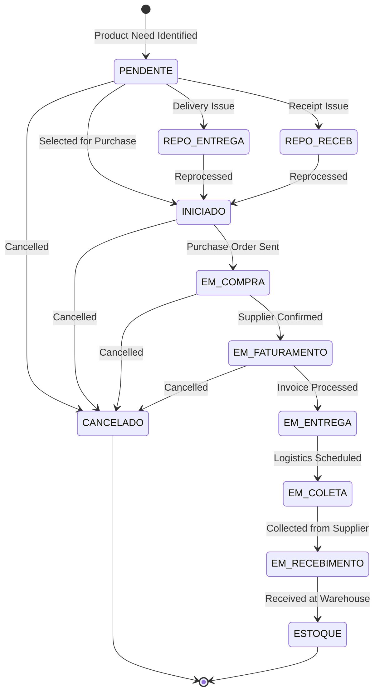
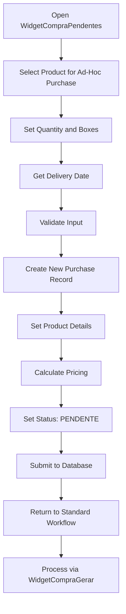
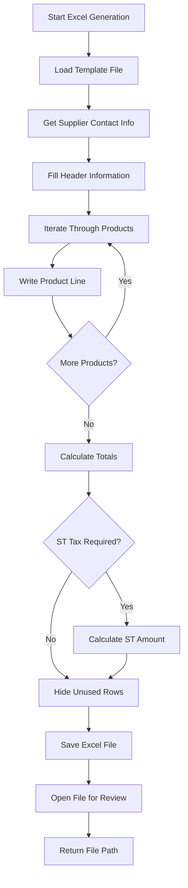

# ERP Staccato - Complete Purchase Process Documentation

## Table of Contents

1. [Overview](#overview)
2. [Database Schema](#database-schema)
3. [Widget Classes](#widget-classes)
4. [Status Flow](#status-flow)
5. [Workflow Stages](#workflow-stages)
6. [Ad-Hoc Purchases](#ad-hoc-purchases)
7. [Excel Generation & Email Integration](#excel-generation--email-integration)
8. [Supplier Management](#supplier-management)
9. [Integration Points](#integration-points)
10. [Brazilian Business Compliance](#brazilian-business-compliance)
11. [Error Handling](#error-handling)
12. [SQL Operations](#sql-operations)
13. [Flowcharts](#flowcharts)

## Overview

The ERP Staccato purchase process is a comprehensive workflow that manages the complete lifecycle from product need identification to stock receipt. The system handles both regular purchases tied to sales orders and ad-hoc purchases for inventory management.

### Key Components
- **Main Tab Manager**: `TabCompras` (`C:\Users\Torres\Dropbox\Projeto_Staccato\erp-staccato\src\tabcompras.cpp`)
- **Core Widgets**: 10 specialized widgets handling different purchase stages
- **Database Tables**: `pedido_fornecedor_has_produto`, `pedido_fornecedor_has_produto2`, `venda_has_produto2`
- **Status Management**: Comprehensive status tracking from PENDENTE to ESTOQUE

## Database Schema

### Core Tables

#### pedido_fornecedor_has_produto
Primary table for supplier orders (initial stage):
```sql
-- Key fields for purchase workflow
idPedido1         -- Primary key for supplier order items
status            -- Status: 'PENDENTE', 'EM COMPRA', 'CANCELADO'
fornecedor        -- Supplier name
idProduto         -- Product ID
descricao         -- Product description
quant             -- Quantity ordered
prcUnitario       -- Unit price
preco             -- Total price
dataPrevCompra    -- Predicted purchase date
ordemCompra       -- Purchase order number
idCompra          -- Unique purchase batch ID
```

#### pedido_fornecedor_has_produto2
Secondary table for confirmed purchases:
```sql
-- Additional tracking fields
idPedido2         -- Secondary ID for purchase tracking
idVendaProduto2   -- Link to sales product
selecionado       -- Selection flag for batch operations
dataRealCompra    -- Actual purchase date
dataPrevConf      -- Predicted confirmation date
dataRealConf      -- Actual confirmation date
dataPrevFat       -- Predicted invoicing date
dataRealFat       -- Actual invoicing date
dataPrevColeta    -- Predicted collection date
dataRealColeta    -- Actual collection date
dataPrevReceb     -- Predicted receipt date
dataRealReceb     -- Actual receipt date
dataPrevEnt       -- Predicted delivery date
dataRealEnt       -- Actual delivery date
```

#### venda_has_produto2
Sales products linked to purchases:
```sql
-- Sales integration fields
idVendaProduto2   -- Primary key
idVenda           -- Sales order ID
status            -- Product status in sales workflow
idCompra          -- Purchase batch ID (links to purchase)
reposicaoEntrega  -- Delivery replacement flag
reposicaoReceb    -- Receipt replacement flag
```

### Database Views

The system uses specialized views for different widgets:

- `view_compras_gerar` - Products ready for purchase generation
- `view_fornecedor_compra_gerar` - Supplier summary for purchase generation
- `view_compras` - Confirmed purchases for processing
- `view_fornecedor_compra_confirmar` - Supplier summary for confirmation
- `view_fornecedor_compra_faturar` - Supplier summary for invoicing
- `view_venda_produto` - Complete product view with sales integration
- `view_compras_financeiro` - Purchase financial information
- `view_ordemcompra_resumo` - Purchase order summary
- `view_ordemcompra` - Detailed purchase order view

## Widget Classes

### 1. WidgetCompraPendentes
**Location**: `C:\Users\Torres\Dropbox\Projeto_Staccato\erp-staccato\src\widgetcomprapendentes.cpp`

**Purpose**: Displays products pending purchase and allows ad-hoc purchase creation

**Key Methods**:
- `montaFiltro()` - Builds complex filters for product status
- `insere(QDate dataPrevista)` - Creates ad-hoc purchase orders
- `setarDadosAvulso()` - Sets up product data for ad-hoc purchases
- `on_pushButtonComprarAvulso_clicked()` - Handles ad-hoc purchase creation

**Database Operations**:
```cpp
// Filter products by status
filtros << "status IN ('PENDENTE', 'REPO. ENTREGA', 'REPO. RECEB.')"

// Create ad-hoc purchase
model.setTable("pedido_fornecedor_has_produto");
model.setData(newRow, "fornecedor", query.value("fornecedor"));
model.setData(newRow, "quant", ui->doubleSpinBoxAvulsoQuant->value());
```

### 2. WidgetCompraGerar
**Location**: `C:\Users\Torres\Dropbox\Projeto_Staccato\erp-staccato\src\widgetcompragerar.cpp`

**Purpose**: Generates purchase orders, creates Excel files, and sends emails to suppliers

**Key Methods**:
- `gerarCompra()` - Creates purchase orders and updates status
- `gerarExcel()` - Generates Excel purchase orders
- `enviarEmail()` - Sends purchase orders to suppliers
- `getOrdemCompra()` - Manages purchase order numbering
- `verificaRepresentacao()` - Checks if supplier is a representation

**Database Operations**:
```cpp
// Update to EM COMPRA status
queryVenda.prepare("UPDATE venda_has_produto2 SET status = 'EM COMPRA', idCompra = :idCompra WHERE status = 'INICIADO'");
queryCompra1.prepare("UPDATE pedido_fornecedor_has_produto set STATUS = 'EM COMPRA', idCompra = :idCompra, ordemCompra = :ordemCompra");
```

**Excel Generation**:
- Uses template: `modelos/compras.xlsx`
- Creates supplier-specific files with purchase order numbers
- Includes product details, quantities, and pricing
- Handles special cases for representation suppliers

### 3. WidgetCompraConfirmar
**Location**: `C:\Users\Torres\Dropbox\Projeto_Staccato\erp-staccato\src\widgetcompraconfirmar.cpp`

**Purpose**: Confirms purchase orders received from suppliers

**Key Methods**:
- `confirmarCompra()` - Moves purchases to invoicing stage
- `on_pushButtonConfirmarCompra_clicked()` - Handles confirmation process

**Database Operations**:
```cpp
// Update to EM FATURAMENTO status
queryVenda.prepare("UPDATE venda_has_produto2 SET status = 'EM FATURAMENTO' WHERE status = 'EM COMPRA'");
queryCompra.prepare("UPDATE pedido_fornecedor_has_produto2 SET status = 'EM FATURAMENTO' WHERE status = 'EM COMPRA'");
```

### 4. WidgetCompraFaturar
**Location**: `C:\Users\Torres\Dropbox\Projeto_Staccato\erp-staccato\src\widgetcomprafaturar.cpp`

**Purpose**: Processes supplier invoices and moves to logistics

**Key Methods**:
- `faturarRepresentacao()` - Special handling for representation invoices
- `on_pushButtonMarcarFaturado_clicked()` - Marks items as invoiced

**Database Operations**:
```cpp
// Update to EM ENTREGA status
queryCompra.prepare("UPDATE pedido_fornecedor_has_produto2 SET status = 'EM ENTREGA' WHERE status = 'EM FATURAMENTO'");
queryVenda.prepare("UPDATE venda_has_produto2 SET status = 'EM ENTREGA' WHERE status = 'EM FATURAMENTO'");
```

### 5. WidgetCompraHistorico
**Location**: `C:\Users\Torres\Dropbox\Projeto_Staccato\erp-staccato\src\widgetcomprahistorico.cpp`

**Purpose**: Displays complete purchase history and tracking

**Key Features**:
- Tree view of purchase hierarchy
- Financial information integration
- NFe (Brazilian electronic invoice) tracking
- Follow-up functionality

### 6. WidgetCompraResumo
**Location**: `C:\Users\Torres\Dropbox\Projeto_Staccato\erp-staccato\src\widgetcompraresumo.cpp`

**Purpose**: Provides high-level summary of all purchase activities

### 7. WidgetCompraConsumos
**Location**: `C:\Users\Torres\Dropbox\Projeto_Staccato\erp-staccato\src\widgetcompraconsumos.cpp`

**Purpose**: Tracks purchase order consumption and usage

### 8. WidgetCompraDevolucao
**Location**: `C:\Users\Torres\Dropbox\Projeto_Staccato\erp-staccato\src\widgetcompradevolucao.cpp`

**Purpose**: Handles product returns and devolutions

### 9. WidgetCompraAvulsa
**Location**: `C:\Users\Torres\Dropbox\Projeto_Staccato\erp-staccato\src\widgetcompraavulsa.cpp`

**Purpose**: Interface for ad-hoc purchase management

### 10. CompraAvulsa (Dialog)
**Location**: `C:\Users\Torres\Dropbox\Projeto_Staccato\erp-staccato\src\compraavulsa.cpp`

**Purpose**: Detailed ad-hoc purchase creation and editing

**Key Features**:
- Product selection and configuration
- Payment term management
- NFe integration
- Financial account linking

## Status Flow

The purchase process follows a strict status progression:



### Status Descriptions

- **PENDENTE**: Product identified for purchase, awaiting processing
- **INICIADO**: Purchase process initiated, ready for order generation
- **EM COMPRA**: Purchase order sent to supplier, awaiting confirmation
- **EM FATURAMENTO**: Supplier confirmed, awaiting invoice processing
- **EM ENTREGA**: Invoice processed, awaiting logistics pickup
- **EM COLETA**: Logistics scheduled, awaiting warehouse collection
- **EM RECEBIMENTO**: Collected from supplier, awaiting warehouse receipt
- **ESTOQUE**: Received in warehouse, available for sales fulfillment
- **CANCELADO**: Purchase cancelled at any stage
- **REPO. ENTREGA**: Replacement for delivery issue
- **REPO. RECEB.**: Replacement for receipt issue

## Workflow Stages

### Stage 1: Need Identification
**Widget**: WidgetCompraPendentes

Products enter the purchase workflow through several paths:
1. **Sales Orders**: Products from confirmed sales that require procurement
2. **Stock Replenishment**: Manual identification of low stock items
3. **Ad-Hoc Requests**: Special orders for specific requirements

**Process**:
```cpp
// Sales-driven purchases automatically set to PENDENTE
// Ad-hoc purchases created through insere() method
modelProduto.setTable("view_venda_produto");
modelProduto.setFilter("status IN ('PENDENTE', 'REPO. ENTREGA', 'REPO. RECEB.')");
```

### Stage 2: Purchase Order Generation
**Widget**: WidgetCompraGerar

**Process Flow**:
1. Select supplier from summary table
2. Choose products for purchase order
3. Get order dates and purchase order number
4. Generate Excel purchase order
5. Send email to supplier
6. Update database status to EM COMPRA

**Key Calculations**:
```cpp
// Calculate total price for selection
for (const auto &index : selection) { 
    preco += modelProdutos.data(index.row(), "preco").toDouble(); 
}

// Generate unique order number
"SELECT ordemCompra_pf + 1 AS ordemCompra FROM maxId WHERE id = 1"
```

**Excel Template Processing**:
```cpp
// Use template file
const QString arquivoModelo = QDir::currentPath() + "/modelos/compras.xlsx";

// Fill in order details
xlsx.write("E4", ordemCompra);
xlsx.write("E5", idVenda);
xlsx.write("E6", fornecedor);
xlsx.write("E8", qApp->serverDateTime().toString("dddd dd 'de' MMMM 'de' yyyy hh:mm"));
```

### Stage 3: Purchase Confirmation
**Widget**: WidgetCompraConfirmar

**Process Flow**:
1. Receive confirmation from supplier
2. Set expected delivery dates
3. Update status to EM FATURAMENTO
4. Trigger financial workflow

**Database Updates**:
```cpp
// Update sales products
"UPDATE venda_has_produto2 SET status = 'EM FATURAMENTO', dataRealConf = :dataRealConf, dataPrevFat = :dataPrevFat WHERE status = 'EM COMPRA'"

// Update purchase products  
"UPDATE pedido_fornecedor_has_produto2 SET status = 'EM FATURAMENTO', dataRealConf = :dataRealConf, dataPrevFat = :dataPrevFat WHERE status = 'EM COMPRA'"
```

### Stage 4: Invoice Processing
**Widget**: WidgetCompraFaturar

**Process Flow**:
1. Receive supplier invoice/NFe
2. Validate against purchase order
3. Process payment authorization
4. Update status to EM ENTREGA
5. Schedule logistics pickup

**Special Handling for Representations**:
```cpp
// Representation suppliers require special processing
if (isRepresentacao) {
    Excel excel(idVenda, Excel::Tipo::Venda, this);
    excel.ordemCompra = ordemCompra;
    excel.anexoCompra = true;
    excel.gerarExcel();
}
```

### Stage 5: Logistics Integration
**Widgets**: Various logistics widgets handle the physical movement

The purchase integrates with the logistics system through status updates:

1. **EM ENTREGA**: Ready for supplier pickup
2. **EM COLETA**: Scheduled for warehouse collection  
3. **EM RECEBIMENTO**: In transit to warehouse
4. **ESTOQUE**: Received and available

**Key Logistics Operations**:
```cpp
// Schedule collection
"UPDATE pedido_fornecedor_has_produto2 SET status = 'EM COLETA', dataRealColeta = :dataRealColeta WHERE status = 'EM ENTREGA'"

// Confirm receipt
"UPDATE pedido_fornecedor_has_produto2 SET status = 'ESTOQUE', dataRealReceb = :dataRealReceb WHERE status = 'EM RECEBIMENTO'"
```

## Ad-Hoc Purchases

### Overview
Ad-hoc purchases (Compra Avulsa) allow purchasing products not tied to specific sales orders. This is used for:
- Stock replenishment
- New product introduction
- Emergency inventory needs
- Special projects

### Implementation
**Main Dialog**: `CompraAvulsa` class
**Widget Interface**: `WidgetCompraAvulsa`

### Database Table
```sql
compra_avulsa TABLE:
- idPedido1: Links to main purchase table
- status: Independent status tracking
- fornecedor: Supplier name
- descricao: Product description
- quant: Quantity
- prcUnitario: Unit price
- preco: Total price
- obs: Observations
```

### Process Flow
1. **Product Selection**: Choose from catalog or create new entry
2. **Quantity Calculation**: Automatic box/unit conversion
3. **Supplier Assignment**: Link to supplier database
4. **Financial Integration**: Connect to accounts payable
5. **Purchase Order Generation**: Standard Excel/email workflow

```cpp
// Ad-hoc purchase creation
void WidgetCompraPendentes::insere(const QDate dataPrevista) {
    SqlTableModel model;
    model.setTable("pedido_fornecedor_has_produto");
    
    const int newRow = model.insertRowAtEnd();
    
    model.setData(newRow, "fornecedor", query.value("fornecedor"));
    model.setData(newRow, "quant", ui->doubleSpinBoxAvulsoQuant->value());
    model.setData(newRow, "dataPrevCompra", dataPrevista);
    
    model.submitAll();
}
```

## Excel Generation & Email Integration

### Excel Templates
**Location**: `C:\Users\Torres\Dropbox\Projeto_Staccato\erp-staccato\modelos\compras.xlsx`

### Template Structure
- **Header Section**: Company information, order details
- **Product Section**: Detailed line items with pricing
- **Footer Section**: Totals, special instructions
- **Metadata**: Order numbers, dates, supplier contact

### Excel Population Process
```cpp
QString WidgetCompraGerar::gerarExcel(const QModelIndexList &list, const int ordemCompra, const bool isRepresentacao) {
    // Load template
    const QString arquivoModelo = QDir::currentPath() + "/modelos/compras.xlsx";
    QXlsx::Document xlsx(arquivoModelo, this);
    
    // Fill header information
    xlsx.write("E4", ordemCompra);              // Order number
    xlsx.write("E5", idVenda);                  // Sales reference
    xlsx.write("E6", fornecedor);               // Supplier name
    xlsx.write("E7", contatoNome);              // Contact person
    xlsx.write("E8", currentDateTime);          // Generation timestamp
    
    // Process line items
    for (const auto &index : list) {
        xlsx.write("A" + QString::number(13 + excelRow), QString::number(excelRow + 1));  // Line number
        xlsx.write("B" + QString::number(13 + excelRow), codComercial);                   // Product code
        xlsx.write("C" + QString::number(13 + excelRow), descricao);                      // Description
        xlsx.write("E" + QString::number(13 + excelRow), prcUnitario);                    // Unit price
        xlsx.write("F" + QString::number(13 + excelRow), unidade);                        // Unit
        xlsx.write("G" + QString::number(13 + excelRow), quantidade);                     // Quantity
        xlsx.write("H" + QString::number(13 + excelRow), precoTotal);                     // Total price
    }
    
    // Handle Brazilian tax calculations (ST - Substituição Tributária)
    if (st == "ST Fornecedor") {
        xlsx.write("G200", "ST:");
        xlsx.write("H200", total * aliquotaSt / 100);
    }
    
    // Save and open file
    xlsx.saveAs(fileName);
    QDesktopServices::openUrl(QUrl::fromLocalFile(fileName));
    
    return fileName;
}
```

### Email Integration
**Class**: `SendMail`
**Purpose**: Automated email sending to suppliers

### Email Process
```cpp
void WidgetCompraGerar::enviarEmail(const QString &razaoSocial, const QString &anexo) {
    QMessageBox msgBox(QMessageBox::Question, "Enviar E-mail?", "Deseja enviar e-mail?", 
                       QMessageBox::Yes | QMessageBox::No, this);
    
    if (msgBox.exec() == QMessageBox::Yes) {
        auto *mail = new SendMail(SendMail::Tipo::GerarCompra, anexo, razaoSocial, this);
        mail->setAttribute(Qt::WA_DeleteOnClose);
        mail->exec();
    }
}
```

### Email Features
- **Automatic Attachment**: Excel purchase orders attached automatically
- **Supplier Lookup**: Email addresses retrieved from supplier database
- **Template Support**: Standardized email templates for different purchase types
- **Delivery Confirmation**: Track email delivery status

## Supplier Management

### Database Integration
Suppliers are managed through the `fornecedor` table with these key fields:
- `razaoSocial`: Legal company name (primary identifier)
- `contatoNome`: Contact person name
- `email`: Contact email address
- `representacao`: Boolean flag for representation suppliers

### Supplier Types

#### 1. Regular Suppliers
Standard suppliers with direct purchase relationships:
```cpp
const bool isRepresentacao = query.value("representacao").toBool();
if (!isRepresentacao) {
    // Standard purchase order processing
    // Direct Excel generation
    // Standard email templates
}
```

#### 2. Representation Suppliers
Special handling for representation relationships:
```cpp
if (isRepresentacao) {
    // Enhanced Excel generation with sales details
    Excel excel(idVenda, Excel::Tipo::Venda, this);
    excel.ordemCompra = ordemCompra;
    excel.anexoCompra = true;
    excel.customFileName = fileName;
    excel.gerarExcel();
    
    // Validation: cannot mix sales in same order
    if (idVendaList.size() > 1) { 
        throw RuntimeError("Não pode misturar produtos de vendas diferentes na representação!"); 
    }
}
```

### Supplier Communication
- **Automated Purchase Orders**: Excel files generated and emailed automatically
- **Follow-up Tracking**: Integrated follow-up system for delayed orders
- **Contact Management**: Centralized contact information with automatic lookup

### Special Supplier Cases
```cpp
// Special handling for specific suppliers
const QString idVenda = (fornecedor == "QUARTZOBRAS" or fornecedor == "MC BAUCHEMIE") ? 
                       "" : idVendas.join(", ");
```

## Integration Points

### 1. Sales Integration
**Tables**: `venda_has_produto2`
**Purpose**: Link purchases to specific sales orders

```cpp
// Update sales status when purchase progresses
queryVenda.prepare("UPDATE venda_has_produto2 SET status = 'EM COMPRA', idCompra = :idCompra WHERE status = 'INICIADO'");

// Track sales fulfillment through purchase status
Sql::updateVendaStatus(idVendas);
```

### 2. Financial Integration
**Tables**: `conta_a_pagar_has_pagamento`, `conta_a_pagar_has_idcompra`
**Purpose**: Link purchases to payment obligations

```cpp
// Connect purchases to financial accounts
modelContaIdCompra.setTable("conta_a_pagar_has_idcompra");

// Track payment status for purchase orders
modelPagar.setFilter("idCompra IN (" + ids.join(", ") + ")");
```

### 3. Inventory Integration
**Tables**: `estoque`, `estoque_has_compra`
**Purpose**: Track physical inventory from purchases

```cpp
// Link purchase to inventory receipt
"UPDATE estoque SET status = 'ESTOQUE', idBloco = :idBloco WHERE status = 'EM RECEBIMENTO'"

// Track consumption from purchase
"UPDATE estoque_has_consumo SET status = 'CONSUMO', idBloco = :idBloco WHERE idEstoque = :idEstoque"
```

### 4. Logistics Integration
**Tables**: `veiculo_has_produto`
**Purpose**: Coordinate physical transportation

```cpp
// Schedule pickup from supplier
"UPDATE pedido_fornecedor_has_produto2 SET status = 'EM COLETA', dataPrevColeta = :dataPrevColeta"

// Track delivery to warehouse
"UPDATE veiculo_has_produto SET status = 'COLETADO' WHERE status = 'EM COLETA'"
```

### 5. NFe Integration
**Tables**: `nfe`
**Purpose**: Brazilian electronic invoice processing

```cpp
// Link purchase to received NFe
modelEstoque.setData(newRow, "idNFe", idNFe);

// Update NFe processing status
"UPDATE nfe SET confirmar = TRUE WHERE idNFe = :idNFe"
```

## Brazilian Business Compliance

### 1. NFe (Nota Fiscal Eletrônica)
Electronic invoice system mandatory in Brazil:

```cpp
// NFe processing integration
ui->itemBoxNFe->setSearchDialog(SearchDialog::nfe(false, false, this));

// Import NFe data to purchases
modelEstoque_compra.setTable("estoque_has_compra");
```

### 2. ST (Substituição Tributária)
Tax substitution system for specific products:

```cpp
// Calculate ST in Excel generation
const QString st = modelProdutos.data(firstRow, "st").toString();
if (st == "ST Fornecedor") {
    xlsx.write("G200", "ST:");
    xlsx.write("H200", total * modelProdutos.data(firstRow, "aliquotaSt").toDouble() / 100);
}
```

### 3. ACBr Integration
**Library**: ACBrLib for Brazilian accounting compliance
**Location**: `C:\Users\Torres\Dropbox\Projeto_Staccato\erp-staccato\3rdparty\ACBrLib\`

```cpp
#include "acbr.h"
#include "acbrlib.h"

// Brazilian fiscal document processing
// Automatic tax calculations
// Government reporting compliance
```

### 4. GARE (Guia de Arrecadação Estadual)
State tax payment processing:

```cpp
// Generate GARE for tax payments
"UPDATE conta_a_pagar_has_pagamento SET status = 'LIBERADO GARE', dataPagamento = :dataRealReceb WHERE status = 'PENDENTE GARE'"
```

### 5. CNAB (Centro Nacional de Automação Bancária)
Brazilian banking automation standard:

```cpp
// Banking integration for payments
"UPDATE conta_a_pagar_has_pagamento SET status = 'AGENDADO', idCnab = " + idCnab
```

## Error Handling

### Transaction Management
All critical operations use database transactions:

```cpp
// Start transaction for purchase generation
qApp->startTransaction("WidgetCompraGerar::on_pushButtonGerarCompra");

try {
    gerarCompra(selection, dataCompra, dataPrevista, ordemCompra);
    Sql::updateVendaStatus(idVendas);
    qApp->endTransaction();  // Commit
} catch (...) {
    qApp->rollbackTransaction();  // Rollback on error
    throw;
}
```

### Validation Checks
```cpp
// Validate selection before processing
if (selection.isEmpty()) { 
    throw RuntimeError("Nenhum item selecionado!", this); 
}

// Validate purchase order uniqueness
if (query2.first()) {
    QMessageBox msgBox(QMessageBox::Question, "Atenção!", "O.C. já existe! Continuar?", 
                       QMessageBox::Yes | QMessageBox::No, this);
}

// Validate representation rules
if (idVendaList.size() > 1) { 
    throw RuntimeError("Não pode misturar produtos de vendas diferentes na representação!"); 
}
```

### Error Recovery
```cpp
// Restore status on cancellation
queryVenda.prepare("UPDATE venda_has_produto2 SET status = CASE WHEN reposicaoEntrega THEN 'REPO. ENTREGA' "
                   "WHEN reposicaoReceb THEN 'REPO. RECEB.' ELSE 'PENDENTE' END");
```

## SQL Operations

### Key Database Views

#### view_compras_gerar
Products ready for purchase order generation:
```sql
-- Filters products in PENDENTE status
-- Groups by supplier for batch processing
-- Includes pricing and quantity calculations
-- Links to sales orders where applicable
```

#### view_fornecedor_compra_gerar
Supplier summary for purchase generation:
```sql
-- Aggregates pending purchases by supplier
-- Calculates total values per supplier
-- Provides supplier contact information
-- Enables supplier-based filtering
```

#### view_compras
Confirmed purchases ready for processing:
```sql
-- Products in EM COMPRA status and beyond
-- Includes purchase order numbers
-- Links to confirmation dates
-- Integrates financial status
```

### Status Update Queries

#### Generate Purchase Orders
```sql
-- Update sales products
UPDATE venda_has_produto2 
SET status = 'EM COMPRA', 
    idCompra = :idCompra, 
    dataRealCompra = :dataRealCompra, 
    dataPrevConf = :dataPrevConf 
WHERE status = 'INICIADO' AND idVendaProdutoFK = :idVendaProduto1;

-- Update purchase products
UPDATE pedido_fornecedor_has_produto 
SET STATUS = 'EM COMPRA', 
    idCompra = :idCompra, 
    ordemCompra = :ordemCompra, 
    dataRealCompra = :dataRealCompra, 
    dataPrevConf = :dataPrevConf 
WHERE status = 'PENDENTE' AND idPedido1 = :idPedido1;
```

#### Confirm Purchases
```sql
-- Move to invoicing stage
UPDATE venda_has_produto2 
SET status = 'EM FATURAMENTO', 
    dataRealConf = :dataRealConf, 
    dataPrevFat = :dataPrevFat 
WHERE status = 'EM COMPRA' AND idVendaProduto2 IN (
    SELECT idVendaProduto2 FROM pedido_fornecedor_has_produto2 
    WHERE ordemCompra = :ordemCompra AND selecionado = TRUE
);
```

#### Process Invoices
```sql
-- Move to logistics stage
UPDATE pedido_fornecedor_has_produto2 
SET status = 'EM ENTREGA', 
    dataRealFat = :dataRealFat 
WHERE status = 'EM FATURAMENTO' AND idCompra = :idCompra;
```

#### Complete Receipt
```sql
-- Final status update to inventory
UPDATE pedido_fornecedor_has_produto2 
SET status = 'ESTOQUE', 
    dataRealReceb = :dataRealReceb 
WHERE status = 'EM RECEBIMENTO' AND idPedido2 IN (
    SELECT idPedido2 FROM estoque_has_compra WHERE idEstoque = :idEstoque
);
```

### Purchase Order Numbering
```sql
-- Get next purchase order number
SELECT ordemCompra_pf + 1 AS ordemCompra FROM maxId WHERE id = 1;

-- Update sequence after use
UPDATE maxId SET ordemCompra_pf = :oc WHERE id = 1;

-- Check for existing order numbers
SELECT ordemCompra FROM pedido_fornecedor_has_produto 
WHERE ordemCompra = :ordemCompra LIMIT 1;
```

### Unique Purchase ID Generation
```sql
-- Generate unique purchase batch ID
SELECT COALESCE(MAX(idCompra), 0) + 1 AS idCompra 
FROM pedido_fornecedor_has_produto;
```

## Flowcharts

### Complete Purchase Workflow



### Purchase Order Generation Flow



### Status Transition Flow



### Ad-Hoc Purchase Flow



### Excel Generation Detail Flow



---

## File Locations Reference

### Core Source Files
- **Main Tab**: `C:\Users\Torres\Dropbox\Projeto_Staccato\erp-staccato\src\tabcompras.cpp`
- **Purchase Generation**: `C:\Users\Torres\Dropbox\Projeto_Staccato\erp-staccato\src\widgetcompragerar.cpp`
- **Purchase Confirmation**: `C:\Users\Torres\Dropbox\Projeto_Staccato\erp-staccato\src\widgetcompraconfirmar.cpp`
- **Invoice Processing**: `C:\Users\Torres\Dropbox\Projeto_Staccato\erp-staccato\src\widgetcomprafaturar.cpp`
- **Pending Products**: `C:\Users\Torres\Dropbox\Projeto_Staccato\erp-staccato\src\widgetcomprapendentes.cpp`
- **Purchase History**: `C:\Users\Torres\Dropbox\Projeto_Staccato\erp-staccato\src\widgetcomprahistorico.cpp`
- **Ad-Hoc Purchases**: `C:\Users\Torres\Dropbox\Projeto_Staccato\erp-staccato\src\compraavulsa.cpp`

### Templates and Resources
- **Excel Template**: `C:\Users\Torres\Dropbox\Projeto_Staccato\erp-staccato\modelos\compras.xlsx`
- **UI Files**: `C:\Users\Torres\Dropbox\Projeto_Staccato\erp-staccato\ui\tabcompras.ui`

### Dependencies
- **LimeReport**: `C:\Users\Torres\Dropbox\Projeto_Staccato\erp-staccato\3rdparty\LimeReport-1.5.68\`
- **QtXlsxWriter**: `C:\Users\Torres\Dropbox\Projeto_Staccato\erp-staccato\3rdparty\QtXlsxWriter\`
- **ACBr (Brazilian Compliance)**: `C:\Users\Torres\Dropbox\Projeto_Staccato\erp-staccato\3rdparty\ACBrLib\`

---

*This documentation provides a comprehensive overview of the ERP Staccato purchase process. For specific implementation details, refer to the source files in their respective locations.*