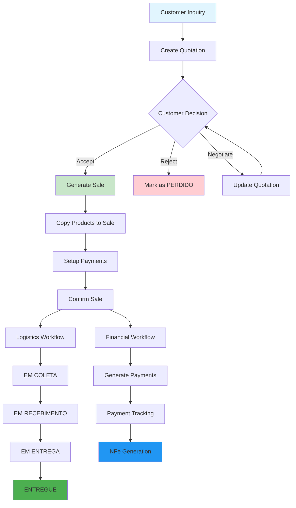

# ERP Staccato - Complete Sales Process Documentation

## Table of Contents
1. [Overview](#overview)
2. [Architecture](#architecture) 
3. [Database Schema](#database-schema)
4. [Sales Workflow](#sales-workflow)
5. [Core Classes Analysis](#core-classes-analysis)
6. [Status Management](#status-management)
7. [UI Components](#ui-components)
8. [Integration Points](#integration-points)
9. [Brazilian Business Requirements](#brazilian-business-requirements)
10. [Configuration & Customization](#configuration--customization)
11. [Code Examples](#code-examples)
12. [Error Handling](#error-handling)

## Overview

The ERP Staccato sales process is a comprehensive system designed specifically for Brazilian businesses, encompassing everything from initial customer inquiry through quotation, sale completion, delivery, and payment tracking. The system is built on Qt C++ with MySQL/MariaDB backend and integrates deeply with Brazilian fiscal requirements including NFe (Electronic Invoice) generation and tax compliance.

### Process Flow Summary
```
Customer Inquiry → Quotation (Orçamento) → Sale (Venda) → Logistics → Delivery → Payment → NFe Generation
```

## Architecture

### Key Design Patterns
- **Model-View Architecture**: Qt's model/view framework with custom delegates
- **Proxy Models**: For filtering and data transformation  
- **Custom Delegates**: For specialized table cell editing
- **Transaction Management**: Database transactions with automatic rollback
- **Exception Handling**: Custom exception classes for business logic errors

### File Organization
```
src/
├── orcamento.cpp/.h           # Quotation dialog and business logic
├── venda.cpp/.h               # Sales dialog and business logic  
├── widgetorcamento.cpp/.h     # Quotation list widget
├── widgetvenda.cpp/.h         # Sales list widget
├── orcamentoproxymodel.cpp/.h # Quotation display proxy model
├── vendaproxymodel.cpp/.h     # Sales display proxy model
├── baixaorcamento.cpp/.h      # Quotation cancellation dialog
├── devolucao.cpp/.h           # Product return management
├── calculofrete.cpp/.h        # Freight calculation
└── widgetpagamentos.cpp/.h    # Payment management widget

ui/
├── orcamento.ui               # Quotation dialog UI
├── venda.ui                   # Sales dialog UI
├── widgetorcamento.ui         # Quotation list UI
└── widgetvenda.ui             # Sales list UI

modelos/
├── orcamento.lrxml            # Quotation report template
└── venda.lrxml                # Sales report template
```

## Database Schema

### Core Sales Tables

#### `orcamento` (Quotations)
**File**: `C:\Users\Torres\Dropbox\Projeto_Staccato\erp-staccato\initdb.sql` (Lines 55-115)

```sql
CREATE TABLE `orcamento` (
  `idAutoInc` INT(11) NOT NULL AUTO_INCREMENT,
  `idOrcamento` VARCHAR(30) NOT NULL,           -- Quotation ID (format: YY.MM.STORE.SEQUENCE)
  `idOrcamentoBase` VARCHAR(11) NULL,           -- Base quotation for replications
  `idLoja` INT(10) UNSIGNED NOT NULL,           -- Store ID
  `idUsuario` INT(10) UNSIGNED NOT NULL,        -- Salesperson ID
  `idUsuarioConsultor` INT(10) UNSIGNED NULL,   -- Consultant ID (referrals)
  `idCliente` INT(10) UNSIGNED NULL,            -- Customer ID
  `idEnderecoEntrega` INT(10) UNSIGNED NULL,    -- Delivery address ID
  `idEnderecoFaturamento` INT(10) UNSIGNED NULL, -- Billing address ID
  `idProfissional` INT(10) UNSIGNED NOT NULL,   -- Professional ID
  `idFollowup` INT(11) NULL,                    -- Last followup ID
  `data` DATETIME NOT NULL,                     -- Quotation date
  `data2` VARCHAR(45) NULL,                     -- Date string (YYYY-MM)
  `subTotalBru` DECIMAL(15,4) NOT NULL DEFAULT '0.0000',  -- Gross subtotal
  `subTotalLiq` DECIMAL(15,4) NOT NULL DEFAULT '0.0000',  -- Net subtotal
  `frete` DECIMAL(15,4) NOT NULL DEFAULT '0.0000',        -- Freight cost
  `freteManual` TINYINT(1) NULL,                          -- Manual freight flag
  `descontoPorc` DECIMAL(15,4) NOT NULL DEFAULT '0.0000', -- Discount percentage
  `descontoReais` DECIMAL(15,4) NOT NULL DEFAULT '0.0000', -- Discount amount
  `total` DECIMAL(15,4) NOT NULL,                         -- Total amount
  `validade` INT(11) NOT NULL DEFAULT '7',                -- Validity in days
  `status` VARCHAR(45) NOT NULL DEFAULT 'ATIVO',          -- Status
  `motivoCancelamento` VARCHAR(45) NULL,                  -- Cancellation reason
  `observacaoCancelamento` VARCHAR(3000) NULL,            -- Cancellation notes
  `observacao` VARCHAR(3000) NULL,                        -- General observations
  `prazoEntrega` INT(11) NULL,                            -- Delivery deadline (days)
  `representacao` TINYINT(1) NULL,                        -- Representation sale flag
  `replicadoDe` VARCHAR(30) NULL,                         -- Source quotation for replicas
  `replicadoEm` VARCHAR(30) NULL,                         -- Target quotation for replicas
  `fornecedores` VARCHAR(200) NULL,                       -- Supplier list
  PRIMARY KEY (`idAutoInc`, `idOrcamento`),
  UNIQUE INDEX `idOrcamento_UNIQUE` (`idOrcamento`)
);
```

#### `venda` (Sales)
**File**: `C:\Users\Torres\Dropbox\Projeto_Staccato\erp-staccato\initdb.sql` (Lines 120-185)

```sql
CREATE TABLE `venda` (
  `idVenda` VARCHAR(30) NOT NULL,               -- Sale ID (format: YY.MM.STORE.SEQUENCE)
  `idVendaBase` VARCHAR(11) NULL,               -- Base sale ID
  `idOrcamento` VARCHAR(30) NULL,               -- Source quotation ID
  `idLoja` INT(10) UNSIGNED NOT NULL,           -- Store ID
  `idUsuario` INT(10) UNSIGNED NOT NULL,        -- Salesperson ID
  `idUsuarioConsultor` INT(10) UNSIGNED NULL,   -- Consultant ID
  `idCliente` INT(10) UNSIGNED NOT NULL,        -- Customer ID
  `idEnderecoEntrega` INT(10) UNSIGNED NOT NULL, -- Delivery address ID
  `idEnderecoFaturamento` INT(10) UNSIGNED NOT NULL, -- Billing address ID
  `idProfissional` INT(10) UNSIGNED NOT NULL,   -- Professional ID
  `idFollowup` INT(11) NULL,                    -- Last followup ID
  `data` DATETIME NOT NULL,                     -- Sale date
  `data2` VARCHAR(45) NULL,                     -- Date string (YYYY-MM)
  `data3` VARCHAR(45) NULL,                     -- Date string (YYYY-MM-DD)
  `dataOrc` DATETIME NOT NULL,                  -- Original quotation date
  `subTotalBru` DECIMAL(15,4) NOT NULL DEFAULT '0.0000',  -- Gross subtotal
  `subTotalLiq` DECIMAL(15,4) NOT NULL DEFAULT '0.0000',  -- Net subtotal
  `frete` DECIMAL(15,4) NOT NULL DEFAULT '0.0000',        -- Freight cost
  `freteManual` TINYINT(1) NULL,                          -- Manual freight flag
  `descontoPorc` DECIMAL(15,4) NOT NULL DEFAULT '0.0000', -- Discount percentage
  `descontoReais` DECIMAL(15,4) NOT NULL DEFAULT '0.0000', -- Discount amount
  `total` DECIMAL(15,4) NOT NULL,                         -- Total amount
  `statusFinanceiro` VARCHAR(45) NULL DEFAULT 'PENDENTE', -- Financial status
  `dataFinanceiro` DATETIME NULL,                         -- Financial completion date
  `status` VARCHAR(45) NOT NULL DEFAULT 'ATIVO',          -- Logistics status
  `observacao` VARCHAR(3000) NULL,                        -- General observations
  `prazoEntrega` INT(11) NOT NULL,                        -- Original delivery deadline
  `novoPrazoEntrega` INT(11) NULL,                        -- Updated delivery deadline
  `representacao` TINYINT(1) NULL DEFAULT '0',            -- Representation sale flag
  `rt` DECIMAL(15,4) NULL,                                -- Professional commission
  `devolucao` TINYINT(1) NULL DEFAULT '0',                -- Return flag
  `fornecedores` VARCHAR(200) NULL,                       -- Supplier list
  `ordemRepresentacao` VARCHAR(90) NULL,                  -- Representation order number
  PRIMARY KEY (`idVenda`),
  FOREIGN KEY (`idOrcamento`) REFERENCES `orcamento` (`idOrcamento`)
);
```

#### `orcamento_has_produto` (Quotation Items)
**File**: `C:\Users\Torres\Dropbox\Projeto_Staccato\erp-staccato\initdb.sql` (Lines 200-250)

Contains detailed product information for quotations including quantities, prices, discounts, and technical specifications.

#### `venda_has_produto` & `venda_has_produto2` (Sale Items)
**File**: `C:\Users\Torres\Dropbox\Projeto_Staccato\erp-staccato\initdb.sql` (Lines 255-350)

Two-level structure for sale items to handle logistics workflow with status transitions from production through delivery.

### Related Tables
- `conta_a_receber_has_pagamento`: Payment tracking
- `orcamento_has_followup`: Quotation followup history
- `venda_has_followup`: Sale followup history
- `cliente`: Customer information
- `profissional`: Professional/architect information
- `produto`: Product catalog
- `loja`: Store/branch information

## Sales Workflow

### Complete Flow Diagram



### Detailed Process Steps

#### 1. Quotation Creation (Orçamento)
**File**: `C:\Users\Torres\Dropbox\Projeto_Staccato\erp-staccato\src\orcamento.cpp`

```cpp
// Constructor initializes the quotation dialog
Orcamento::Orcamento(QWidget *parent) : RegisterDialog("orcamento", "idOrcamento", parent)
{
    ui->setupUi(this);
    connectLineEditsToDirty();
    setItemBoxes();
    setupTables();
    setupMapper();
    newRegister();
}
```

**Key Methods**:
- `generateId()`: Creates unique quotation ID (format: YY.MM.STORE.SEQUENCE)
- `adicionarItem()`: Adds product items to quotation
- `calcularTotais()`: Calculates totals with discounts and freight
- `verificaDisponibilidadeEstoque()`: Checks product availability
- `on_pushButtonGerarVenda_clicked()`: Converts quotation to sale

#### 2. Sale Generation (Venda)
**File**: `C:\Users\Torres\Dropbox\Projeto_Staccato\erp-staccato\src\venda.cpp`

```cpp
// Prepares sale from quotation
void Venda::prepararVenda(const QString &idOrcamento) {
    ui->lineEditIdOrcamento->setText(idOrcamento);
    ui->lineEditVenda->setText("Auto gerado");
    ui->dateTimeEdit->setDate(qApp->serverDate());
    
    copiaProdutosOrcamento();  // Copy products from quotation
    setTreeView();             // Setup product tree view
    
    // Load quotation data
    SqlQuery queryOrc;
    queryOrc.prepare("SELECT idUsuario, idLoja, idUsuarioConsultor, idCliente, "
                     "idEnderecoEntrega, idProfissional, data, subTotalBru, "
                     "subTotalLiq, frete, freteManual, descontoPorc, descontoReais, "
                     "total, status, observacao, prazoEntrega, representacao "
                     "FROM orcamento WHERE idOrcamento = :idOrcamento");
    queryOrc.bindValue(":idOrcamento", idOrcamento);
    
    if (not queryOrc.exec() || not queryOrc.first()) {
        throw RuntimeException("Orçamento não encontrado: '" + idOrcamento + "'");
    }
    
    // Populate sale fields from quotation data
    ui->itemBoxVendedor->setId(queryOrc.value("idUsuario"));
    ui->itemBoxConsultor->setId(queryOrc.value("idUsuarioConsultor"));
    // ... (additional field mappings)
}
```

#### 3. Product Management
**File**: `C:\Users\Torres\Dropbox\Projeto_Staccato\erp-staccato\src\venda.cpp` (Lines 350-400)

```cpp
void Venda::copiaProdutosOrcamento() {
    // Copy products from quotation to sale
    SqlQuery queryItem;
    queryItem.prepare("SELECT * FROM orcamento_has_produto "
                     "WHERE idOrcamento = :idOrcamento");
    queryItem.bindValue(":idOrcamento", ui->lineEditIdOrcamento->text());
    
    if (not queryItem.exec()) {
        throw RuntimeException("Erro buscando produtos: " + queryItem.lastError().text());
    }
    
    while (queryItem.next()) {
        // Insert into venda_has_produto
        const int newRow = modelItem.rowCount();
        modelItem.insertRow(newRow);
        
        // Copy all product data
        modelItem.setData(newRow, "idVenda", ui->lineEditVenda->text());
        modelItem.setData(newRow, "idProduto", queryItem.value("idProduto"));
        modelItem.setData(newRow, "fornecedor", queryItem.value("fornecedor"));
        // ... (copy all fields)
        
        modelItem.setData(newRow, "status", "PENDENTE");
    }
}
```

## Core Classes Analysis

### Orcamento Class
**File**: `C:\Users\Torres\Dropbox\Projeto_Staccato\erp-staccato\src\orcamento.h`

#### Key Attributes
```cpp
class Orcamento final : public RegisterDialog {
private:
    bool replicando = false;          // Replication mode flag
    bool canChangeFrete = false;      // Freight modification permission
    bool currentItemIsEstoque = false; // Current item stock status
    bool isReadOnly = false;          // Read-only mode (expired/closed quotations)
    double minimoFrete = 0.;          // Minimum freight amount
    double minimoGerente = 0.;        // Manager minimum discount
    double porcFrete = 0.;            // Freight percentage
    int currentItemIsPromocao = 0;    // Promotion status
    int currentRowItem = -1;          // Current selected item row
    QDataWidgetMapper mapperItem;     // Item data mapper
    QList<QSqlRecord> backupItem;     // Item backup for undo operations
    QStack<int> blockingSignals;      // Signal blocking stack
    SqlTableModel modelItem;          // Product items model
};
```

#### Key Methods
```cpp
// Core business logic methods
auto cadastrar() -> void final;                    // Save quotation
auto calcPrecoGlobalTotal() -> void;               // Calculate global totals
auto calcularFrete(const bool updateSpinBox) -> void; // Calculate freight
auto calcularTotais() -> std::tuple<double, double, double>; // Calculate totals
auto verificaDisponibilidadeEstoque() -> void;     // Check stock availability
auto on_pushButtonGerarVenda_clicked() -> void;    // Generate sale from quotation

// Item management
auto adicionarItem(const Tipo tipoItem = Tipo::Cadastrar) -> void;
auto atualizarItem() -> void;                      // Update current item
auto removeItem() -> void;                         // Remove current item
auto setarParametrosProduto() -> void;             // Set product parameters

// UI and validation
auto verificaCadastroCliente() -> void;            // Validate customer registration
auto verificaServicosEspeciais() -> bool;          // Check special services
auto verificarTotais() -> void;                    // Validate totals
```

### Venda Class  
**File**: `C:\Users\Torres\Dropbox\Projeto_Staccato\erp-staccato\src\venda.h`

#### Key Attributes
```cpp
class Venda final : public RegisterDialog {
private:
    bool canChangeFrete = false;      // Freight modification permission
    bool correcao = false;            // Correction mode flag
    bool financeiro = false;          // Financial module mode
    bool representacao = false;       // Representation sale flag
    double minimoFrete = 0;           // Minimum freight amount
    double minimoGerente = 0.;        // Manager minimum discount
    double porcFrete = 0;             // Freight percentage
    int idLoja = 0;                   // Store ID
    QList<QSqlRecord> backupItem;     // Item backup
    QStack<int> blockingSignals;      // Signal blocking stack
    SqlTableModel modelFluxoCaixa2;   // Financial flow model (details)
    SqlTableModel modelFluxoCaixa;    // Financial flow model (summary)
    SqlTableModel modelItem2;         // Sale items level 2 (logistics)
    SqlTableModel modelItem;          // Sale items level 1 (base)
    SqlTreeModel modelTree;           // Tree view model
};
```

#### Key Methods
```cpp
// Core business logic
auto prepararVenda(const QString &idOrcamento) -> void; // Prepare sale from quotation
auto cadastrar() -> void final;                         // Save sale
auto copiaProdutosOrcamento() -> void;                   // Copy products from quotation
auto montarFluxoCaixa() -> void;                         // Setup payment flow
auto criarComissaoProfissional() -> void;               // Create professional commission
auto criarConsumos() -> void;                            // Create material consumption records

// Financial management
auto financeiroSalvar() -> void;                        // Save financial data
auto processarPagamento(Pagamento *pgt) -> void;        // Process payment
auto atualizarCredito() -> void;                        // Update customer credit

// Logistics and delivery
auto verificaDisponibilidadeEstoque() -> void;          // Check stock availability
auto verificaFreteLoja() -> void;                       // Validate store freight
auto cancelamento() -> void;                             // Handle cancellation
```

### WidgetOrcamento Class
**File**: `C:\Users\Torres\Dropbox\Projeto_Staccato\erp-staccato\src\widgetorcamento.h`

#### Purpose
Management widget for quotation lists with filtering, searching, and batch operations.

#### Key Features
```cpp
class WidgetOrcamento final : public QWidget {
private:
    bool isSet = false;                    // Initialization flag
    QStack<int> blockingSignals;           // Signal blocking stack
    SqlTableModel modelOrcamento;          // Quotation list model
    
    // Filter and search methods
    auto montaFiltro() -> void;            // Build dynamic filter
    auto fillComboBoxFollowup() -> void;   // Populate followup filter
    auto fillComboBoxFornecedor() -> void; // Populate supplier filter
    auto fillComboBoxLoja() -> void;       // Populate store filter
    auto fillComboBoxVendedor() -> void;   // Populate salesperson filter
};
```

### WidgetVenda Class
**File**: `C:\Users\Torres\Dropbox\Projeto_Staccato\erp-staccato\src\widgetvenda.h`

#### Purpose
Management widget for sales lists with advanced filtering for both logistics and financial status.

#### Key Features
```cpp
class WidgetVenda final : public QWidget {
private:
    bool isSet = false;                    // Initialization flag
    bool financeiro = false;               // Financial mode flag
    QStack<int> blockingSignals;           // Signal blocking stack
    SqlTableModel modelVenda;              // Sales list model
    
    // Advanced filtering
    auto montaFiltro() -> void;            // Build dynamic filter
    auto ajustarGroupBoxStatus() -> void;  // Adjust status filter UI
    auto setFinanceiro() -> void;          // Enable financial filtering
};
```

## Status Management

### Quotation Status Flow
**File**: `C:\Users\Torres\Dropbox\Projeto_Staccato\erp-staccato\src\orcamento.cpp` (Lines 450-470)

```cpp
// Status validation in viewRegister()
const QString status = data("status").toString();
const bool expirado = (qApp->serverDate() > data("data").toDate().addDays(data("validade").toInt()));

if (status == "FECHADO" or status == "PERDIDO") { 
    ui->pushButtonApagarOrc->hide(); 
}

if (status == "PERDIDO" or status == "CANCELADO") {
    ui->labelBaixa->show();
    ui->plainTextEditBaixa->show();
}

if (expirado or status != "ATIVO") {
    isReadOnly = true;
    ui->pushButtonReplicar->show();
    // Disable editing for non-active quotations
}
```

#### Status Definitions
- **ATIVO**: Active quotation, can be edited and converted to sale
- **FECHADO**: Closed/won quotation (converted to sale)  
- **PERDIDO**: Lost quotation (customer declined)
- **CANCELADO**: Cancelled quotation (internal cancellation)

### Sale Status Flow
**File**: `C:\Users\Torres\Dropbox\Projeto_Staccato\erp-staccato\src\venda.cpp` (Lines 200-250)

#### Logistics Status
- **ATIVO**: Active sale, in initial phase
- **EM COLETA**: Products being collected from suppliers
- **EM RECEBIMENTO**: Products being received at warehouse
- **EM ENTREGA**: Products being delivered to customer
- **ENTREGUE**: Products delivered to customer
- **CANCELADO**: Sale cancelled

#### Financial Status  
- **PENDENTE**: Payment pending
- **PAGO**: Fully paid
- **PARCIAL**: Partially paid
- **CANCELADO**: Payment cancelled

### Status Transition Implementation
**File**: `C:\Users\Torres\Dropbox\Projeto_Staccato\erp-staccato\src\baixaorcamento.cpp` (Lines 40-50)

```cpp
// Quotation cancellation/loss marking
void BaixaOrcamento::on_pushButtonSalvar_clicked() {
    if (ui->plainTextEditObservacao->toPlainText().isEmpty()) {
        throw RuntimeError("Deve preencher a observação!", this);
    }
    
    const auto children = ui->groupBox->findChildren<QRadioButton *>(QRegularExpression("radioButton"));
    QString motivo;
    
    for (const auto &child : children) {
        if (child->isChecked()) { motivo = child->text(); }
    }
    
    if (motivo.isEmpty()) { throw RuntimeError("Deve escolher um motivo!", this); }
    
    modelOrcamento.setData(0, "status", "PERDIDO");
    modelOrcamento.setData(0, "motivoCancelamento", motivo);
    modelOrcamento.setData(0, "observacaoCancelamento", ui->plainTextEditObservacao->toPlainText());
    
    modelOrcamento.submitAll();
}
```

## UI Components

### Quotation Dialog (orcamento.ui)
**File**: `C:\Users\Torres\Dropbox\Projeto_Staccato\erp-staccato\ui\orcamento.ui`

#### Main Sections
1. **Customer Information**
   - Customer selection (ItemBox with registration capability)
   - Delivery and billing addresses
   - Professional/architect selection

2. **Product Management**  
   - Product selection and configuration
   - Quantity, pricing, and discount management
   - Stock availability checking
   - Dynamic freight calculation

3. **Totals and Pricing**
   - Subtotal calculations (gross/net)
   - Global discount application  
   - Freight calculation (manual/automatic)
   - Final total with tax implications

4. **Actions**
   - Save/Update quotation
   - Generate sale from quotation
   - Print/Export to PDF/Excel
   - Replicate quotation
   - Follow-up management

### Sale Dialog (venda.ui)
**File**: `C:\Users\Torres\Dropbox\Projeto_Staccato\erp-staccato\ui\venda.ui`

#### Main Sections
1. **Sale Information**
   - Link to source quotation
   - Sale date and delivery deadline
   - Customer and professional information

2. **Product Tree View**
   - Two-level product hierarchy (base + logistics)
   - Status tracking per item
   - Delivery date management
   - Production and logistics scheduling

3. **Financial Management**
   - Payment schedule setup
   - Payment tracking and status
   - Commission calculations
   - Credit management

4. **Logistics Integration**
   - Delivery scheduling
   - Warehouse coordination
   - Transportation management
   - Status updates and notifications

### List Widgets (widgetorcamento.ui, widgetvenda.ui)
**Files**: 
- `C:\Users\Torres\Dropbox\Projeto_Staccato\erp-staccato\ui\widgetorcamento.ui`
- `C:\Users\Torres\Dropbox\Projeto_Staccato\erp-staccato\ui\widgetvenda.ui`

#### Features
1. **Advanced Filtering**
   - Status-based filtering
   - Date range filtering  
   - Salesperson and store filtering
   - Customer and supplier filtering
   - Text search across multiple fields

2. **User Permission Integration**
   - Role-based view restrictions
   - Store-specific filtering for managers
   - Salesperson-specific views

3. **Visual Indicators**
   - Color coding for status (via proxy models)
   - Expiration indicators for quotations
   - Priority highlighting for urgent items

## Integration Points

### Inventory Module Integration
**File**: `C:\Users\Torres\Dropbox\Projeto_Staccato\erp-staccato\src\orcamento.cpp` (Lines 800-850)

```cpp
void Orcamento::verificaDisponibilidadeEstoque() {
    // Check stock availability for quotation items
    for (int row = 0; row < modelItem.rowCount(); ++row) {
        const QString idProduto = modelItem.data(row, "idProduto").toString();
        const double quantRequerida = modelItem.data(row, "quant").toDouble();
        
        SqlQuery queryEstoque;
        queryEstoque.prepare("SELECT SUM(restante) as disponivel FROM view_estoque_disponivel "
                           "WHERE idProduto = :idProduto AND restante > 0");
        queryEstoque.bindValue(":idProduto", idProduto);
        
        if (queryEstoque.exec() && queryEstoque.first()) {
            const double disponivel = queryEstoque.value("disponivel").toDouble();
            const bool temEstoque = (disponivel >= quantRequerida);
            
            modelItem.setData(row, "estoque", temEstoque);
            
            if (!temEstoque) {
                // Trigger purchase workflow for insufficient stock
                criarPedidoCompra(idProduto, quantRequerida - disponivel);
            }
        }
    }
}
```

### Purchase Module Integration  
**File**: `C:\Users\Torres\Dropbox\Projeto_Staccato\erp-staccato\src\venda.cpp` (Lines 600-650)

```cpp
void Venda::criarConsumos() {
    // Create material consumption records for production
    SqlQuery queryConsumo;
    queryConsumo.prepare("INSERT INTO estoque_has_consumo "
                        "(idEstoque, idVendaProduto2, quant, status) "
                        "SELECT e.idEstoque, :idVendaProduto2, :quant, 'TEMP' "
                        "FROM estoque e WHERE e.idProduto = :idProduto "
                        "AND e.restante >= :quant ORDER BY e.dataEntrada LIMIT 1");
    
    for (int row = 0; row < modelItem2.rowCount(); ++row) {
        if (modelItem2.data(row, "status").toString() != "PENDENTE") continue;
        
        const int idVendaProduto2 = modelItem2.data(row, "idVendaProduto2").toInt();
        const QString idProduto = modelItem2.data(row, "idProduto").toString();
        const double quant = modelItem2.data(row, "quant").toDouble();
        
        queryConsumo.bindValue(":idVendaProduto2", idVendaProduto2);
        queryConsumo.bindValue(":idProduto", idProduto);
        queryConsumo.bindValue(":quant", quant);
        
        if (!queryConsumo.exec()) {
            throw RuntimeException("Erro criando consumo: " + queryConsumo.lastError().text());
        }
    }
}
```

### Logistics Module Integration
**File**: `C:\Users\Torres\Dropbox\Projeto_Staccato\erp-staccato\src\venda.cpp` (Lines 400-450)

The sale system integrates with logistics through status management in `venda_has_produto2`:

```cpp
// Status transitions trigger logistics workflow
void Venda::atualizarStatusLogistica(const QString &novoStatus) {
    const int row = getCurrentRow();
    const QString statusAtual = modelItem2.data(row, "status").toString();
    
    // Validate status transition
    if (!isValidStatusTransition(statusAtual, novoStatus)) {
        throw RuntimeError("Transição de status inválida: " + statusAtual + " -> " + novoStatus);
    }
    
    modelItem2.setData(row, "status", novoStatus);
    
    // Update corresponding dates
    if (novoStatus == "EM COLETA") {
        modelItem2.setData(row, "dataRealColeta", QDateTime::currentDateTime());
    } else if (novoStatus == "EM ENTREGA") {
        modelItem2.setData(row, "dataRealEnt", QDateTime::currentDateTime());
    }
    
    // Trigger logistics notifications
    notificarLogistica(modelItem2.data(row, "idVendaProduto2").toInt(), novoStatus);
}
```

### Financial Module Integration
**File**: `C:\Users\Torres\Dropbox\Projeto_Staccato\erp-staccato\src\venda.cpp` (Lines 500-580)

```cpp
void Venda::montarFluxoCaixa() {
    // Generate payment schedule from sale
    const double totalVenda = ui->doubleSpinBoxTotal->value();
    const QDate dataVenda = ui->dateTimeEdit->date();
    const QString idVenda = ui->lineEditVenda->text();
    
    // Get payment configuration from WidgetPagamentos
    const auto pagamentos = ui->widgetPgts->getPagamentos();
    
    for (const auto &pgt : pagamentos) {
        SqlQuery queryPagamento;
        queryPagamento.prepare("INSERT INTO conta_a_receber_has_pagamento "
                             "(dataEmissao, idVenda, idLoja, contraParte, valor, tipo, "
                             "parcela, dataPagamento, observacao, status, representacao) "
                             "VALUES (:dataEmissao, :idVenda, :idLoja, :contraParte, :valor, "
                             ":tipo, :parcela, :dataPagamento, :observacao, :status, :representacao)");
        
        queryPagamento.bindValue(":dataEmissao", dataVenda);
        queryPagamento.bindValue(":idVenda", idVenda);
        queryPagamento.bindValue(":idLoja", User::idLoja);
        queryPagamento.bindValue(":contraParte", ui->itemBoxCliente->text());
        queryPagamento.bindValue(":valor", pgt.valor);
        queryPagamento.bindValue(":tipo", pgt.tipo);
        queryPagamento.bindValue(":parcela", pgt.parcela);
        queryPagamento.bindValue(":dataPagamento", pgt.dataPagamento);
        queryPagamento.bindValue(":observacao", pgt.observacao);
        queryPagamento.bindValue(":status", "PENDENTE");
        queryPagamento.bindValue(":representacao", ui->checkBoxRepresentacao->isChecked());
        
        if (!queryPagamento.exec()) {
            throw RuntimeException("Erro criando pagamento: " + queryPagamento.lastError().text());
        }
    }
}
```

### NFe Integration
**File**: `C:\Users\Torres\Dropbox\Projeto_Staccato\erp-staccato\src\cadastrarnfe.cpp` (Lines 100-150)

```cpp
void CadastrarNFe::setupTables() {
    // Link NFe generation to sale
    modelVenda.setTable("venda");
    modelVenda.setFilter("idVenda = '" + idVenda + "'");
    modelVenda.select();
    
    // Prepare NFe data from sale information
    const QString idCliente = modelVenda.data(0, "idCliente").toString();
    const QString enderecoEntrega = getEnderecoEntrega(modelVenda.data(0, "idEnderecoEntrega").toInt());
    const double total = modelVenda.data(0, "total").toDouble();
    
    // Generate NFe complementary information
    const QString texto = "Venda de código " + modelVenda.data(0, "idVenda").toString() + 
                         "\nEND. ENTREGA: " + enderecoEntrega +
                         "\nInformações Adicionais de Interesse do Fisco: ICMS RECOLHIDO ANTECIPADAMENTE CONFORME ARTIGO 313Y" +
                         "\nTotal Aproximado de tributos federais, estaduais e municipais: R$ " +
                         QLocale(QLocale::Portuguese).toString(total);
    
    ui->infCompSistema->setPlainText(texto);
}
```

## Brazilian Business Requirements

### Electronic Invoice (NFe) Integration
**File**: `C:\Users\Torres\Dropbox\Projeto_Staccato\erp-staccato\src\acbrlib.cpp`

The system integrates with ACBr library for Brazilian fiscal compliance:

```cpp
class ACBrLib {
public:
    // NFe operations
    auto criarNFe(const QString &dadosNFe) -> QString;
    auto assinarNFe(const QString &arquivo) -> bool;
    auto enviarNFe(const QString &arquivo) -> QString;
    auto consultarStatusNFe(const QString &chave) -> QString;
    auto cancelarNFe(const QString &chave, const QString &motivo) -> QString;
    
    // SEFAZ integration
    auto consultarCadastro(const QString &cnpj) -> QString;
    auto verificarServico() -> bool;
    
private:
    QString certificadoPath;      // Digital certificate path
    QString certificadoSenha;     // Digital certificate password
    int ambiente;                 // Environment (1=Production, 2=Homologation)
};
```

### Tax Calculation
**File**: `C:\Users\Torres\Dropbox\Projeto_Staccato\erp-staccato\src\cadastrarnfe.cpp` (Lines 300-400)

```cpp
void CadastrarNFe::calculaIcms() {
    // Calculate ICMS (State Tax)
    const double valorBC = ui->doubleSpinBoxICMSvbc->value();
    const double aliquota = ui->doubleSpinBoxICMSpicms->value();
    const double valorICMS = valorBC * (aliquota / 100.0);
    
    ui->doubleSpinBoxICMSvicms->setValue(valorICMS);
    
    // Calculate ICMS ST (Tax Substitution)
    const double mvaST = ui->doubleSpinBoxICMSpmvast->value();
    const double valorBCST = valorBC * (1 + mvaST / 100.0);
    const double aliquotaST = ui->doubleSpinBoxICMSpicmsst->value();
    const double valorICMSST = (valorBCST * aliquotaST / 100.0) - valorICMS;
    
    ui->doubleSpinBoxICMSvbcst->setValue(valorBCST);
    ui->doubleSpinBoxICMSvicmsst->setValue(valorICMSST);
}

void CadastrarNFe::calculaPis() {
    // Calculate PIS (Social Integration Program Tax)
    const double valorBC = ui->doubleSpinBoxPISvbc->value();
    const double aliquota = ui->doubleSpinBoxPISppis->value();
    const double valorPIS = valorBC * (aliquota / 100.0);
    
    ui->doubleSpinBoxPISvpis->setValue(valorPIS);
}

void CadastrarNFe::calculaCofins() {
    // Calculate COFINS (Social Security Financing Tax)
    const double valorBC = ui->doubleSpinBoxCOFINSvbc->value();
    const double aliquota = ui->doubleSpinBoxCOFINSpcofins->value();
    const double valorCOFINS = valorBC * (aliquota / 100.0);
    
    ui->doubleSpinBoxCOFINSvcofins->setValue(valorCOFINS);
}
```

### Digital Certificate Management
**File**: `C:\Users\Torres\Dropbox\Projeto_Staccato\erp-staccato\src\cadastroloja.cpp` (Lines 200-250)

```cpp
// Store certificate configuration
void CadastroLoja::configurarCertificado() {
    const QString serie = ui->lineEditCertificadoSerie->text();
    const QString senha = ui->lineEditCertificadoSenha->text();
    
    if (serie.isEmpty() || senha.isEmpty()) {
        throw RuntimeError("Certificado digital deve ser configurado para emissão de NFe");
    }
    
    // Validate certificate
    ACBrLib acbr;
    if (!acbr.validarCertificado(serie, senha)) {
        throw RuntimeError("Certificado digital inválido ou expirado");
    }
    
    // Save certificate configuration
    modelLoja.setData(0, "certificadoSerie", serie);
    modelLoja.setData(0, "certificadoSenha", senha);
}
```

### CFOP (Tax Classification) Management
**File**: `C:\Users\Torres\Dropbox\Projeto_Staccato\erp-staccato\initdb.sql` (Lines 100-120)

```sql
CREATE TABLE `cfop` (
  `cfop` VARCHAR(4) NOT NULL,
  `descricao` VARCHAR(255) NOT NULL,
  `aplicacao` VARCHAR(500) NULL,
  `estadual` TINYINT(1) DEFAULT '0',    -- State operation flag
  `interestadual` TINYINT(1) DEFAULT '0', -- Interstate operation flag
  `exterior` TINYINT(1) DEFAULT '0',     -- International operation flag
  PRIMARY KEY (`cfop`)
);
```

Common CFOPs used in the system:
- **5101**: Sale within state
- **6101**: Interstate sale  
- **5102**: Sale within state (non-taxpayer)
- **6102**: Interstate sale (non-taxpayer)
- **5405**: Sale of goods produced by the establishment

## Configuration & Customization

### User Permissions and Roles
**File**: `C:\Users\Torres\Dropbox\Projeto_Staccato\erp-staccato\src\user.cpp`

```cpp
class User {
public:
    static QString nome;          // User name
    static QString tipo;          // User type/role
    static QString idLoja;        // User's store ID
    
    // Permission checking methods
    static bool isAdmin();        // Administrator permissions
    static bool isAdministrativo(); // Administrative permissions  
    static bool isGerente();      // Manager permissions
    static bool isVendedor();     // Salesperson permissions
    static bool isEspecial();     // Special salesperson permissions
    static bool isVendedorOrEspecial(); // Combined salesperson check
    
    // Discount permission validation
    static bool canGiveDiscount(double percentage);
    static double getMaxDiscount();
};

// Implementation examples
bool User::isAdministrativo() { 
    return (User::tipo == "ADMINISTRADOR" || 
            User::tipo == "ADMINISTRATIVO" || 
            User::tipo == "DIRETOR"); 
}

bool User::isVendedorOrEspecial() { 
    return (User::tipo == "VENDEDOR" || 
            User::tipo == "VENDEDOR ESPECIAL"); 
}
```

### Store Configuration
**File**: `C:\Users\Torres\Dropbox\Projeto_Staccato\erp-staccato\src\cadastroloja.cpp`

```cpp
// Store-specific settings affecting sales process
struct LojaConfig {
    double porcentagemFrete = 4.0;      // Default freight percentage
    double valorMinimoFrete = 80.0;     // Minimum freight amount
    double tetoProfissionalRT = 5.0;    // Professional commission cap
    QString cidadesSemQualp;            // Cities without Qualp integration
    
    // Certificate configuration for NFe
    QString certificadoSerie;           // Certificate serial number
    QString certificadoSenha;           // Certificate password
    
    // Tax configuration
    double porcentagemPIS;              // PIS percentage
    double porcentagemCOFINS;           // COFINS percentage
};
```

### Product Parameters
**File**: `C:\Users\Torres\Dropbox\Projeto_Staccato\erp-staccato\src\orcamento.cpp` (Lines 700-750)

```cpp
void Orcamento::setarParametrosProduto() {
    // Configure product-specific parameters for quotation item
    const QString idProduto = dataItem("idProduto").toString();
    
    SqlQuery queryProduto;
    queryProduto.prepare("SELECT peso, caixaFornecedor, quantCaixa, un, promocao, "
                        "kgcx, pesoEspecifico, precoVenda, margemMin "
                        "FROM produto WHERE idProduto = :idProduto");
    queryProduto.bindValue(":idProduto", idProduto);
    
    if (queryProduto.exec() && queryProduto.first()) {
        // Set item parameters from product data
        setDataItem("kg", queryProduto.value("peso"));
        setDataItem("quantCaixa", queryProduto.value("quantCaixa"));
        setDataItem("un", queryProduto.value("un"));
        setDataItem("promocao", queryProduto.value("promocao"));
        
        // Configure pricing constraints
        const double precoVenda = queryProduto.value("precoVenda").toDouble();
        const double margemMin = queryProduto.value("margemMin").toDouble();
        const double precoMinimo = precoVenda * (1 - margemMin / 100.0);
        
        ui->doubleSpinBoxPrecoUn->setMinimum(precoMinimo);
        ui->doubleSpinBoxPrecoUn->setValue(precoVenda);
        
        // Configure quantity constraints
        const double quantCaixa = queryProduto.value("quantCaixa").toDouble();
        ui->doubleSpinBoxQuant->setSingleStep(quantCaixa);
        ui->doubleSpinBoxCaixas->setSingleStep(1.0);
    }
}
```

### Freight Calculation Configuration
**File**: `C:\Users\Torres\Dropbox\Projeto_Staccato\erp-staccato\src\orcamento.cpp` (Lines 550-600)

```cpp
void Orcamento::calcularFrete(const bool updateSpinBox) {
    if (ui->checkBoxFreteManual->isChecked()) return;
    
    const double pesoTotal = calcularPesoTotal();
    const QString cepDestino = ui->itemBoxEndereco->data("cep").toString();
    
    // Get freight parameters from store configuration
    buscarParametrosFrete();
    
    double valorFrete = 0.0;
    
    if (pesoTotal > 0) {
        // Calculate freight based on weight and distance
        const double custoTransporte = porcFrete * pesoTotal / 1000.0; // per ton
        const double distancia = calcularDistancia(cepDestino);
        
        valorFrete = custoTransporte * distancia;
        
        // Apply minimum freight rule
        if (valorFrete < minimoFrete) {
            valorFrete = minimoFrete;
        }
        
        // Apply manager override if available
        if (User::isGerente() && valorFrete < minimoGerente) {
            valorFrete = minimoGerente;
        }
    }
    
    if (updateSpinBox) {
        ui->doubleSpinBoxFrete->setValue(valorFrete);
    }
}
```

## Code Examples

### Complete Quotation to Sale Conversion
**File**: `C:\Users\Torres\Dropbox\Projeto_Staccato\erp-staccato\src\orcamento.cpp` (Lines 1200-1230)

```cpp
void Orcamento::on_pushButtonGerarVenda_clicked() {
    // Validate quotation before conversion
    save(true);  // Save current quotation state
    
    const QDate date = ui->dataEmissao->date();
    if (!date.isValid()) { return; }
    
    // Check quotation validity
    if (qApp->serverDate() > date.addDays(data("validade").toInt())) {
        throw RuntimeError("Orçamento vencido!");
    }
    
    // Validate delivery address
    if (ui->itemBoxEndereco->text().isEmpty()) {
        throw RuntimeError("Deve selecionar endereço!");
    }
    
    // Validate customer registration
    verificaCadastroCliente();
    
    // Create and open sale dialog
    auto *venda = new Venda(parentWidget());
    venda->setAttribute(Qt::WA_DeleteOnClose);
    venda->prepararVenda(ui->lineEditOrcamento->text());
    venda->show();
    
    close();  // Close quotation dialog
}
```

### Advanced Product Search and Selection
**File**: `C:\Users\Torres\Dropbox\Projeto_Staccato\erp-staccato\src\orcamento.cpp` (Lines 900-950)

```cpp
void Orcamento::on_itemBoxProduto_idChanged() {
    const QString idProduto = ui->itemBoxProduto->getId().toString();
    
    if (idProduto.isEmpty()) return;
    
    // Load product information
    SqlQuery queryProduto;
    queryProduto.prepare("SELECT p.*, f.razaoSocial as fornecedor "
                        "FROM produto p "
                        "LEFT JOIN fornecedor f ON p.idFornecedor = f.idFornecedor "
                        "WHERE p.idProduto = :idProduto");
    queryProduto.bindValue(":idProduto", idProduto);
    
    if (queryProduto.exec() && queryProduto.first()) {
        // Populate item fields
        setDataItem("idProduto", idProduto);
        setDataItem("fornecedor", queryProduto.value("fornecedor"));
        setDataItem("produto", queryProduto.value("descricao"));
        setDataItem("codComercial", queryProduto.value("codComercial"));
        setDataItem("formComercial", queryProduto.value("formComercial"));
        setDataItem("un", queryProduto.value("un"));
        setDataItem("quantCaixa", queryProduto.value("quantCaixa"));
        setDataItem("prcUnitario", queryProduto.value("precoVenda"));
        
        // Check stock availability
        verificaDisponibilidadeEstoque();
        
        // Set product parameters
        setarParametrosProduto();
        
        // Calculate initial totals
        calcularTotais();
    }
}
```

### Dynamic Filtering Implementation
**File**: `C:\Users\Torres\Dropbox\Projeto_Staccato\erp-staccato\src\widgetorcamento.cpp` (Lines 250-350)

```cpp
void WidgetOrcamento::montaFiltro() {
    QStringList filtros;
    
    // Store filter (for multi-store operations)
    const QString filtroLoja = (ui->comboBoxLojas->currentText() == "Lojas") ? 
        "" : "idLoja = " + ui->comboBoxLojas->currentData().toString();
    if (!filtroLoja.isEmpty()) { filtros << filtroLoja; }
    
    // Date filter
    const QString filtroMes = (ui->checkBoxMes->isChecked()) ? 
        "data2 = '" + ui->dateEditMes->date().toString("yyyy-MM") + "'" : "";
    if (!filtroMes.isEmpty()) { filtros << filtroMes; }
    
    // Salesperson filter
    const QString idVendedor = ui->comboBoxVendedores->currentData().toString();
    const QString filtroVendedor = (ui->comboBoxVendedores->currentText() == "Vendedores") ? 
        "" : "(idUsuario = " + idVendedor + " OR idUsuarioConsultor = " + idVendedor + ")";
    if (!filtroVendedor.isEmpty()) { filtros << filtroVendedor; }
    
    // Supplier filter
    const QString fornecedor = qApp->sanitizeSQL(ui->comboBoxFornecedores->currentText());
    const QString filtroFornecedor = (fornecedor == "Fornecedores") ? 
        "" : "(fornecedores LIKE '%" + fornecedor + "%')";
    if (!filtroFornecedor.isEmpty()) { filtros << filtroFornecedor; }
    
    // User role filter
    const QString filtroRadio = (ui->radioButtonTodos->isChecked()) ? 
        "" : "(vendedor = '" + qApp->sanitizeSQL(User::nome) + "'" + 
             " OR consultor = '" + qApp->sanitizeSQL(User::nome) + "')";
    if (!filtroRadio.isEmpty()) { filtros << filtroRadio; }
    
    // Status filter
    QStringList filtroCheck;
    const auto children = ui->groupBoxStatus->findChildren<QCheckBox *>(QRegularExpression("checkBox"));
    for (const auto &child : children) {
        if (child->isChecked()) { 
            filtroCheck << "'" + child->text().toUpper() + "'"; 
        }
    }
    if (!filtroCheck.isEmpty()) { 
        filtros << "status IN (" + filtroCheck.join(", ") + ")"; 
    }
    
    // Text search filter
    const QString textoBusca = qApp->sanitizeSQL(ui->lineEditBusca->text());
    const QString filtroBusca = "(idOrcamento LIKE '%" + textoBusca + "%' OR " +
                               "vendedor LIKE '%" + textoBusca + "%' OR " +
                               "cliente LIKE '%" + textoBusca + "%' OR " +
                               "profissional LIKE '%" + textoBusca + "%')";
    if (!textoBusca.isEmpty()) { filtros << filtroBusca; }
    
    // Apply combined filter
    modelOrcamento.setFilter(filtros.join(" AND "));
}
```

### Professional Commission Calculation  
**File**: `C:\Users\Torres\Dropbox\Projeto_Staccato\erp-staccato\src\venda.cpp` (Lines 750-800)

```cpp
void Venda::criarComissaoProfissional() {
    const QString idProfissional = ui->itemBoxProfissional->getId().toString();
    const QString idVenda = ui->lineEditVenda->text();
    const double totalVenda = ui->doubleSpinBoxTotal->value();
    
    if (idProfissional.isEmpty() || totalVenda <= 0) return;
    
    // Get professional commission rate
    SqlQuery queryProf;
    queryProf.prepare("SELECT rt, tetoProfissionalRT FROM profissional p "
                     "INNER JOIN loja l ON p.idLoja = l.idLoja "
                     "WHERE p.idProfissional = :idProfissional");
    queryProf.bindValue(":idProfissional", idProfissional);
    
    if (queryProf.exec() && queryProf.first()) {
        const double rtProfissional = queryProf.value("rt").toDouble();
        const double tetoProfissional = queryProf.value("tetoProfissionalRT").toDouble();
        
        // Calculate commission with ceiling
        double valorComissao = totalVenda * (rtProfissional / 100.0);
        const double valorTeto = totalVenda * (tetoProfissional / 100.0);
        
        if (valorComissao > valorTeto) {
            valorComissao = valorTeto;
        }
        
        // Create commission payment record
        SqlQuery queryComissao;
        queryComissao.prepare("INSERT INTO conta_a_pagar_has_pagamento "
                             "(dataEmissao, contraParte, valor, tipo, dataPagamento, "
                             "observacao, status, idVenda, idLoja) "
                             "VALUES (:dataEmissao, :contraParte, :valor, :tipo, "
                             ":dataPagamento, :observacao, :status, :idVenda, :idLoja)");
        
        queryComissao.bindValue(":dataEmissao", ui->dateTimeEdit->date());
        queryComissao.bindValue(":contraParte", ui->itemBoxProfissional->text());
        queryComissao.bindValue(":valor", valorComissao);
        queryComissao.bindValue(":tipo", "Comissão Profissional");
        queryComissao.bindValue(":dataPagamento", ui->dateTimeEdit->date().addDays(30));
        queryComissao.bindValue(":observacao", "Venda: " + idVenda);
        queryComissao.bindValue(":status", "PENDENTE");
        queryComissao.bindValue(":idVenda", idVenda);
        queryComissao.bindValue(":idLoja", User::idLoja);
        
        if (!queryComissao.exec()) {
            throw RuntimeException("Erro criando comissão: " + queryComissao.lastError().text());
        }
        
        // Update sale record with commission amount
        ui->doubleSpinBoxRT->setValue(valorComissao);
    }
}
```

## Error Handling

### Custom Exception Classes
**File**: `C:\Users\Torres\Dropbox\Projeto_Staccato\erp-staccato\src\application.h`

```cpp
class RuntimeError : public std::runtime_error {
public:
    explicit RuntimeError(const QString &message, QWidget *parent = nullptr) 
        : std::runtime_error(message.toStdString()), parent_(parent) {}
    
    auto showDialog() const -> void {
        QMessageBox::critical(parent_, "Erro", QString::fromStdString(what()));
    }
    
private:
    QWidget *parent_;
};

class RuntimeException : public std::runtime_error {
public:
    explicit RuntimeException(const QString &message) 
        : std::runtime_error(message.toStdString()) {}
};
```

### Transaction Management
**File**: `C:\Users\Torres\Dropbox\Projeto_Staccato\erp-staccato\src\venda.cpp` (Lines 300-350)

```cpp
void Venda::cadastrar() {
    QSqlDatabase::database().transaction();
    
    try {
        // Save main sale record
        RegisterDialog::cadastrar();
        
        // Save sale items
        modelItem.submitAll();
        modelItem2.submitAll();
        
        // Create financial records
        montarFluxoCaixa();
        
        // Create commission records
        criarComissaoProfissional();
        
        // Create material consumption records
        criarConsumos();
        
        // Update quotation status
        SqlQuery queryOrcamento;
        queryOrcamento.prepare("UPDATE orcamento SET status = 'FECHADO' "
                              "WHERE idOrcamento = :idOrcamento");
        queryOrcamento.bindValue(":idOrcamento", ui->lineEditIdOrcamento->text());
        
        if (!queryOrcamento.exec()) {
            throw RuntimeException("Erro atualizando orçamento: " + queryOrcamento.lastError().text());
        }
        
        QSqlDatabase::database().commit();
        
        successMessage();
        
    } catch (const std::exception &e) {
        QSqlDatabase::database().rollback();
        throw RuntimeException("Erro salvando venda: " + QString(e.what()));
    }
}
```

### Validation and Business Rules
**File**: `C:\Users\Torres\Dropbox\Projeto_Staccato\erp-staccato\src\orcamento.cpp` (Lines 1100-1150)

```cpp
void Orcamento::verifyFields() {
    // Validate required fields
    if (ui->itemBoxCliente->text().isEmpty()) {
        throw RuntimeError("Deve selecionar cliente!", this);
    }
    
    if (ui->itemBoxEndereco->text().isEmpty()) {
        throw RuntimeError("Deve selecionar endereço de entrega!", this);
    }
    
    if (ui->itemBoxProfissional->text().isEmpty()) {
        throw RuntimeError("Deve selecionar profissional!", this);
    }
    
    if (modelItem.rowCount() == 0) {
        throw RuntimeError("Deve adicionar pelo menos um produto!", this);
    }
    
    // Validate totals
    verificarTotais();
    
    // Validate special services
    if (!verificaServicosEspeciais()) {
        throw RuntimeError("Serviços especiais não validados!", this);
    }
    
    // Validate customer registration
    verificaCadastroCliente();
    
    // Validate stock availability
    verificaDisponibilidadeEstoque();
}

void Orcamento::verificarTotais() {
    const auto [subTotalBru, subTotalLiq, frete] = calcularTotais();
    const double descontoPorc = ui->doubleSpinBoxDescontoGlobal->value();
    const double descontoReais = ui->doubleSpinBoxDescontoGlobalReais->value();
    const double total = ui->doubleSpinBoxTotal->value();
    
    // Validate discount limits
    if (descontoPorc > getMaxDescontoPorc()) {
        throw RuntimeError("Desconto percentual excede limite permitido!", this);
    }
    
    // Validate minimum values
    if (total < getMinimoVenda()) {
        throw RuntimeError("Valor da venda abaixo do mínimo permitido!", this);
    }
    
    // Validate calculation consistency
    const double totalCalculado = subTotalLiq - descontoReais + frete;
    if (abs(total - totalCalculado) > 0.01) {
        throw RuntimeError("Inconsistência nos totais calculados!", this);
    }
}
```

---

## Summary

The ERP Staccato sales process is a sophisticated system that handles the complete Brazilian sales workflow from quotation to delivery and payment. Key features include:

1. **Complete Integration**: Seamless integration with inventory, purchase, logistics, and financial modules
2. **Brazilian Compliance**: Full NFe support with tax calculations and SEFAZ integration  
3. **Flexible Workflow**: Support for various sales scenarios including representation sales and special services
4. **Robust Architecture**: Transaction-safe operations with comprehensive error handling
5. **User Permission System**: Role-based access control with configurable discount limits
6. **Advanced UI**: Rich desktop interface with filtering, searching, and batch operations

The system is built using modern C++ with Qt framework, providing a robust and maintainable codebase suitable for enterprise-level operations in the Brazilian market.