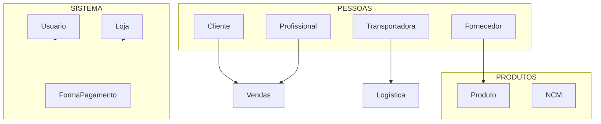

# Módulo: Cadastros

> Status: **Rascunho**
> Prioridade: 6 (base)
> Complexidade: **Baixa**

---

## Visão Geral

O módulo de Cadastros gerencia os dados mestres do sistema: Clientes, Fornecedores, Produtos, Transportadoras, Profissionais, Usuários e Lojas.

### Entidades Principais



---

## Implementação Atual (C++)

### Classes

| Classe                   | Arquivo                      | Finalidade              |
| ------------------------ | ---------------------------- | ----------------------- |
| `CadastroCliente`        | `cadastrocliente.cpp`        | CRUD de clientes        |
| `CadastroFornecedor`     | `cadastrofornecedor.cpp`     | CRUD de fornecedores    |
| `CadastroProduto`        | `cadastroproduto.cpp`        | CRUD de produtos        |
| `CadastroTransportadora` | `cadastrotransportadora.cpp` | CRUD de transportadoras |
| `CadastroProfissional`   | `cadastroprofissional.cpp`   | CRUD de profissionais   |
| `CadastroUsuario`        | `cadastrousuario.cpp`        | CRUD de usuários        |
| `CadastroLoja`           | `cadastroloja.cpp`           | CRUD de lojas           |
| `CadastroNCM`            | `cadastroncm.cpp`            | CRUD de NCM             |
| `CadastroPagamento`      | `cadastropagamento.cpp`      | Formas de pagamento     |
| `CadastroFuncionario`    | `cadastrofuncionario.cpp`    | Funcionários            |

### Tabelas do Banco de Dados

#### Endereços (Compartilhado - Polimórfico)

```sql
-- Tabela compartilhada para endereços de múltiplas entidades
enderecos (POLYMORPHIC)
├── id (PK)
├── enderecavel_type    -- 'cliente', 'fornecedor', 'loja', 'transportadora'
├── enderecavel_id      -- FK para a entidade específica
├── tipo                -- 'principal', 'entrega', 'cobranca'
├── cep
├── logradouro
├── numero
├── complemento
├── bairro
├── cidade
├── uf
├── latitude, longitude -- Geolocalização
├── is_ativo
├── created_at, updated_at
└── UNIQUE(enderecavel_type, enderecavel_id, tipo)
```

**Padrão Polimórfico**: Uma tabela `enderecos` serve Clientes, Fornecedores, Lojas e Transportadoras.
- `enderecavel_type`: Identifica qual entidade (não é FK, é string para flexibilidade)
- `enderecavel_id`: ID da entidade específica
- Unique constraint garante um endereço de cada tipo por entidade

#### Cliente

```sql
cliente
├── id (PK)
├── tipo                      -- PF ou PJ
├── nome_razao                -- Nome/Razão Social
├── nome_fantasia             -- Nome Fantasia
├── cpf_cnpj (UNIQUE)         -- Documento fiscal unificado
├── inscricao_estadual        -- Inscrição Estadual
├── email, telefone           -- Contatos
├── limite_credito            -- Limite de crédito
├── saldo_credito             -- Saldo disponível
├── vendedor_id (FK)          -- Representante vinculado
├── is_incompleto             -- Cadastro incompleto
├── is_ativo
└── deleted_at (Soft Delete)
```

#### Fornecedor

```sql
fornecedor
├── id (PK)
├── razao_social, nome_fantasia
├── cnpj (UNIQUE)
├── inscricao_estadual
├── email, telefone
├── banco, agencia, conta     -- Dados bancários (Phase 2)
├── comissao_1, comissao_2    -- Taxas de comissão (Phase 2)
├── is_representacao          -- É representação? (Phase 2)
├── is_frete_pago_loja        -- Quem paga frete (Phase 2)
├── is_ativo
└── deleted_at (Soft Delete)

-- Endereços: via tabela compartilhada enderecos com enderecavel_type='fornecedor'
```

**Nota**: Dados bancários, comissões e flags de negócio foram adiados para Phase 2.

#### Produto

```sql
produto
├── idProduto (PK)
├── idFornecedor (FK)
├── fornecedor                -- ⚠️ Desnormalizado
├── descricao                 -- Full-text indexado
├── codComercial              -- Código comercial
├── codBarras                 -- Código de barras
├── formComercial             -- Formato comercial
├── un                        -- Unidade
├── quantCaixa                -- Unidades por caixa
├── custo                     -- Preço de custo
├── precoVenda                -- Preço de venda
├── markup                    -- Calculado automaticamente
├── ncm                       -- Classificação NCM
├── cst                       -- CST ICMS
├── icms                      -- Alíquota ICMS
├── st, sticms, mva           -- Substituição tributária
├── estoqueRestante           -- Estoque disponível
├── temLote                   -- Rastreamento de lote
├── descontinuado             -- Descontinuado
└── desativado

-- Constraint: fornecedor + codComercial UNIQUE
```

#### Transportadora

```sql
transportadora
├── idTransportadora (PK)
├── razaoSocial, nomeFantasia
├── cnpj (UNIQUE)
├── inscEstadual
├── antt                      -- Registro ANTT
├── email, tel
└── desativado

transportadora_has_veiculo
├── idVeiculo (PK)
├── idTransportadora (FK)
├── placa
├── modelo
├── capacidade
├── tipo
└── desativado
```

#### Profissional

```sql
profissional
├── idProfissional (PK)
├── nome
├── cpf (UNIQUE)
├── email, tel
├── comissao                  -- Taxa de comissão RT
├── banco, agencia, conta     -- Dados para pagamento
└── desativado
```

#### Usuário

```sql
usuario
├── idUsuario (PK)
├── user (UNIQUE)             -- Username
├── nome
├── tipo                      -- ADMINISTRADOR, GERENTE LOJA, VENDEDOR, etc.
├── idLoja (FK)               -- Loja do usuário
├── email
├── password                  -- SHA_PASSWORD()
├── permissoes                -- JSON ou bitfield
└── desativado
```

#### Loja

```sql
loja
├── id (PK)
├── codigo (UNIQUE)           -- Código da loja
├── nome
├── cnpj (UNIQUE)
├── inscricao_estadual
├── config (JSONB)            -- Configurações flexíveis
├── is_ativo
└── deleted_at (Soft Delete)

-- Endereços: via tabela compartilhada enderecos com enderecavel_type='loja'
```

---

## Implementação Laravel

### Models

```php
// app/Models/Cliente.php
class Cliente extends Model
{
    protected $fillable = [
        'tipo_pessoa', 'razao_social', 'nome_fantasia',
        'cpf', 'cnpj', 'inscricao_estadual',
        'email', 'telefone', 'celular',
        'credito', 'profissional_id',
        'cadastro_incompleto', 'ativo',
    ];

    protected $casts = [
        'tipo_pessoa' => TipoPessoa::class,
        'cadastro_incompleto' => 'boolean',
        'ativo' => 'boolean',
    ];

    public function enderecos(): HasMany
    {
        return $this->hasMany(ClienteEndereco::class);
    }

    public function enderecoEntrega(): HasOne
    {
        return $this->hasOne(ClienteEndereco::class)
            ->where('tipo', TipoEndereco::ENTREGA);
    }

    public function enderecoFaturamento(): HasOne
    {
        return $this->hasOne(ClienteEndereco::class)
            ->where('tipo', TipoEndereco::FATURAMENTO);
    }

    public function profissional(): BelongsTo
    {
        return $this->belongsTo(Profissional::class);
    }

    public function orcamentos(): HasMany
    {
        return $this->hasMany(Orcamento::class);
    }

    public function vendas(): HasMany
    {
        return $this->hasMany(Venda::class);
    }

    // Validação de documento
    public function getDocumentoAttribute(): string
    {
        return $this->tipo_pessoa === TipoPessoa::PF
            ? $this->cpf
            : $this->cnpj;
    }

    // Scope para ativos
    public function scopeAtivos(Builder $query): Builder
    {
        return $query->where('ativo', true);
    }

    // Scope para busca
    public function scopeBusca(Builder $query, string $termo): Builder
    {
        return $query->where(function ($q) use ($termo) {
            $q->where('razao_social', 'like', "%{$termo}%")
              ->orWhere('nome_fantasia', 'like', "%{$termo}%")
              ->orWhere('cpf', 'like', "%{$termo}%")
              ->orWhere('cnpj', 'like', "%{$termo}%");
        });
    }
}

// app/Models/ClienteEndereco.php
class ClienteEndereco extends Model
{
    protected $table = 'cliente_enderecos';

    protected $fillable = [
        'cliente_id', 'tipo',
        'cep', 'logradouro', 'numero', 'complemento',
        'bairro', 'cidade', 'uf',
        'latitude', 'longitude',
        'ativo',
    ];

    protected $casts = [
        'tipo' => TipoEndereco::class,
        'ativo' => 'boolean',
    ];

    public function cliente(): BelongsTo
    {
        return $this->belongsTo(Cliente::class);
    }

    // Formatado
    public function getEnderecoCompletoAttribute(): string
    {
        return "{$this->logradouro}, {$this->numero}" .
            ($this->complemento ? " - {$this->complemento}" : '') .
            " - {$this->bairro}, {$this->cidade}/{$this->uf}";
    }
}

// app/Models/Fornecedor.php
class Fornecedor extends Model
{
    protected $table = 'fornecedores';

    protected $fillable = [
        'razao_social', 'nome_fantasia',
        'cnpj', 'inscricao_estadual',
        'email', 'telefone', 'fax',
        'banco', 'agencia', 'conta',
        'comissao_1', 'comissao_2',
        'representacao', 'frete_pago_loja', 'vem_do_sul',
        'ativo',
    ];

    protected $casts = [
        'representacao' => 'boolean',
        'frete_pago_loja' => 'boolean',
        'vem_do_sul' => 'boolean',
        'ativo' => 'boolean',
    ];

    public function enderecos(): HasMany
    {
        return $this->hasMany(FornecedorEndereco::class);
    }

    public function produtos(): HasMany
    {
        return $this->hasMany(Produto::class);
    }

    public function compras(): HasMany
    {
        return $this->hasMany(Compra::class);
    }
}

// app/Models/Produto.php
class Produto extends Model
{
    protected $fillable = [
        'fornecedor_id', 'descricao', 'codigo_comercial', 'codigo_barras',
        'formato_comercial', 'unidade', 'quantidade_caixa',
        'custo', 'preco_venda', 'markup',
        'ncm', 'cst', 'aliquota_icms',
        'tem_substituicao', 'aliquota_st', 'mva',
        'tem_lote', 'descontinuado', 'ativo',
    ];

    protected $casts = [
        'tem_substituicao' => 'boolean',
        'tem_lote' => 'boolean',
        'descontinuado' => 'boolean',
        'ativo' => 'boolean',
    ];

    public function fornecedor(): BelongsTo
    {
        return $this->belongsTo(Fornecedor::class);
    }

    public function estoques(): HasMany
    {
        return $this->hasMany(Estoque::class);
    }

    // Calcular markup automaticamente
    protected static function booted(): void
    {
        static::saving(function (Produto $produto) {
            if ($produto->custo > 0 && $produto->preco_venda > 0) {
                $produto->markup = (($produto->preco_venda / $produto->custo) - 1) * 100;
            }
        });
    }

    // Estoque disponível
    public function getEstoqueDisponivelAttribute(): float
    {
        return $this->estoques()
            ->disponivel()
            ->sum('quantidade_disponivel');
    }

    // Scope para busca
    public function scopeBusca(Builder $query, string $termo): Builder
    {
        return $query->where(function ($q) use ($termo) {
            $q->where('descricao', 'like', "%{$termo}%")
              ->orWhere('codigo_comercial', 'like', "%{$termo}%")
              ->orWhere('codigo_barras', 'like', "%{$termo}%");
        });
    }
}

// app/Models/Usuario.php
class Usuario extends Authenticatable
{
    protected $table = 'usuarios';

    protected $fillable = [
        'username', 'nome', 'email', 'password',
        'tipo', 'loja_id', 'permissoes', 'ativo',
    ];

    protected $hidden = ['password', 'remember_token'];

    protected $casts = [
        'tipo' => TipoUsuario::class,
        'permissoes' => 'array',
        'ativo' => 'boolean',
    ];

    public function loja(): BelongsTo
    {
        return $this->belongsTo(Loja::class);
    }

    // Verificar permissão
    public function temPermissao(string $permissao): bool
    {
        if ($this->tipo === TipoUsuario::ADMINISTRADOR) {
            return true;
        }

        return in_array($permissao, $this->permissoes ?? []);
    }
}
```

### Enums

```php
// app/Enums/TipoPessoa.php
enum TipoPessoa: string
{
    case PF = 'PF';
    case PJ = 'PJ';

    public function label(): string
    {
        return match($this) {
            self::PF => 'Pessoa Física',
            self::PJ => 'Pessoa Jurídica',
        };
    }
}

// app/Enums/TipoEndereco.php
enum TipoEndereco: string
{
    case ENTREGA = 'ENTREGA';
    case FATURAMENTO = 'FATURAMENTO';
    case AMBOS = 'AMBOS';
}

// app/Enums/TipoUsuario.php
enum TipoUsuario: string
{
    case ADMINISTRADOR = 'ADMINISTRADOR';
    case GERENTE_LOJA = 'GERENTE LOJA';
    case VENDEDOR = 'VENDEDOR';
    case ESTOQUISTA = 'ESTOQUISTA';
    case FINANCEIRO = 'FINANCEIRO';
    case LOGISTICA = 'LOGISTICA';

    public function label(): string
    {
        return match($this) {
            self::ADMINISTRADOR => 'Administrador',
            self::GERENTE_LOJA => 'Gerente de Loja',
            self::VENDEDOR => 'Vendedor',
            self::ESTOQUISTA => 'Estoquista',
            self::FINANCEIRO => 'Financeiro',
            self::LOGISTICA => 'Logística',
        };
    }
}
```

### Services

```php
// app/Services/Cadastros/ClienteService.php
class ClienteService
{
    public function __construct(
        private CepService $cepService
    ) {}

    /**
     * Criar cliente
     */
    public function criar(array $dados): Cliente
    {
        $this->validarDocumento($dados);

        return DB::transaction(function () use ($dados) {
            $cliente = Cliente::create([
                'tipo_pessoa' => $dados['tipo_pessoa'],
                'razao_social' => $dados['razao_social'],
                'nome_fantasia' => $dados['nome_fantasia'] ?? null,
                'cpf' => $dados['cpf'] ?? null,
                'cnpj' => $dados['cnpj'] ?? null,
                'inscricao_estadual' => $dados['inscricao_estadual'] ?? null,
                'email' => $dados['email'] ?? null,
                'telefone' => $dados['telefone'] ?? null,
                'celular' => $dados['celular'] ?? null,
                'profissional_id' => $dados['profissional_id'] ?? null,
            ]);

            // Criar endereços
            if (!empty($dados['enderecos'])) {
                foreach ($dados['enderecos'] as $endereco) {
                    $this->criarEndereco($cliente, $endereco);
                }
            }

            return $cliente;
        });
    }

    /**
     * Criar endereço com consulta de CEP
     */
    public function criarEndereco(Cliente $cliente, array $dados): ClienteEndereco
    {
        // Consultar CEP para completar dados
        if (!empty($dados['cep']) && empty($dados['logradouro'])) {
            $dadosCep = $this->cepService->consultar($dados['cep']);
            $dados = array_merge($dados, $dadosCep);
        }

        return $cliente->enderecos()->create($dados);
    }

    /**
     * Adicionar crédito ao cliente
     */
    public function adicionarCredito(Cliente $cliente, float $valor, string $motivo): void
    {
        DB::transaction(function () use ($cliente, $valor, $motivo) {
            $cliente->increment('credito', $valor);

            // Log de auditoria
            CreditoLog::create([
                'cliente_id' => $cliente->id,
                'valor' => $valor,
                'saldo_anterior' => $cliente->credito - $valor,
                'saldo_novo' => $cliente->credito,
                'motivo' => $motivo,
                'usuario_id' => auth()->id(),
            ]);
        });
    }

    private function validarDocumento(array $dados): void
    {
        if ($dados['tipo_pessoa'] === 'PF') {
            if (empty($dados['cpf'])) {
                throw new ValidationException('CPF é obrigatório para pessoa física');
            }
            if (!$this->validarCpf($dados['cpf'])) {
                throw new ValidationException('CPF inválido');
            }
        } else {
            if (empty($dados['cnpj'])) {
                throw new ValidationException('CNPJ é obrigatório para pessoa jurídica');
            }
            if (!$this->validarCnpj($dados['cnpj'])) {
                throw new ValidationException('CNPJ inválido');
            }
        }
    }

    private function validarCpf(string $cpf): bool
    {
        // Implementação de validação de CPF
        $cpf = preg_replace('/\D/', '', $cpf);
        if (strlen($cpf) !== 11) return false;
        // ... algoritmo de validação
        return true;
    }

    private function validarCnpj(string $cnpj): bool
    {
        // Implementação de validação de CNPJ
        $cnpj = preg_replace('/\D/', '', $cnpj);
        if (strlen($cnpj) !== 14) return false;
        // ... algoritmo de validação
        return true;
    }
}

// app/Services/Cadastros/CepService.php
class CepService
{
    /**
     * Consultar CEP via API
     */
    public function consultar(string $cep): array
    {
        $cep = preg_replace('/\D/', '', $cep);

        $response = Http::get("https://viacep.com.br/ws/{$cep}/json/");

        if ($response->failed() || isset($response['erro'])) {
            throw new CepNotFoundException("CEP {$cep} não encontrado");
        }

        $dados = $response->json();

        return [
            'logradouro' => $dados['logradouro'],
            'bairro' => $dados['bairro'],
            'cidade' => $dados['localidade'],
            'uf' => $dados['uf'],
        ];
    }
}
```

### Controllers

```php
// app/Http/Controllers/ClienteController.php
class ClienteController extends Controller
{
    public function __construct(
        private ClienteService $clienteService
    ) {}

    public function index(Request $request)
    {
        $clientes = Cliente::query()
            ->with('profissional:id,nome')
            ->when($request->busca, fn($q) => $q->busca($request->busca))
            ->when($request->tipo_pessoa, fn($q) => $q->where('tipo_pessoa', $request->tipo_pessoa))
            ->when(!$request->mostrar_inativos, fn($q) => $q->ativos())
            ->orderBy('razao_social')
            ->paginate(50);

        return Inertia::render('Cadastros/Clientes/Index', [
            'clientes' => $clientes,
            'filters' => $request->only(['busca', 'tipo_pessoa', 'mostrar_inativos']),
        ]);
    }

    public function store(CriarClienteRequest $request)
    {
        $cliente = $this->clienteService->criar($request->validated());

        return redirect()->route('clientes.show', $cliente)
            ->with('success', 'Cliente criado com sucesso');
    }

    public function show(Cliente $cliente)
    {
        $cliente->load(['enderecos', 'profissional', 'vendas' => fn($q) => $q->latest()->limit(10)]);

        return Inertia::render('Cadastros/Clientes/Show', [
            'cliente' => $cliente,
        ]);
    }

    public function update(Cliente $cliente, AtualizarClienteRequest $request)
    {
        $cliente->update($request->validated());

        return back()->with('success', 'Cliente atualizado');
    }

    public function destroy(Cliente $cliente)
    {
        // Soft delete
        $cliente->update(['ativo' => false]);

        return redirect()->route('clientes.index')
            ->with('success', 'Cliente desativado');
    }
}

// app/Http/Controllers/ProdutoController.php
class ProdutoController extends Controller
{
    public function index(Request $request)
    {
        $produtos = Produto::query()
            ->with('fornecedor:id,razao_social')
            ->when($request->busca, fn($q) => $q->busca($request->busca))
            ->when($request->fornecedor_id, fn($q) => $q->where('fornecedor_id', $request->fornecedor_id))
            ->when(!$request->mostrar_inativos, fn($q) => $q->where('ativo', true))
            ->orderBy('descricao')
            ->paginate(50);

        return Inertia::render('Cadastros/Produtos/Index', [
            'produtos' => $produtos,
        ]);
    }

    public function store(CriarProdutoRequest $request)
    {
        $produto = Produto::create($request->validated());

        return redirect()->route('produtos.show', $produto)
            ->with('success', 'Produto criado');
    }

    public function verificarEstoque(Produto $produto)
    {
        $estoques = $produto->estoques()
            ->disponivel()
            ->with(['fornecedor:id,razao_social', 'bloco:id,nome'])
            ->fifo()
            ->get();

        return response()->json([
            'total_disponivel' => $estoques->sum('quantidade_disponivel'),
            'lotes' => $estoques,
        ]);
    }
}
```

### Rotas

```php
// routes/web.php
Route::middleware(['auth'])->prefix('cadastros')->name('cadastros.')->group(function () {
    // Clientes
    Route::resource('clientes', ClienteController::class);
    Route::post('clientes/{cliente}/endereco', [ClienteController::class, 'adicionarEndereco'])
        ->name('clientes.endereco');
    Route::post('clientes/{cliente}/credito', [ClienteController::class, 'adicionarCredito'])
        ->name('clientes.credito');

    // Fornecedores
    Route::resource('fornecedores', FornecedorController::class);

    // Produtos
    Route::resource('produtos', ProdutoController::class);
    Route::get('produtos/{produto}/estoque', [ProdutoController::class, 'verificarEstoque'])
        ->name('produtos.estoque');

    // Transportadoras
    Route::resource('transportadoras', TransportadoraController::class);
    Route::resource('transportadoras.veiculos', VeiculoController::class)->shallow();

    // Profissionais
    Route::resource('profissionais', ProfissionalController::class);

    // Usuários
    Route::resource('usuarios', UsuarioController::class);

    // Lojas
    Route::resource('lojas', LojaController::class);

    // NCM
    Route::resource('ncm', NcmController::class);

    // Formas de Pagamento
    Route::resource('formas-pagamento', FormaPagamentoController::class);

    // API de CEP
    Route::get('cep/{cep}', [CepController::class, 'consultar'])->name('cep.consultar');
});
```

---

## Componentes de UI

### Lista de Cadastros

- Busca por texto
- Filtros por status (ativo/inativo)
- Paginação
- Ações: Visualizar, Editar, Desativar

### Formulário de Cliente

- Tipo de pessoa (PF/PJ)
- Campos condicionais (CPF ou CNPJ)
- Múltiplos endereços
- Consulta de CEP automática
- Geolocalização

### Formulário de Produto

- Seleção de fornecedor
- Códigos (comercial, barras)
- Precificação (custo, venda, markup)
- Dados fiscais (NCM, CST, ICMS)
- Substituição tributária

### Validações

- CPF/CNPJ válidos
- CEP com consulta automática
- Duplicidade de documentos
- Campos obrigatórios por contexto

---

## Eventos

| Evento              | Dispara                     |
| ------------------- | --------------------------- |
| `ClienteCriado`     | Log de auditoria            |
| `ClienteAtualizado` | Log de auditoria            |
| `CreditoAdicionado` | Notificar financeiro        |
| `ProdutoCriado`     | Indexar para busca          |
| `UsuarioCriado`     | Enviar email de boas-vindas |

---

## Considerações de Migração

### Migração de Dados

1. `cliente` → `clientes` (renomear campos)
2. `cliente_has_endereco` → `cliente_enderecos`
3. `fornecedor` → `fornecedores`
4. `produto` → `produtos` (normalizar fornecedor)
5. `usuario` → `usuarios` (adequar auth Laravel)

### Mudanças

- Normalizar `produto.fornecedor` para `produto.fornecedor_id`
- Password hash compatível com Laravel
- Permissões via Spatie/Laravel-Permission ou similar
- Soft delete padrão
