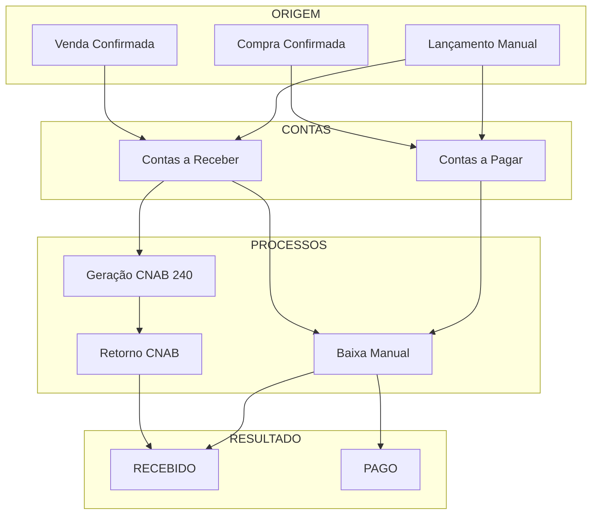
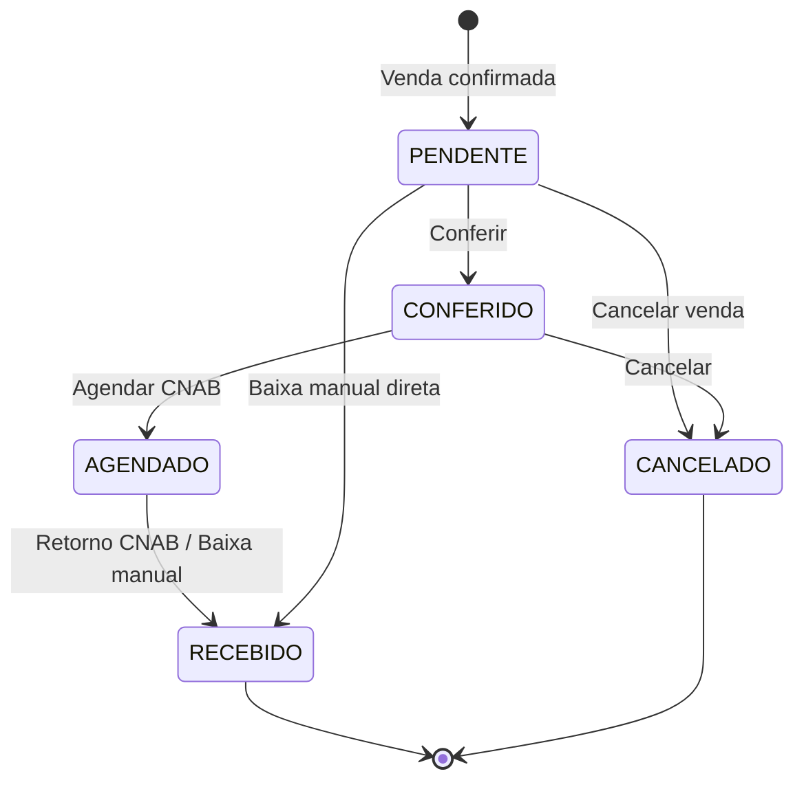
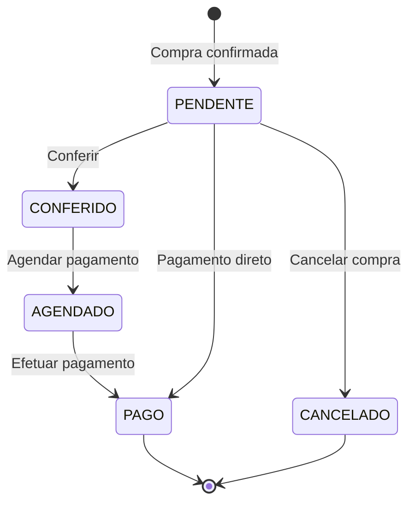

# Módulo: Financeiro

> Status: **Rascunho**
> Prioridade: 3 (crítico para operação)
> Complexidade: **Alta**

---

## Visão Geral

O módulo Financeiro gerencia Contas a Pagar (fornecedores) e Contas a Receber (clientes), incluindo geração de CNAB, baixa automática e conciliação bancária.

### Fluxos Principais



---

## Implementação Atual (C++)

### Classes

| Classe                       | Arquivo                          | Finalidade                      |
| ---------------------------- | -------------------------------- | ------------------------------- |
| `TabFinanceiro`              | `tabfinanceiro.cpp`              | Container principal da aba      |
| `Contas`                     | `contas.cpp`                     | Diálogo unificado Pagar/Receber |
| `WidgetFinanceiroContas`     | `widgetfinanceirocontas.cpp`     | Lista de contas                 |
| `WidgetFinanceiroFluxoCaixa` | `widgetfinanceirofluxocaixa.cpp` | Fluxo de caixa                  |
| `WidgetFinanceiroCompra`     | `widgetfinanceirocompra.cpp`     | Contas de compra                |
| `InputDialogFinanceiro`      | `inputdialogfinanceiro.cpp`      | Entrada de dados                |
| `FinanceiroProxyModel`       | `financeiroproxymodel.cpp`       | Filtros                         |

### Tabelas do Banco de Dados

```sql
-- Contas a Receber
conta_a_receber_has_pagamento
├── idPagamento (PK)
├── idVenda (FK)              -- Venda de origem
├── idLoja (FK)               -- Loja
├── contraParte               -- Nome do cliente
├── tipo                      -- Forma de pagamento (BOLETO, PIX, etc.)
├── parcela                   -- Número da parcela (1/3, 2/3, etc.)
├── valor                     -- Valor previsto
├── valorReal                 -- Valor recebido
├── status                    -- PENDENTE, CONFERIDO, AGENDADO, RECEBIDO, CANCELADO
├── dataPagamento             -- Data de vencimento
├── dataRealizado             -- Data de recebimento
├── idConta (FK)              -- Conta bancária
├── centroCusto               -- Centro de custo
├── tipoReal                  -- Forma real de pagamento
├── parcelaReal               -- Parcela real
├── observacao                -- Observações
├── grupo                     -- Agrupamento (VENDAS, TAXA CARTÃO, etc.)
└── deslesaoBancaria          -- Flag de deslocamento bancário

-- Contas a Pagar
conta_a_pagar_has_pagamento
├── idPagamento (PK)
├── idCompra (FK)             -- Compra de origem
├── idLoja (FK)               -- Loja
├── contraParte               -- Nome do fornecedor
├── tipo                      -- Forma de pagamento
├── parcela                   -- Número da parcela
├── valor                     -- Valor previsto
├── valorReal                 -- Valor pago
├── status                    -- PENDENTE, CONFERIDO, AGENDADO, PAGO, CANCELADO
├── dataPagamento             -- Data de vencimento
├── dataRealizado             -- Data de pagamento
├── idConta (FK)              -- Conta bancária
├── centroCusto               -- Centro de custo
├── grupo                     -- Agrupamento (COMPRAS, RT, DESPESAS, etc.)
├── subGrupo                  -- Subgrupo
├── nroPF                     -- Número do pedido fornecedor
└── observacao                -- Observações

-- Formas de Pagamento
forma_pagamento
├── idPagamento (PK)
├── pagamento                 -- Nome (BOLETO, PIX, CARTÃO, etc.)
├── idConta (FK)              -- Conta bancária padrão
├── parcelas                  -- Número de parcelas
├── taxa                      -- Taxa percentual
├── dMaisUm                   -- D+1 (flag)
├── pula1Mes                  -- Pula primeiro mês (flag)
├── ajustaDiaUtil             -- Ajustar para dia útil (flag)
└── desativado

-- Contas Bancárias
conta
├── idConta (PK)
├── banco                     -- Nome do banco
├── agencia                   -- Número da agência
├── conta                     -- Número da conta
├── tipo                      -- CORRENTE, POUPANÇA
└── saldo                     -- Saldo atual
```

### Fluxo de Estados

#### Contas a Receber



#### Contas a Pagar



### Geração de Contas

#### Contas a Receber (na Venda)

```cpp
// venda.cpp - montarFluxoCaixa()
void Venda::montarFluxoCaixa() {
    // Para cada forma de pagamento selecionada
    for (pagamento : formasPagamento) {
        // Obter configuração da forma de pagamento
        FormaPagamento config = getFormaPagamento(pagamento.tipo);

        // Para cada parcela
        for (int i = 1; i <= config.parcelas; i++) {
            QDate vencimento = calcularVencimento(
                dataVenda,
                i,
                config.dMaisUm,
                config.pula1Mes,
                config.ajustaDiaUtil
            );

            double valorParcela = pagamento.valor / config.parcelas;

            INSERT INTO conta_a_receber_has_pagamento (
                idVenda, idLoja, contraParte,
                tipo, parcela, valor,
                status = 'PENDENTE',
                dataPagamento = vencimento,
                grupo = 'VENDAS'
            );
        }

        // Se for cartão, criar taxa negativa
        if (pagamento.tipo.startsWith("CARTÃO")) {
            INSERT INTO conta_a_receber_has_pagamento (
                valor = -pagamento.valor * config.taxa / 100,
                grupo = 'TAXA CARTÃO',
                status = 'PENDENTE'
            );
        }
    }
}
```

#### Contas a Pagar (na Confirmação de Compra)

```cpp
// widgetcompraconfirmar.cpp
// Criado ao importar NFe do fornecedor
for (duplicata : nfe.duplicatas) {
    INSERT INTO conta_a_pagar_has_pagamento (
        idCompra, idLoja, contraParte = fornecedor,
        tipo = duplicata.tipo,
        parcela = duplicata.numero,
        valor = duplicata.valor,
        status = 'PENDENTE',
        dataPagamento = duplicata.vencimento,
        grupo = 'COMPRAS'
    );
}
```

### Baixa Manual

```cpp
// contas.cpp:100-150 - preencher()
// Quando usuário preenche dataRealizado:
void Contas::preencher(const QModelIndex &index) {
    if (coluna == "dataRealizado") {
        // Auto-preencher campos
        modelPendentes.setData(row, "status", tipo == Receber ? "RECEBIDO" : "PAGO");
        modelPendentes.setData(row, "valorReal", modelPendentes.data(row, "valor"));
        modelPendentes.setData(row, "tipoReal", modelPendentes.data(row, "tipo"));
        modelPendentes.setData(row, "parcelaReal", modelPendentes.data(row, "parcela"));
        modelPendentes.setData(row, "centroCusto", modelPendentes.data(row, "idLoja"));

        // Ajustar para dia útil
        modelPendentes.setData(row, "dataRealizado",
            qApp->ajustarDiaUtil(dataRealizado));

        // Se for taxa de cartão, baixar também
        if (grupo == "VENDAS" && tipoCartao) {
            baixarTaxaCartao(idVenda, tipo, parcela);
        }
    }
}
```

---

## Implementação Laravel (V2 - Event Sourced)

### Models

```php
// app/Models/FinanceiroParcela.php
// Unified table: financeiro_parcelas (tipo: RECEBER or PAGAR)
class FinanceiroParcela extends Model
{
    protected $table = 'financeiro_parcelas';

    protected $fillable = [
        'loja_id', 'tipo',
        'cliente_id', 'fornecedor_id',  // One OR the other depending on tipo
        'venda_id', 'compra_id',
        'nfe_entrada_id',
        'numero_parcela', 'total_parcelas',
        'valor', 'valor_recebido_pago',
        'valor_juros', 'valor_multa', 'valor_desconto',
        'data_vencimento', 'data_recebimento_pagamento',
        'forma_pagamento',
        'status',
        'nosso_numero', 'linha_digitavel', 'codigo_barras',
        'remessa_id', 'documento', 'observacoes',
    ];

    protected $casts = [
        'tipo' => FinanceiroTipo::class,
        'status' => FinanceiroStatus::class,
        'forma_pagamento' => FormaPagamento::class,
        'valor' => 'decimal:2',
        'valor_recebido_pago' => 'decimal:2',
        'valor_juros' => 'decimal:2',
        'valor_multa' => 'decimal:2',
        'valor_desconto' => 'decimal:2',
        'data_vencimento' => 'date',
        'data_recebimento_pagamento' => 'date',
    ];

    public function venda(): BelongsTo
    {
        return $this->belongsTo(Venda::class);
    }

    public function compra(): BelongsTo
    {
        return $this->belongsTo(Compra::class);
    }

    public function cliente(): BelongsTo
    {
        return $this->belongsTo(Cliente::class);
    }

    public function fornecedor(): BelongsTo
    {
        return $this->belongsTo(Fornecedor::class);
    }

    public function loja(): BelongsTo
    {
        return $this->belongsTo(Loja::class);
    }

    public function nfeEntrada(): BelongsTo
    {
        return $this->belongsTo(Nfe::class, 'nfe_entrada_id');
    }

    // View: Contas a Receber
    public static function scopeReceber(Builder $query): Builder
    {
        return $query->where('tipo', FinanceiroTipo::RECEBER);
    }

    // View: Contas a Pagar
    public static function scopePagar(Builder $query): Builder
    {
        return $query->where('tipo', FinanceiroTipo::PAGAR);
    }

    // Vencidos
    public static function scopeVencidos(Builder $query): Builder
    {
        return $query->where('data_vencimento', '<', now()->toDateString())
            ->whereIn('status', [FinanceiroStatus::PENDENTE, FinanceiroStatus::ATRASADO]);
    }

    // A vencer
    public static function scopeAVencer(Builder $query, int $dias = 7): Builder
    {
        return $query->whereBetween('data_vencimento', [now()->toDateString(), now()->addDays($dias)->toDateString()])
            ->where('status', FinanceiroStatus::PENDENTE);
    }

    // Pago/Recebido
    public static function scopePagos(Builder $query): Builder
    {
        return $query->where('status', FinanceiroStatus::PAGO)
            ->orWhere('status', FinanceiroStatus::RECEBIDO);
    }

    // Calcula dias em atraso
    public function diasAtraso(): int
    {
        if ($this->status->isCompleto()) {
            return 0;
        }
        return now()->diffInDays($this->data_vencimento);
    }

    // Valor pendente
    public function valorPendente(): float
    {
        $base = $this->valor + $this->valor_juros + $this->valor_multa - $this->valor_desconto;
        return max(0, $base - $this->valor_recebido_pago);
    }
}

// app/Models/RemessaCnab.php
class RemessaCnab extends Model
{
    protected $table = 'remessas_cnab';

    protected $fillable = [
        'loja_id', 'tipo', 'forma_pagamento',
        'data_geracao', 'sequencia_remessa',
        'arquivo_nome', 'conteudo',
        'status', 'data_envio', 'data_retorno',
    ];

    protected $casts = [
        'tipo' => RemessaTipo::class,
        'status' => RemessaStatus::class,
        'data_geracao' => 'datetime',
        'data_envio' => 'datetime',
        'data_retorno' => 'datetime',
    ];

    public function loja(): BelongsTo
    {
        return $this->belongsTo(Loja::class);
    }

    public function parcelas(): BelongsToMany
    {
        return $this->belongsToMany(FinanceiroParcela::class, 'financeiro_parcelas', 'remessa_id');
    }
}
```

### Event Sourcing (Append-Only Audit Trail)

This module implements Event Sourcing pattern with pg_ivm (PostgreSQL Incremental Materialized Views) for real-time audit logging and state reconstruction.

#### Event Tables (Append-Only)

```php
// Database Schema
CREATE TABLE financeiro_parcelas_events (
    id BIGSERIAL PRIMARY KEY,
    parcela_id BIGINT NOT NULL,                    -- Reference to FinanceiroParcela
    event_type VARCHAR(50) NOT NULL,               -- CRIADA, VALOR_ALTERADO, RECEBIDA, etc.
    event_data JSONB NOT NULL,                     -- Complete event payload
    usuario_id BIGINT,                             -- Who triggered the event
    ip_address INET,                               -- Source IP for audit
    created_at TIMESTAMP NOT NULL DEFAULT NOW()    -- Immutable timestamp
);

-- Immutability constraint: No UPDATE/DELETE allowed
CREATE TRIGGER fn_prevent_mutation_financeiro_events
BEFORE UPDATE OR DELETE ON financeiro_parcelas_events
FOR EACH ROW EXECUTE FUNCTION fn_prevent_mutation();

-- Append-only index for query performance
CREATE INDEX idx_financeiro_events_parcela_tipo
ON financeiro_parcelas_events (parcela_id, event_type, created_at);
```

#### Event Types

```php
// app/Enums/FinanceiroEventType.php
enum FinanceiroEventType: string
{
    case CRIADA = 'CRIADA';                        // Parcela created (from venda/compra)
    case VENCIMENTO_ALTERADO = 'VENCIMENTO_ALTERADO';
    case VALOR_ALTERADO = 'VALOR_ALTERADO';        // Interest/penalty/discount added
    case RECEBIDA = 'RECEBIDA';                    // Payment received
    case PAGA = 'PAGA';                            // Payment made
    case ATRASADA = 'ATRASADA';                    // Status changed to ATRASADO (automatic)
    case CANCELADA = 'CANCELADA';                  // Parcel canceled
    case JUROS_ADICIONADO = 'JUROS_ADICIONADO';
    case MULTA_ADICIONADA = 'MULTA_ADICIONADA';
    case DESCONTO_APLICADO = 'DESCONTO_APLICADO';
    case REMESSA_CNAB_GERADA = 'REMESSA_CNAB_GERADA';
    case RETORNO_PROCESSADO = 'RETORNO_PROCESSADO';
}
```

#### Event Recording Pattern

```php
// app/Services/Financeiro/FinanceiroParcelaService.php
class FinanceiroParcelaService
{
    /**
     * Create parcela and record CRIADA event
     */
    public function criarParcela(array $dados): FinanceiroParcela
    {
        return DB::transaction(function () use ($dados) {
            $parcela = FinanceiroParcela::create($dados);

            // Record event in append-only table
            DB::table('financeiro_parcelas_events')->insert([
                'parcela_id' => $parcela->id,
                'event_type' => FinanceiroEventType::CRIADA->value,
                'event_data' => json_encode([
                    'tipo' => $parcela->tipo,
                    'cliente_id' => $parcela->cliente_id,
                    'fornecedor_id' => $parcela->fornecedor_id,
                    'valor' => $parcela->valor,
                    'data_vencimento' => $parcela->data_vencimento,
                    'origem' => 'VENDA',  // or 'COMPRA', 'MANUAL'
                ]),
                'usuario_id' => auth()->id(),
                'ip_address' => request()->ip(),
                'created_at' => now(),
            ]);

            event(new FinanceiroParcelaCriada($parcela));

            return $parcela;
        });
    }

    /**
     * Record payment and update parcela
     */
    public function registrarRecebimento(
        FinanceiroParcela $parcela,
        float $valor,
        string $formaRecebimento,
        ?string $nossoNumero = null
    ): void {
        DB::transaction(function () use ($parcela, $valor, $formaRecebimento, $nossoNumero) {
            // Record event FIRST (append-only)
            DB::table('financeiro_parcelas_events')->insert([
                'parcela_id' => $parcela->id,
                'event_type' => FinanceiroEventType::RECEBIDA->value,
                'event_data' => json_encode([
                    'valor_recebido' => $valor,
                    'forma_recebimento' => $formaRecebimento,
                    'nosso_numero' => $nossoNumero,
                    'saldo_anterior' => $parcela->valorPendente(),
                    'saldo_novo' => max(0, $parcela->valorPendente() - $valor),
                ]),
                'usuario_id' => auth()->id(),
                'ip_address' => request()->ip(),
                'created_at' => now(),
            ]);

            // Then update materialized view (computed from events)
            $parcela->update([
                'valor_recebido_pago' => $parcela->valor_recebido_pago + $valor,
                'data_recebimento_pagamento' => now(),
                'status' => FinanceiroStatus::RECEBIDO,
                'forma_pagamento' => $formaRecebimento,
            ]);

            event(new FinanceiroParcelaRecebida($parcela, $valor));
        });
    }
}
```

#### Materialized View Maintenance (pg_ivm)

```sql
-- Create materialized view for fast queries (updated incrementally by pg_ivm)
CREATE MATERIALIZED VIEW financeiro_parcelas_view AS
SELECT
    fp.id,
    fp.loja_id,
    fp.tipo,
    fp.cliente_id,
    fp.fornecedor_id,
    fp.valor,
    fp.valor_recebido_pago,
    (fp.valor + fp.valor_juros + fp.valor_multa - fp.valor_desconto - fp.valor_recebido_pago) as saldo_pendente,
    fp.data_vencimento,
    CASE
        WHEN fp.status = 'RECEBIDO' THEN 'RECEBIDO'
        WHEN fp.status = 'PAGO' THEN 'PAGO'
        WHEN fp.status = 'CANCELADO' THEN 'CANCELADO'
        WHEN CURDATE() > fp.data_vencimento AND fp.status NOT IN ('RECEBIDO', 'PAGO', 'CANCELADO')
            THEN 'ATRASADO'
        ELSE fp.status
    END as status_atual,
    fp.created_at,
    MAX(evt.created_at) as ultima_atualizacao
FROM financeiro_parcelas fp
LEFT JOIN financeiro_parcelas_events evt ON evt.parcela_id = fp.id
GROUP BY fp.id, fp.loja_id, fp.tipo, fp.cliente_id, fp.fornecedor_id,
         fp.valor, fp.valor_recebido_pago, fp.valor_juros, fp.valor_multa,
         fp.valor_desconto, fp.data_vencimento, fp.status, fp.created_at;

-- Create IVM trigger to maintain view incrementally
CREATE TRIGGER refresh_financeiro_parcelas_view_on_event
AFTER INSERT ON financeiro_parcelas_events
FOR EACH ROW EXECUTE FUNCTION refresh_ivm_view('financeiro_parcelas_view');
```

#### Audit Trail Query Example

```php
// Query the append-only event log for a specific parcel
$eventos = DB::table('financeiro_parcelas_events')
    ->where('parcela_id', $parcelaId)
    ->orderBy('created_at')
    ->get();

// Reconstruct full history from events
foreach ($eventos as $evento) {
    echo sprintf(
        "[%s] %s: %s (user: %s, ip: %s)\n",
        $evento->created_at->format('Y-m-d H:i:s'),
        $evento->event_type,
        $evento->event_data,
        $evento->usuario_id ?? 'system',
        $evento->ip_address ?? 'unknown'
    );
}
```

#### Key Benefits

- **Immutability**: Events cannot be changed or deleted (fn_prevent_mutation trigger)
- **Audit Trail**: Complete history of all changes with timestamp, user, and IP
- **State Reconstruction**: Can rebuild any parcel state at any point in time
- **Real-time Views**: pg_ivm maintains views incrementally without cron jobs
- **Compliance**: Meets regulatory requirements for financial records
- **Debugging**: Trace exact sequence of changes and who made them

---

### Enums

```php
// app/Enums/FinanceiroTipo.php
enum FinanceiroTipo: string
{
    case RECEBER = 'RECEBER';
    case PAGAR = 'PAGAR';

    public function label(): string
    {
        return match($this) {
            self::RECEBER => 'Contas a Receber',
            self::PAGAR => 'Contas a Pagar',
        };
    }
}

// app/Enums/FinanceiroStatus.php
enum FinanceiroStatus: string
{
    case PENDENTE = 'PENDENTE';
    case AGENDADO = 'AGENDADO';
    case PAGO = 'PAGO';
    case RECEBIDO = 'RECEBIDO';
    case ATRASADO = 'ATRASADO';
    case CANCELADO = 'CANCELADO';

    public function label(): string
    {
        return match($this) {
            self::PENDENTE => 'Pendente',
            self::AGENDADO => 'Agendado',
            self::PAGO => 'Pago',
            self::RECEBIDO => 'Recebido',
            self::ATRASADO => 'Atrasado',
            self::CANCELADO => 'Cancelado',
        };
    }

    public function isCompleto(): bool
    {
        return in_array($this, [self::PAGO, self::RECEBIDO, self::CANCELADO]);
    }
}

// app/Enums/FormaPagamento.php
enum FormaPagamento: string
{
    case DINHEIRO = 'DINHEIRO';
    case PIX = 'PIX';
    case CARTAO_DEBITO = 'CARTAO_DEBITO';
    case CARTAO_CREDITO = 'CARTAO_CREDITO';
    case BOLETO = 'BOLETO';
    case TRANSFERENCIA = 'TRANSFERENCIA';
    case CHEQUE = 'CHEQUE';
    case OUTROS = 'OUTROS';

    public function label(): string
    {
        return match($this) {
            self::DINHEIRO => 'Dinheiro',
            self::PIX => 'PIX',
            self::CARTAO_DEBITO => 'Cartão Débito',
            self::CARTAO_CREDITO => 'Cartão Crédito',
            self::BOLETO => 'Boleto',
            self::TRANSFERENCIA => 'Transferência Bancária',
            self::CHEQUE => 'Cheque',
            self::OUTROS => 'Outros',
        };
    }

    public function temErro(): bool
    {
        return match($this) {
            self::BOLETO, self::CARTAO_CREDITO => true,
            default => false,
        };
    }
}

// NOTE: ContaReceberStatus and ContaPagarStatus are DEPRECATED
// Use the unified FinanceiroStatus enum instead
// Both receivables and payables use the same status values, distinguished by tipo field

// app/Enums/ContaGrupo.php
enum ContaGrupo: string
{
    case VENDAS = 'VENDAS';
    case TAXA_CARTAO = 'TAXA CARTÃO';
    case COMPRAS = 'COMPRAS';
    case RT = 'RT';  // Comissões
    case DESPESAS = 'DESPESAS';
    case IMPOSTOS = 'IMPOSTOS';
    case OUTROS = 'OUTROS';
}
```

### Services

```php
// app/Services/Financeiro/FinanceiroParcelaService.php
//
// UNIFIED SERVICE - Handles both receivables and payables
// Replaces: ContaReceberService, ContaPagarService
// Distinction: tipo field on FinanceiroParcela ('RECEBER' vs 'PAGAR')

class FinanceiroParcelaService
{
    /**
     * Gerar parcelas de venda (contas a receber)
     */
    public function gerarDeVenda(Venda $venda, array $pagamentos): Collection
    {
        return DB::transaction(function () use ($venda, $pagamentos) {
            $parcelas = collect();

            foreach ($pagamentos as $pagamento) {
                $formaPagamento = FormaPagamento::findOrFail($pagamento['forma_pagamento_id']);
                $valorParcela = $pagamento['valor'] / $formaPagamento->parcelas;

                for ($i = 1; $i <= $formaPagamento->parcelas; $i++) {
                    $parcela = FinanceiroParcela::create([
                        'tipo' => FinanceiroTipo::RECEBER,
                        'loja_id' => $venda->loja_id,
                        'venda_id' => $venda->id,
                        'cliente_id' => $venda->cliente_id,
                        'forma_pagamento_id' => $formaPagamento->id,
                        'conta_bancaria_id' => $formaPagamento->conta_bancaria_id,
                        'parcela' => $i,
                        'total_parcelas' => $formaPagamento->parcelas,
                        'valor' => $valorParcela,
                        'status' => FinanceiroStatus::PENDENTE,
                        'grupo' => ContaGrupo::VENDAS,
                        'vencimento' => $formaPagamento->calcularVencimento(
                            $venda->created_at,
                            $i
                        ),
                    ]);

                    // Record event
                    $this->recordarEvento($parcela, 'CRIADA');
                    $parcelas->push($parcela);
                }

                // Criar taxa de cartão se aplicável
                if ($formaPagamento->taxa_percentual > 0) {
                    $taxa = FinanceiroParcela::create([
                        'tipo' => FinanceiroTipo::RECEBER,
                        'loja_id' => $venda->loja_id,
                        'venda_id' => $venda->id,
                        'cliente_id' => $venda->cliente_id,
                        'forma_pagamento_id' => $formaPagamento->id,
                        'valor' => -($pagamento['valor'] * $formaPagamento->taxa_percentual / 100),
                        'status' => FinanceiroStatus::PENDENTE,
                        'grupo' => ContaGrupo::TAXA_CARTAO,
                        'vencimento' => $formaPagamento->calcularVencimento(
                            $venda->created_at,
                            $formaPagamento->parcelas
                        ),
                    ]);

                    $this->recordarEvento($taxa, 'CRIADA');
                    $parcelas->push($taxa);
                }
            }

            return $parcelas;
        });
    }

    /**
     * Gerar parcelas de compra (contas a pagar)
     */
    public function gerarDeCompra(Compra $compra, array $duplicatas): Collection
    {
        return DB::transaction(function () use ($compra, $duplicatas) {
            $parcelas = collect();

            foreach ($duplicatas as $duplicata) {
                $parcela = FinanceiroParcela::create([
                    'tipo' => FinanceiroTipo::PAGAR,
                    'loja_id' => $compra->loja_id,
                    'compra_id' => $compra->id,
                    'fornecedor_id' => $compra->fornecedor_id,
                    'parcela' => $duplicata['numero'],
                    'total_parcelas' => count($duplicatas),
                    'valor' => $duplicata['valor'],
                    'status' => FinanceiroStatus::PENDENTE,
                    'grupo' => ContaGrupo::COMPRAS,
                    'vencimento' => Carbon::parse($duplicata['vencimento']),
                    'numero_documento' => $duplicata['numero_documento'] ?? null,
                ]);

                $this->recordarEvento($parcela, 'CRIADA');
                $parcelas->push($parcela);
            }

            return $parcelas;
        });
    }

    /**
     * Baixar parcela (receber/pagar)
     */
    public function baixar(
        FinanceiroParcela $parcela,
        Carbon $dataMovimentacao,
        ?float $valorReal = null,
        ?int $contaBancariaId = null
    ): void {
        $this->validarBaixa($parcela);

        DB::transaction(function () use ($parcela, $dataMovimentacao, $valorReal, $contaBancariaId) {
            $novoStatus = match ($parcela->tipo) {
                FinanceiroTipo::RECEBER => FinanceiroStatus::RECEBIDA,
                FinanceiroTipo::PAGAR => FinanceiroStatus::PAGA,
            };

            $parcela->update([
                'status' => $novoStatus,
                'data_movimentacao' => $dataMovimentacao,
                'valor_real' => $valorReal ?? $parcela->valor,
                'conta_bancaria_id' => $contaBancariaId ?? $parcela->conta_bancaria_id,
            ]);

            $this->recordarEvento($parcela, 'RECEBIDA/PAGA', [
                'valor' => $valorReal ?? $parcela->valor,
                'data' => $dataMovimentacao->format('Y-m-d'),
            ]);

            // Se for venda, baixar taxa de cartão correspondente
            if ($parcela->grupo === ContaGrupo::VENDAS) {
                $this->baixarTaxaCartaoCorrespondente($parcela, $dataMovimentacao);
            }

            event(new FinanceiroParcelaBaixa($parcela));
        });
    }

    /**
     * Criar comissão (RT) - contas a pagar
     */
    public function criarComissao(
        Venda $venda,
        Profissional $profissional,
        float $valor
    ): FinanceiroParcela {
        return DB::transaction(function () use ($venda, $profissional, $valor) {
            $parcela = FinanceiroParcela::create([
                'tipo' => FinanceiroTipo::PAGAR,
                'loja_id' => $venda->loja_id,
                'fornecedor_id' => null,  // Profissional não é fornecedor
                'parcela' => 1,
                'total_parcelas' => 1,
                'valor' => $valor,
                'status' => FinanceiroStatus::PENDENTE,
                'grupo' => ContaGrupo::RT,
                'vencimento' => now()->addDays(30),
                'observacao' => "Comissão venda #{$venda->id} - {$profissional->nome}",
            ]);

            $this->recordarEvento($parcela, 'CRIADA');
            return $parcela;
        });
    }

    /**
     * Cancelar parcela
     */
    public function cancelar(FinanceiroParcela $parcela, string $motivo): void
    {
        if (in_array($parcela->status, [FinanceiroStatus::RECEBIDA, FinanceiroStatus::PAGA])) {
            throw new BusinessException('Não é possível cancelar parcela já liquidada');
        }

        $parcela->update([
            'status' => FinanceiroStatus::CANCELADA,
            'observacao' => $motivo,
        ]);

        $this->recordarEvento($parcela, 'CANCELADA', ['motivo' => $motivo]);
    }

    /**
     * Baixar taxa de cartão correspondente
     */
    private function baixarTaxaCartaoCorrespondente(FinanceiroParcela $parcela, Carbon $dataMovimentacao): void
    {
        $taxaCartao = FinanceiroParcela::where('venda_id', $parcela->venda_id)
            ->where('forma_pagamento_id', $parcela->forma_pagamento_id)
            ->where('grupo', ContaGrupo::TAXA_CARTAO)
            ->where('status', FinanceiroStatus::PENDENTE)
            ->first();

        if ($taxaCartao) {
            $taxaCartao->update([
                'status' => FinanceiroStatus::RECEBIDA,
                'data_movimentacao' => $dataMovimentacao,
                'valor_real' => $taxaCartao->valor,
            ]);

            $this->recordarEvento($taxaCartao, 'RECEBIDA/PAGA');
        }
    }

    private function validarBaixa(FinanceiroParcela $parcela): void
    {
        $statusPermitidos = [FinanceiroStatus::PENDENTE, FinanceiroStatus::ATRASADA];
        if (!in_array($parcela->status, $statusPermitidos)) {
            throw new BusinessException(
                "Parcela com status {$parcela->status->label()} não pode ser baixada"
            );
        }
    }

    private function recordarEvento(FinanceiroParcela $parcela, string $tipoEvento, array $dados = []): void
    {
        DB::table('financeiro_parcelas_events')->insert([
            'parcela_id' => $parcela->id,
            'event_type' => $tipoEvento,
            'event_data' => json_encode($dados),
            'created_at' => now(),
            'updated_at' => now(),
        ]);
    }
}

// app/Services/Financeiro/CnabService.php
//
// CNAB Processing - Works with unified FinanceiroParcela model
// Handles both receivables (tipo='RECEBER') remittance and return processing

class CnabService
{
    public function __construct(private FinanceiroParcelaService $parcelaService) {}

    /**
     * Gerar arquivo CNAB 240 para cobrança
     * Filtra apenas parcelas RECEBER com forma de pagamento BOLETO
     */
    public function gerarCnab240(Collection $parcelas, ContaBancaria $contaBancaria): string
    {
        // Validar que todas são RECEBER
        if ($parcelas->contains(fn($p) => $p->tipo !== FinanceiroTipo::RECEBER)) {
            throw new BusinessException('CNAB de cobrança deve conter apenas parcelas a receber');
        }

        $cnab = new Cnab240();

        $cnab->setEmpresa([
            'nome' => config('app.empresa_nome'),
            'cnpj' => config('app.empresa_cnpj'),
        ]);

        $cnab->setConta([
            'banco' => $contaBancaria->banco,
            'agencia' => $contaBancaria->agencia,
            'conta' => $contaBancaria->conta,
            'digito' => $contaBancaria->digito,
        ]);

        $parcelas->each(function (FinanceiroParcela $parcela) use ($cnab) {
            $cnab->addBoleto([
                'nosso_numero' => $parcela->id,
                'valor' => $parcela->valor,
                'vencimento' => $parcela->vencimento->format('Y-m-d'),
                'sacado' => [
                    'nome' => $parcela->cliente->razao_social,
                    'cpf_cnpj' => $parcela->cliente->cpf_cnpj,
                    'endereco' => $parcela->cliente->endereco,
                ],
            ]);

            // Marcar como agendado para cobrança
            $parcela->update(['status' => FinanceiroStatus::AGENDADA]);

            DB::table('financeiro_parcelas_events')->insert([
                'parcela_id' => $parcela->id,
                'event_type' => 'REMESSA_CNAB_GERADA',
                'event_data' => json_encode(['banco' => $cnab->getBanco()]),
                'created_at' => now(),
                'updated_at' => now(),
            ]);
        });

        return $cnab->gerar();
    }

    /**
     * Processar arquivo de retorno CNAB
     * Atualiza parcelas com informações de pagamento recebidas do banco
     */
    public function processarRetorno(string $conteudo): array
    {
        $cnab = new Cnab240Retorno($conteudo);
        $processados = [];

        foreach ($cnab->getRegistros() as $registro) {
            if ($registro->isPago()) {
                $parcela = FinanceiroParcela::find($registro->getNossoNumero());

                if ($parcela) {
                    $this->parcelaService->baixar(
                        $parcela,
                        Carbon::parse($registro->getDataPagamento()),
                        $registro->getValorPago()
                    );

                    DB::table('financeiro_parcelas_events')->insert([
                        'parcela_id' => $parcela->id,
                        'event_type' => 'RETORNO_PROCESSADO',
                        'event_data' => json_encode([
                            'banco' => $registro->getBanco(),
                            'sequencial' => $registro->getSequencial(),
                        ]),
                        'created_at' => now(),
                        'updated_at' => now(),
                    ]);

                    $processados[] = $parcela;
                }
            }
        }

        return $processados;
    }
}
```

### Controllers

```php
// app/Http/Controllers/FinanceiroParcelaController.php
//
// UNIFIED CONTROLLER - Handles receivables and payables
// Replaces: ContaReceberController, ContaPagarController
// Routes are filtered by tipo parameter (RECEBER vs PAGAR)

class FinanceiroParcelaController extends Controller
{
    public function __construct(
        private FinanceiroParcelaService $parcelaService
    ) {}

    /**
     * Listar parcelas (contas a receber ou pagar)
     */
    public function index(Request $request, string $tipo = 'RECEBER')
    {
        $tipoEnum = FinanceiroTipo::tryFrom(strtoupper($tipo));
        if (!$tipoEnum) {
            return back()->withErrors('Tipo inválido: deve ser RECEBER ou PAGAR');
        }

        $query = FinanceiroParcela::where('tipo', $tipoEnum);

        if ($tipoEnum === FinanceiroTipo::RECEBER) {
            $parcelas = $query->with(['venda:id', 'cliente:id,razao_social', 'formaPagamento:id,nome'])
                ->when($request->status, fn($q) => $q->where('status', $request->status))
                ->when($request->cliente_id, fn($q) => $q->where('cliente_id', $request->cliente_id))
                ->when($request->vencidos, fn($q) => $q->where('vencimento', '<', now())->where('status', '!=', FinanceiroStatus::RECEBIDA))
                ->when($request->a_vencer, fn($q) => $q->where('vencimento', '<=', now()->addDays($request->a_vencer)))
                ->when($request->periodo, function($q) use ($request) {
                    [$inicio, $fim] = explode(',', $request->periodo);
                    $q->whereBetween('vencimento', [$inicio, $fim]);
                })
                ->orderBy('vencimento')
                ->paginate(50);

            return Inertia::render('Financeiro/Parcelas/Receber', [
                'parcelas' => $parcelas,
                'totais' => [
                    'pendente' => FinanceiroParcela::where('tipo', FinanceiroTipo::RECEBER)
                        ->where('status', FinanceiroStatus::PENDENTE)->sum('valor'),
                    'vencida' => FinanceiroParcela::where('tipo', FinanceiroTipo::RECEBER)
                        ->where('vencimento', '<', now())
                        ->where('status', '!=', FinanceiroStatus::RECEBIDA)
                        ->sum('valor'),
                ],
            ]);
        } else {
            // PAGAR
            $parcelas = $query->with(['compra:id', 'fornecedor:id,razao_social'])
                ->when($request->status, fn($q) => $q->where('status', $request->status))
                ->when($request->fornecedor_id, fn($q) => $q->where('fornecedor_id', $request->fornecedor_id))
                ->when($request->vencidos, fn($q) => $q->where('vencimento', '<', now())->where('status', '!=', FinanceiroStatus::PAGA))
                ->orderBy('vencimento')
                ->paginate(50);

            return Inertia::render('Financeiro/Parcelas/Pagar', [
                'parcelas' => $parcelas,
                'totais' => [
                    'pendente' => FinanceiroParcela::where('tipo', FinanceiroTipo::PAGAR)
                        ->where('status', FinanceiroStatus::PENDENTE)->sum('valor'),
                    'vencida' => FinanceiroParcela::where('tipo', FinanceiroTipo::PAGAR)
                        ->where('vencimento', '<', now())
                        ->where('status', '!=', FinanceiroStatus::PAGA)
                        ->sum('valor'),
                ],
            ]);
        }
    }

    /**
     * Visualizar parcela
     */
    public function show(FinanceiroParcela $parcela)
    {
        return Inertia::render('Financeiro/Parcelas/Show', [
            'parcela' => $parcela->load('eventos'),
            'eventos' => $parcela->eventos()
                ->orderByDesc('created_at')
                ->get(),
        ]);
    }

    /**
     * Baixar parcela (receber/pagar)
     */
    public function baixar(FinanceiroParcela $parcela, BaixarParcelaRequest $request)
    {
        try {
            $this->parcelaService->baixar(
                $parcela,
                Carbon::parse($request->data_movimentacao),
                $request->valor_real ?? $parcela->valor,
                $request->conta_bancaria_id
            );

            return back()->with('success', match ($parcela->tipo) {
                FinanceiroTipo::RECEBER => 'Parcela recebida com sucesso',
                FinanceiroTipo::PAGAR => 'Parcela paga com sucesso',
            });
        } catch (BusinessException $e) {
            return back()->withErrors($e->getMessage());
        }
    }

    /**
     * Baixar parcelas em lote
     */
    public function baixarEmLote(BaixarParcelasEmLoteRequest $request)
    {
        $parcelas = FinanceiroParcela::whereIn('id', $request->parcela_ids)->get();

        try {
            foreach ($parcelas as $parcela) {
                $this->parcelaService->baixar(
                    $parcela,
                    Carbon::parse($request->data_movimentacao ?? now()),
                    null,
                    $request->conta_bancaria_id ?? null
                );
            }

            return back()->with('success', count($parcelas) . ' parcelas liquidadas');
        } catch (BusinessException $e) {
            return back()->withErrors($e->getMessage());
        }
    }

    /**
     * Cancelar parcela
     */
    public function cancelar(FinanceiroParcela $parcela, CancelarParcelaRequest $request)
    {
        try {
            $this->parcelaService->cancelar($parcela, $request->motivo);

            return back()->with('success', 'Parcela cancelada com sucesso');
        } catch (BusinessException $e) {
            return back()->withErrors($e->getMessage());
        }
    }
}
```

### Rotas

```php
// routes/web.php
Route::middleware(['auth'])->prefix('financeiro')->name('financeiro.')->group(function () {
    // UNIFIED: Parcelas (Contas a Receber e Pagar)
    // Filter by tipo parameter: ?tipo=RECEBER (default) or ?tipo=PAGAR

    Route::get('parcelas/{tipo?}', [FinanceiroParcelaController::class, 'index'])
        ->name('parcelas.index');

    Route::get('parcelas/{parcela}', [FinanceiroParcelaController::class, 'show'])
        ->name('parcelas.show');

    Route::post('parcelas/{parcela}/baixar', [FinanceiroParcelaController::class, 'baixar'])
        ->name('parcelas.baixar');

    Route::post('parcelas/baixar-lote', [FinanceiroParcelaController::class, 'baixarEmLote'])
        ->name('parcelas.baixar-lote');

    Route::post('parcelas/{parcela}/cancelar', [FinanceiroParcelaController::class, 'cancelar'])
        ->name('parcelas.cancelar');

    // Legacy routes for backwards compatibility (redirect to unified controller)
    Route::redirect('receber', '/financeiro/parcelas/RECEBER')->name('receber.index');
    Route::redirect('pagar', '/financeiro/parcelas/PAGAR')->name('pagar.index');

    // CNAB
    Route::post('cnab/gerar', [CnabController::class, 'gerar'])->name('cnab.gerar');
    Route::post('cnab/processar-retorno', [CnabController::class, 'processarRetorno'])
        ->name('cnab.processar-retorno');

    // Fluxo de Caixa
    Route::get('fluxo-caixa', [FluxoCaixaController::class, 'index'])->name('fluxo-caixa');
});
```

---

## Componentes de UI

### Lista de Parcelas (Contas a Receber/Pagar)

**UNIFIED VIEW** - Filtra por `tipo` (RECEBER ou PAGAR)

#### Contas a Receber (`/financeiro/parcelas/RECEBER`)
- Filtros: Status, Cliente, Vencimento, Vencidos, A Vencer
- Colunas: Venda, Cliente, Forma, Parcela, Valor, Vencimento, Status
- Totalizadores: Pendente, Vencido, Recebido no período
- Ações: Visualizar, Baixar, Baixar em lote, Cancelar
- Status valores: PENDENTE, AGENDADA, RECEBIDA, ATRASADA, CANCELADA

#### Contas a Pagar (`/financeiro/parcelas/PAGAR`)
- Filtros: Status, Fornecedor, Grupo, Vencimento
- Colunas: Compra, Fornecedor, Grupo, Valor, Vencimento, Status
- Totalizadores: Por grupo, Vencido, A vencer
- Ações: Visualizar, Baixar, Cancelar
- Status valores: PENDENTE, AGENDADA, PAGA, ATRASADA, CANCELADA

### Fluxo de Caixa

- Visão diária/semanal/mensal
- Entradas vs Saídas
- Saldo projetado
- Gráfico de evolução

### Geração de CNAB

- Seleção de contas para cobrança
- Conta bancária de destino
- Download do arquivo
- Histórico de remessas

### Processamento de Retorno

- Upload de arquivo de retorno
- Preview de baixas
- Confirmação
- Log de processamento

---

## Eventos

**UNIFIED EVENTS** - All events use the same `FinanceiroParcelaBaixa` event

| Evento                    | Tipo         | Dispara              | Nota |
| ----------------------- | ------------ | -------------------- | ---- |
| `FinanceiroParcelaBaixa` | RECEBER      | Notificar cliente quando recebe | Com `tipo='RECEBER'` |
| `FinanceiroParcelaBaixa` | PAGAR        | Notificar quando efetua pagamento | Com `tipo='PAGAR'` |
| `FinanceiroParcelaAtrasada` | RECEBER/PAGAR | Alerta para cobrança/pagamento | Triggered by scheduler |
| Event type: `REMESSA_CNAB_GERADA` | Audit trail | Log de remessa gerada | Event Sourcing table |
| Event type: `RETORNO_PROCESSADO` | Audit trail | Log de retorno processado | Event Sourcing table |

Ver: **Event Sourcing** section acima (Database → Event Sourcing) para tabelas `financeiro_parcelas_events` e tipos de eventos completos.

---

## Considerações de Migração

### Migração de Dados

1. `conta_a_receber_has_pagamento` → `contas_receber`
2. `conta_a_pagar_has_pagamento` → `contas_pagar`
3. `forma_pagamento` → `formas_pagamento`
4. `conta` → `contas_bancarias`

### Mudanças

- Separar cliente/fornecedor em FK ao invés de `contraParte` VARCHAR
- Status como Enum
- Normalizar grupos e subgrupos
- Adicionar índices para consultas de vencimento

### Scripts de Migração

```sql
-- Step 1: Create unified financeiro_parcelas table from old contas_receber
INSERT INTO financeiro_parcelas (
    loja_id, tipo, cliente_id, fornecedor_id,
    venda_id, numero_parcela, total_parcelas,
    valor, valor_recebido_pago, valor_juros, valor_multa, valor_desconto,
    data_vencimento, data_recebimento_pagamento,
    forma_pagamento, status, observacoes,
    created_at, updated_at
)
SELECT
    1,  -- Default loja_id (update with actual loja mapping)
    'RECEBER',
    c.id,  -- cliente_id from normalized cliente
    NULL,  -- No fornecedor for receivable
    cr.venda_id,
    cr.numero_parcela,
    cr.total_parcelas,
    cr.valor,
    cr.valor_recebido,
    cr.valor_juros,
    cr.valor_multa,
    cr.valor_desconto,
    cr.data_vencimento,
    CASE WHEN cr.status = 'RECEBIDO' THEN cr.data_recebimento ELSE NULL END,
    cr.forma_pagamento,
    CASE
        WHEN cr.status = 'RECEBIDO' THEN 'RECEBIDO'
        WHEN cr.status = 'CANCELADO' THEN 'CANCELADO'
        WHEN cr.status = 'PENDENTE' THEN 'PENDENTE'
        WHEN CURDATE() > cr.data_vencimento AND cr.status NOT IN ('RECEBIDO', 'CANCELADO')
            THEN 'ATRASADO'
        ELSE 'PENDENTE'
    END,
    cr.observacoes,
    cr.created_at,
    cr.updated_at
FROM contas_receber cr
LEFT JOIN clientes c ON cr.cliente_id = c.id OR (cr.contraparte IS NOT NULL AND c.razao_social = cr.contraparte)
WHERE cr.id NOT IN (SELECT original_id FROM financeiro_parcelas WHERE original_id IS NOT NULL);

-- Step 2: Create unified financeiro_parcelas table from old contas_pagar
INSERT INTO financeiro_parcelas (
    loja_id, tipo, cliente_id, fornecedor_id,
    compra_id, numero_parcela, total_parcelas,
    valor, valor_recebido_pago, valor_juros, valor_multa, valor_desconto,
    data_vencimento, data_recebimento_pagamento,
    forma_pagamento, status, observacoes,
    created_at, updated_at
)
SELECT
    1,  -- Default loja_id (update with actual loja mapping)
    'PAGAR',
    NULL,  -- No cliente for payable
    f.id,  -- fornecedor_id from normalized fornecedor
    cp.compra_id,
    cp.numero_parcela,
    cp.total_parcelas,
    cp.valor,
    cp.valor_pago,
    cp.valor_juros,
    cp.valor_multa,
    cp.valor_desconto,
    cp.data_vencimento,
    CASE WHEN cp.status = 'PAGO' THEN cp.data_pagamento ELSE NULL END,
    cp.forma_pagamento,
    CASE
        WHEN cp.status = 'PAGO' THEN 'PAGO'
        WHEN cp.status = 'CANCELADO' THEN 'CANCELADO'
        WHEN cp.status = 'PENDENTE' THEN 'PENDENTE'
        WHEN CURDATE() > cp.data_vencimento AND cp.status NOT IN ('PAGO', 'CANCELADO')
            THEN 'ATRASADO'
        ELSE 'PENDENTE'
    END,
    cp.observacoes,
    cp.created_at,
    cp.updated_at
FROM contas_pagar cp
LEFT JOIN fornecedores f ON cp.fornecedor_id = f.id OR (cp.contraparte IS NOT NULL AND f.razao_social = cp.contraparte)
WHERE cp.id NOT IN (SELECT original_id FROM financeiro_parcelas WHERE original_id IS NOT NULL);

-- Step 3: Add index for query performance (FIFO for payment scheduling)
CREATE INDEX idx_financeiro_parcelas_vencimento
ON financeiro_parcelas (tipo, status, data_vencimento)
WHERE status IN ('PENDENTE', 'AGENDADO', 'ATRASADO');

-- Step 4: Add index for client/supplier queries
CREATE INDEX idx_financeiro_parcelas_partes
ON financeiro_parcelas (cliente_id, fornecedor_id, tipo);
```

---

## Roadmap de Expansão: ERP Financeiro Completo

Este roadmap expande o módulo financeiro básico para um sistema ERP completo, seguindo padrões brasileiros e melhores práticas de mercado.

### Estado Atual vs. Estado Alvo

| Aspecto | Atual | Alvo |
|---------|-------|------|
| Tabelas | Separadas CR/CP | Unificada `financeiro_parcelas` |
| FKs | `contraParte` VARCHAR | Proper `cliente_id`/`fornecedor_id` |
| Status | VARCHAR | ENUM com state machine |
| Pagamentos | Tudo-ou-nada | Pagamentos parciais |
| Juros/Multa | Entrada manual | Cálculo automático |
| CNAB | Somente Itaú | Multi-banco (Bradesco, Caixa, BB, Santander) |
| Auditoria | Timestamps | Event Sourcing completo |
| Conciliação | Manual | Automatizada com OFX |
| PIX | Não suportado | QR Code + Webhook |

---

### FASE 1: FUNDAÇÃO (P0 - Crítico)

**Complexidade:** Alta | **Estimativa:** 8-10 semanas

#### 1.1 Schema Principal

```sql
-- =====================================================
-- FASE 1: FUNDAÇÃO - Schema Core
-- =====================================================

-- ENUMs Base
CREATE TYPE tipo_financeiro AS ENUM ('RECEBER', 'PAGAR');

CREATE TYPE status_financeiro AS ENUM (
    'PENDENTE',      -- Criada, aguardando ação
    'AGENDADO',      -- Em CNAB ou agendado para pagamento
    'PARCIAL',       -- Pagamento parcial recebido (NOVO)
    'PAGO',          -- Totalmente pago (para PAGAR)
    'RECEBIDO',      -- Totalmente recebido (para RECEBER)
    'ATRASADO',      -- Vencida sem pagamento
    'PROTESTADO',    -- Em cartório (NOVO)
    'CANCELADO'      -- Cancelada
);

CREATE TYPE grupo_financeiro AS ENUM (
    'VENDAS',        -- Receita de vendas
    'TAXA_CARTAO',   -- Dedução de taxa de cartão
    'COMPRAS',       -- Pagamento de compras
    'COMISSAO',      -- Comissões (RT)
    'DESPESAS',      -- Despesas operacionais
    'IMPOSTOS',      -- Tributos
    'SALARIOS',      -- Folha de pagamento
    'OUTROS'         -- Outros lançamentos
);

CREATE TYPE origem_financeiro AS ENUM (
    'VENDA',         -- Gerado de venda
    'COMPRA',        -- Gerado de compra
    'NFE_ENTRADA',   -- Importado de NFe entrada
    'MANUAL',        -- Lançamento manual
    'RENEGOCIACAO',  -- Renegociação de dívida
    'DEVOLUCAO'      -- Devolução/estorno
);

-- ⚠️ IMPORTANTE: Dois campos diferentes com nome "tipo"
-- Não confundir estes dois campos não relacionados:
--
-- 1. financeiro_parcelas.tipo (Discriminador)
--    └── Valores: RECEBER, PAGAR
--    └── Propósito: Distinguir se é conta a receber ou a pagar
--    └── Referencia FK: cliente_id OU fornecedor_id
--
-- 2. centros_custo.tipo (Classificação)
--    └── Valores: OPERACIONAL, ADMINISTRATIVO, COMERCIAL
--    └── Propósito: Classificar o centro de custo por função
--    └── Sem relação com financeiro_parcelas.tipo
--
-- Código deve usar o tipo correto em cada contexto.

-- Tabela Principal Unificada
CREATE TABLE financeiro_parcelas (
    id BIGSERIAL PRIMARY KEY,
    uuid UUID DEFAULT gen_random_uuid() NOT NULL UNIQUE,

    -- Tipo e Origem
    tipo tipo_financeiro NOT NULL,
    origem origem_financeiro NOT NULL DEFAULT 'MANUAL',
    grupo grupo_financeiro NOT NULL,

    -- Relacionamentos (mutuamente exclusivos baseado em tipo)
    loja_id BIGINT NOT NULL REFERENCES lojas(id),
    cliente_id BIGINT REFERENCES clientes(id),      -- Quando tipo='RECEBER'
    fornecedor_id BIGINT REFERENCES fornecedores(id), -- Quando tipo='PAGAR'

    -- Origem documental
    venda_id BIGINT REFERENCES vendas(id),
    compra_id BIGINT REFERENCES compras(id),
    nfe_id BIGINT REFERENCES nfes(id),
    pedido_compra_id BIGINT REFERENCES pedidos_compra(id),

    -- Parcela relacionada (para taxa de cartão, etc.)
    parcela_relacionada_id BIGINT REFERENCES financeiro_parcelas(id),

    -- Dados da Parcela
    numero_parcela SMALLINT NOT NULL DEFAULT 1,
    total_parcelas SMALLINT NOT NULL DEFAULT 1,
    documento VARCHAR(50),                           -- Número do documento/boleto
    nosso_numero VARCHAR(20),                        -- Nosso número bancário

    -- Valores
    valor DECIMAL(15,2) NOT NULL,
    valor_juros DECIMAL(15,2) DEFAULT 0,
    valor_multa DECIMAL(15,2) DEFAULT 0,
    valor_desconto DECIMAL(15,2) DEFAULT 0,
    valor_pago DECIMAL(15,2) DEFAULT 0,              -- Total já pago (soma dos pagamentos)

    -- Datas
    data_emissao DATE NOT NULL DEFAULT CURRENT_DATE,
    data_vencimento DATE NOT NULL,
    data_competencia DATE,                           -- Mês de competência contábil

    -- Status e Processamento
    status status_financeiro NOT NULL DEFAULT 'PENDENTE',
    forma_pagamento VARCHAR(30),
    conta_bancaria_id BIGINT REFERENCES contas_bancarias(id),
    centro_custo_id BIGINT REFERENCES centros_custo(id),

    -- Boleto/Cobrança
    linha_digitavel VARCHAR(54),
    codigo_barras VARCHAR(44),
    pix_copia_cola TEXT,
    url_boleto TEXT,

    -- Metadados
    observacoes TEXT,
    created_at TIMESTAMP DEFAULT NOW(),
    updated_at TIMESTAMP DEFAULT NOW(),
    deleted_at TIMESTAMP,                            -- Soft delete

    -- Constraints
    CONSTRAINT chk_valor_positivo CHECK (valor > 0),
    CONSTRAINT chk_parcela_valida CHECK (numero_parcela > 0 AND numero_parcela <= total_parcelas),
    CONSTRAINT chk_tipo_referencias CHECK (
        (tipo = 'RECEBER' AND cliente_id IS NOT NULL AND fornecedor_id IS NULL) OR
        (tipo = 'PAGAR' AND fornecedor_id IS NOT NULL AND cliente_id IS NULL) OR
        (tipo = 'PAGAR' AND grupo IN ('COMISSAO', 'SALARIOS', 'DESPESAS', 'IMPOSTOS', 'OUTROS'))
    ),
    CONSTRAINT chk_origem_documental CHECK (
        (origem = 'VENDA' AND venda_id IS NOT NULL) OR
        (origem = 'COMPRA' AND compra_id IS NOT NULL) OR
        (origem = 'NFE_ENTRADA' AND nfe_id IS NOT NULL) OR
        (origem IN ('MANUAL', 'RENEGOCIACAO', 'DEVOLUCAO'))
    ),
    CONSTRAINT chk_valor_pago_nao_excede CHECK (
        valor_pago <= (valor + valor_juros + valor_multa - valor_desconto)
    )
);

-- Índices para Fase 1
CREATE INDEX idx_fin_parcelas_tipo_status ON financeiro_parcelas(tipo, status);
CREATE INDEX idx_fin_parcelas_vencimento ON financeiro_parcelas(data_vencimento)
    WHERE status IN ('PENDENTE', 'AGENDADO', 'PARCIAL', 'ATRASADO');
CREATE INDEX idx_fin_parcelas_cliente ON financeiro_parcelas(cliente_id) WHERE cliente_id IS NOT NULL;
CREATE INDEX idx_fin_parcelas_fornecedor ON financeiro_parcelas(fornecedor_id) WHERE fornecedor_id IS NOT NULL;
CREATE INDEX idx_fin_parcelas_loja_periodo ON financeiro_parcelas(loja_id, data_vencimento);
CREATE INDEX idx_fin_parcelas_venda ON financeiro_parcelas(venda_id) WHERE venda_id IS NOT NULL;
CREATE INDEX idx_fin_parcelas_compra ON financeiro_parcelas(compra_id) WHERE compra_id IS NOT NULL;
```

#### 1.2 Pagamentos Parciais

```sql
-- Tabela de Pagamentos (suporta múltiplos pagamentos por parcela)
CREATE TABLE financeiro_parcelas_pagamentos (
    id BIGSERIAL PRIMARY KEY,
    parcela_id BIGINT NOT NULL REFERENCES financeiro_parcelas(id),

    -- Valor do pagamento
    valor DECIMAL(15,2) NOT NULL,
    valor_juros DECIMAL(15,2) DEFAULT 0,
    valor_multa DECIMAL(15,2) DEFAULT 0,
    valor_desconto DECIMAL(15,2) DEFAULT 0,

    -- Detalhes do pagamento
    data_pagamento DATE NOT NULL,
    forma_pagamento VARCHAR(30) NOT NULL,
    conta_bancaria_id BIGINT REFERENCES contas_bancarias(id),

    -- Identificação bancária
    nosso_numero VARCHAR(20),
    autenticacao VARCHAR(50),                        -- Código de autenticação
    comprovante_url TEXT,

    -- Origem do pagamento
    origem VARCHAR(20) NOT NULL DEFAULT 'MANUAL',    -- MANUAL, CNAB_RETORNO, PIX_WEBHOOK, OFX
    referencia_externa VARCHAR(100),                 -- ID externo (tx PIX, etc.)

    -- Auditoria
    usuario_id BIGINT REFERENCES usuarios(id),
    created_at TIMESTAMP DEFAULT NOW(),

    CONSTRAINT chk_pagamento_valor_positivo CHECK (valor > 0)
);

CREATE INDEX idx_fin_pagamentos_parcela ON financeiro_parcelas_pagamentos(parcela_id);
CREATE INDEX idx_fin_pagamentos_data ON financeiro_parcelas_pagamentos(data_pagamento);

-- Trigger para atualizar valor_pago na parcela
CREATE OR REPLACE FUNCTION fn_atualizar_valor_pago()
RETURNS TRIGGER AS $$
BEGIN
    IF TG_OP = 'INSERT' THEN
        UPDATE financeiro_parcelas
        SET valor_pago = valor_pago + NEW.valor,
            updated_at = NOW(),
            status = CASE
                WHEN valor_pago + NEW.valor >= (valor + valor_juros + valor_multa - valor_desconto)
                    THEN CASE tipo
                        WHEN 'RECEBER' THEN 'RECEBIDO'::status_financeiro
                        WHEN 'PAGAR' THEN 'PAGO'::status_financeiro
                    END
                ELSE 'PARCIAL'::status_financeiro
            END
        WHERE id = NEW.parcela_id;
    ELSIF TG_OP = 'DELETE' THEN
        UPDATE financeiro_parcelas
        SET valor_pago = valor_pago - OLD.valor,
            updated_at = NOW(),
            status = CASE
                WHEN valor_pago - OLD.valor <= 0 THEN 'PENDENTE'::status_financeiro
                ELSE 'PARCIAL'::status_financeiro
            END
        WHERE id = OLD.parcela_id;
    END IF;
    RETURN NEW;
END;
$$ LANGUAGE plpgsql;

CREATE TRIGGER trg_atualizar_valor_pago
AFTER INSERT OR DELETE ON financeiro_parcelas_pagamentos
FOR EACH ROW EXECUTE FUNCTION fn_atualizar_valor_pago();
```

#### 1.3 Event Sourcing (Audit Trail Imutável)

```sql
-- Tipos de eventos financeiros
CREATE TYPE evento_financeiro_tipo AS ENUM (
    'CRIADA',
    'VENCIMENTO_ALTERADO',
    'VALOR_ALTERADO',
    'JUROS_ADICIONADO',
    'MULTA_ADICIONADA',
    'DESCONTO_APLICADO',
    'PAGAMENTO_PARCIAL',
    'PAGAMENTO_TOTAL',
    'AGENDADA_CNAB',
    'RETORNO_CNAB_PROCESSADO',
    'PROTESTADA',
    'RENEGOCIADA',
    'CANCELADA',
    'ESTORNADA'
);

-- Tabela de eventos (append-only)
CREATE TABLE financeiro_parcelas_events (
    id BIGSERIAL PRIMARY KEY,
    parcela_id BIGINT NOT NULL REFERENCES financeiro_parcelas(id),

    evento_tipo evento_financeiro_tipo NOT NULL,
    evento_dados JSONB NOT NULL DEFAULT '{}',

    -- Valores no momento do evento (snapshot)
    valor_anterior DECIMAL(15,2),
    valor_novo DECIMAL(15,2),
    status_anterior status_financeiro,
    status_novo status_financeiro,

    -- Auditoria
    usuario_id BIGINT REFERENCES usuarios(id),
    ip_address INET,
    user_agent TEXT,

    created_at TIMESTAMP NOT NULL DEFAULT NOW()
);

-- Impedir UPDATE/DELETE (imutabilidade)
CREATE OR REPLACE FUNCTION fn_prevent_mutation_events()
RETURNS TRIGGER AS $$
BEGIN
    RAISE EXCEPTION 'Tabela de eventos é imutável. UPDATE/DELETE não permitido.';
END;
$$ LANGUAGE plpgsql;

CREATE TRIGGER trg_prevent_mutation_fin_events
BEFORE UPDATE OR DELETE ON financeiro_parcelas_events
FOR EACH ROW EXECUTE FUNCTION fn_prevent_mutation_events();

-- Índices para consultas de auditoria
CREATE INDEX idx_fin_events_parcela_tipo ON financeiro_parcelas_events(parcela_id, evento_tipo);
CREATE INDEX idx_fin_events_created ON financeiro_parcelas_events(created_at DESC);
CREATE INDEX idx_fin_events_usuario ON financeiro_parcelas_events(usuario_id, created_at DESC);
```

#### 1.4 Centros de Custo

```sql
-- Centros de Custo (para rateio de despesas)
CREATE TABLE centros_custo (
    id BIGSERIAL PRIMARY KEY,
    codigo VARCHAR(20) NOT NULL UNIQUE,
    nome VARCHAR(100) NOT NULL,
    tipo VARCHAR(20) NOT NULL DEFAULT 'OPERACIONAL', -- OPERACIONAL, ADMINISTRATIVO, COMERCIAL
    loja_id BIGINT REFERENCES lojas(id),             -- NULL = todas as lojas
    ativo BOOLEAN DEFAULT TRUE,
    created_at TIMESTAMP DEFAULT NOW()
);

-- Rateio por centro de custo (quando parcela afeta múltiplos centros)
CREATE TABLE financeiro_parcelas_rateio (
    id BIGSERIAL PRIMARY KEY,
    parcela_id BIGINT NOT NULL REFERENCES financeiro_parcelas(id),
    centro_custo_id BIGINT NOT NULL REFERENCES centros_custo(id),
    percentual DECIMAL(5,2) NOT NULL,
    valor DECIMAL(15,2) NOT NULL,

    CONSTRAINT chk_percentual_valido CHECK (percentual > 0 AND percentual <= 100)
);
```

#### 1.5 Features da Fase 1

| Feature | Descrição | Prioridade |
|---------|-----------|------------|
| Tabela unificada | `financeiro_parcelas` com tipo discriminador | P0 |
| FKs proper | `cliente_id` / `fornecedor_id` com constraints | P0 |
| Pagamentos parciais | Múltiplos pagamentos por parcela | P0 |
| Event Sourcing | Trilha de auditoria imutável | P0 |
| Juros/Multa/Desconto | Campos dedicados com cálculo | P1 |
| Centro de custo | Rateio de despesas | P2 |
| Link taxa cartão | FK `parcela_relacionada_id` | P1 |

---

### FASE 2: INTEGRAÇÃO BANCÁRIA (P1 - Compliance)

**Complexidade:** Alta | **Estimativa:** 10-12 semanas
**Dependências:** Fase 1

#### 2.1 Contas Bancárias

```sql
-- =====================================================
-- FASE 2: INTEGRAÇÃO BANCÁRIA
-- =====================================================

CREATE TYPE tipo_conta_bancaria AS ENUM (
    'CORRENTE',
    'POUPANCA',
    'PAGAMENTO',        -- Conta de pagamento (fintech)
    'INVESTIMENTO'
);

CREATE TYPE banco_codigo AS ENUM (
    '001',  -- Banco do Brasil
    '033',  -- Santander
    '104',  -- Caixa Econômica Federal
    '237',  -- Bradesco
    '341',  -- Itaú
    '756',  -- Sicoob
    '748',  -- Sicredi
    '077',  -- Inter
    '260',  -- Nubank
    '336'   -- C6 Bank
);

CREATE TABLE contas_bancarias (
    id BIGSERIAL PRIMARY KEY,
    loja_id BIGINT NOT NULL REFERENCES lojas(id),

    -- Dados bancários
    banco_codigo banco_codigo NOT NULL,
    banco_nome VARCHAR(50) NOT NULL,
    agencia VARCHAR(10) NOT NULL,
    agencia_digito VARCHAR(2),
    conta VARCHAR(15) NOT NULL,
    conta_digito VARCHAR(2) NOT NULL,
    tipo tipo_conta_bancaria NOT NULL DEFAULT 'CORRENTE',

    -- Titular
    titular_nome VARCHAR(100) NOT NULL,
    titular_documento VARCHAR(14) NOT NULL,          -- CPF ou CNPJ

    -- PIX
    pix_chave_tipo VARCHAR(20),                      -- CPF, CNPJ, EMAIL, TELEFONE, EVP
    pix_chave VARCHAR(100),

    -- Convênio/Cobrança
    convenio_cobranca VARCHAR(20),
    carteira_cobranca VARCHAR(5),
    variacao_carteira VARCHAR(5),
    codigo_beneficiario VARCHAR(20),

    -- Configurações CNAB
    cnab_layout VARCHAR(10) DEFAULT '240',           -- 240 ou 400
    sequencial_remessa INTEGER DEFAULT 1,
    sequencial_nosso_numero BIGINT DEFAULT 1,

    -- Controle
    saldo_atual DECIMAL(15,2) DEFAULT 0,
    data_ultimo_saldo DATE,
    ativo BOOLEAN DEFAULT TRUE,
    padrao_recebimento BOOLEAN DEFAULT FALSE,
    padrao_pagamento BOOLEAN DEFAULT FALSE,

    created_at TIMESTAMP DEFAULT NOW(),
    updated_at TIMESTAMP DEFAULT NOW()
);

CREATE INDEX idx_contas_bancarias_loja ON contas_bancarias(loja_id, ativo);
```

#### 2.2 CNAB Multi-Banco

```sql
-- Tipo de arquivo CNAB
CREATE TYPE cnab_tipo AS ENUM (
    'REMESSA_COBRANCA',      -- Boletos para cobrança
    'REMESSA_PAGAMENTO',     -- Pagamentos a fornecedores
    'RETORNO_COBRANCA',      -- Retorno de cobrança
    'RETORNO_PAGAMENTO'      -- Retorno de pagamentos
);

CREATE TYPE cnab_status AS ENUM (
    'GERADO',
    'ENVIADO',
    'PROCESSADO',
    'PROCESSADO_PARCIAL',
    'ERRO'
);

-- Remessas CNAB (arquivos gerados)
CREATE TABLE cnab_remessas (
    id BIGSERIAL PRIMARY KEY,
    loja_id BIGINT NOT NULL REFERENCES lojas(id),
    conta_bancaria_id BIGINT NOT NULL REFERENCES contas_bancarias(id),

    tipo cnab_tipo NOT NULL,
    layout VARCHAR(10) NOT NULL,                     -- '240' ou '400'

    -- Arquivo
    sequencial INTEGER NOT NULL,
    arquivo_nome VARCHAR(100) NOT NULL,
    arquivo_conteudo TEXT,                           -- Conteúdo do arquivo
    arquivo_hash VARCHAR(64),                        -- SHA256 para verificação

    -- Totais
    total_registros INTEGER DEFAULT 0,
    total_valor DECIMAL(15,2) DEFAULT 0,

    -- Status
    status cnab_status NOT NULL DEFAULT 'GERADO',
    data_geracao TIMESTAMP DEFAULT NOW(),
    data_envio TIMESTAMP,

    -- Auditoria
    usuario_id BIGINT REFERENCES usuarios(id),
    created_at TIMESTAMP DEFAULT NOW()
);

-- Itens da remessa (parcelas incluídas)
CREATE TABLE cnab_remessas_itens (
    id BIGSERIAL PRIMARY KEY,
    remessa_id BIGINT NOT NULL REFERENCES cnab_remessas(id),
    parcela_id BIGINT NOT NULL REFERENCES financeiro_parcelas(id),

    -- Dados no momento da remessa
    nosso_numero VARCHAR(20) NOT NULL,
    valor DECIMAL(15,2) NOT NULL,
    data_vencimento DATE NOT NULL,

    -- Resultado (preenchido no retorno)
    codigo_movimento VARCHAR(5),
    codigo_rejeicao VARCHAR(100),
    data_credito DATE,
    valor_pago DECIMAL(15,2),
    valor_tarifa DECIMAL(15,2),

    CONSTRAINT uq_remessa_parcela UNIQUE (remessa_id, parcela_id)
);

-- Retornos CNAB (arquivos processados)
CREATE TABLE cnab_retornos (
    id BIGSERIAL PRIMARY KEY,
    loja_id BIGINT NOT NULL REFERENCES lojas(id),
    conta_bancaria_id BIGINT NOT NULL REFERENCES contas_bancarias(id),
    remessa_id BIGINT REFERENCES cnab_remessas(id), -- Remessa correspondente

    tipo cnab_tipo NOT NULL,
    layout VARCHAR(10) NOT NULL,

    -- Arquivo
    arquivo_nome VARCHAR(100) NOT NULL,
    arquivo_conteudo TEXT,
    arquivo_hash VARCHAR(64),

    -- Totais
    total_registros INTEGER DEFAULT 0,
    registros_processados INTEGER DEFAULT 0,
    registros_erro INTEGER DEFAULT 0,
    total_valor_pago DECIMAL(15,2) DEFAULT 0,
    total_valor_tarifa DECIMAL(15,2) DEFAULT 0,

    -- Status
    status cnab_status NOT NULL DEFAULT 'PROCESSADO',
    data_arquivo DATE,
    data_processamento TIMESTAMP DEFAULT NOW(),

    -- Auditoria
    usuario_id BIGINT REFERENCES usuarios(id),
    created_at TIMESTAMP DEFAULT NOW()
);

-- Log detalhado do retorno
CREATE TABLE cnab_retornos_log (
    id BIGSERIAL PRIMARY KEY,
    retorno_id BIGINT NOT NULL REFERENCES cnab_retornos(id),
    parcela_id BIGINT REFERENCES financeiro_parcelas(id),

    -- Dados do registro
    nosso_numero VARCHAR(20),
    codigo_movimento VARCHAR(5) NOT NULL,
    descricao_movimento VARCHAR(100),

    -- Valores
    valor_titulo DECIMAL(15,2),
    valor_pago DECIMAL(15,2),
    valor_desconto DECIMAL(15,2),
    valor_juros DECIMAL(15,2),
    valor_multa DECIMAL(15,2),
    valor_tarifa DECIMAL(15,2),

    -- Datas
    data_vencimento DATE,
    data_credito DATE,
    data_ocorrencia DATE,

    -- Status do processamento
    processado BOOLEAN DEFAULT FALSE,
    erro_mensagem TEXT,

    created_at TIMESTAMP DEFAULT NOW()
);

CREATE INDEX idx_cnab_remessas_status ON cnab_remessas(status, data_geracao);
CREATE INDEX idx_cnab_retornos_status ON cnab_retornos(status, data_processamento);
```

#### 2.3 OFX Import (Conciliação)

```sql
-- Importação de extratos OFX
CREATE TABLE ofx_importacoes (
    id BIGSERIAL PRIMARY KEY,
    conta_bancaria_id BIGINT NOT NULL REFERENCES contas_bancarias(id),

    -- Arquivo
    arquivo_nome VARCHAR(100) NOT NULL,
    arquivo_hash VARCHAR(64) NOT NULL,

    -- Período
    data_inicio DATE NOT NULL,
    data_fim DATE NOT NULL,
    saldo_inicial DECIMAL(15,2),
    saldo_final DECIMAL(15,2),

    -- Status
    total_transacoes INTEGER DEFAULT 0,
    transacoes_conciliadas INTEGER DEFAULT 0,

    created_at TIMESTAMP DEFAULT NOW()
);

-- Transações do extrato
CREATE TABLE ofx_transacoes (
    id BIGSERIAL PRIMARY KEY,
    importacao_id BIGINT NOT NULL REFERENCES ofx_importacoes(id),

    -- Dados da transação
    fitid VARCHAR(50) NOT NULL,                      -- ID único do banco
    tipo VARCHAR(20) NOT NULL,                       -- CREDIT, DEBIT, etc.
    data_transacao DATE NOT NULL,
    valor DECIMAL(15,2) NOT NULL,
    descricao TEXT,
    memo TEXT,

    -- Conciliação
    parcela_id BIGINT REFERENCES financeiro_parcelas(id),
    pagamento_id BIGINT REFERENCES financeiro_parcelas_pagamentos(id),
    conciliado BOOLEAN DEFAULT FALSE,
    conciliado_em TIMESTAMP,
    conciliado_por BIGINT REFERENCES usuarios(id),

    CONSTRAINT uq_fitid_importacao UNIQUE (importacao_id, fitid)
);

CREATE INDEX idx_ofx_transacoes_nao_conciliadas
    ON ofx_transacoes(importacao_id) WHERE NOT conciliado;
```

#### 2.4 PIX Integration

```sql
-- Cobranças PIX (QR Codes gerados)
CREATE TABLE pix_cobrancas (
    id BIGSERIAL PRIMARY KEY,
    parcela_id BIGINT NOT NULL REFERENCES financeiro_parcelas(id),
    conta_bancaria_id BIGINT NOT NULL REFERENCES contas_bancarias(id),

    -- Identificadores
    txid VARCHAR(35) NOT NULL UNIQUE,                -- Transaction ID
    e2eid VARCHAR(32),                               -- End-to-End ID
    location_id VARCHAR(100),                        -- Location ID do QR

    -- QR Code
    qr_code TEXT NOT NULL,                           -- Payload completo
    qr_code_imagem TEXT,                             -- Base64 da imagem

    -- Valores
    valor_original DECIMAL(15,2) NOT NULL,
    valor_final DECIMAL(15,2),                       -- Com juros/desconto

    -- Validade
    data_criacao TIMESTAMP DEFAULT NOW(),
    data_expiracao TIMESTAMP,

    -- Status
    status VARCHAR(20) DEFAULT 'ATIVA',              -- ATIVA, PAGA, EXPIRADA, CANCELADA

    -- Pagamento (quando pago)
    data_pagamento TIMESTAMP,
    valor_pago DECIMAL(15,2),
    pagador_nome VARCHAR(100),
    pagador_documento VARCHAR(14),
    info_adicional TEXT
);

-- Webhooks PIX recebidos
CREATE TABLE pix_webhooks (
    id BIGSERIAL PRIMARY KEY,
    cobranca_id BIGINT REFERENCES pix_cobrancas(id),

    -- Request
    webhook_id VARCHAR(100),
    payload JSONB NOT NULL,

    -- Processamento
    processado BOOLEAN DEFAULT FALSE,
    processado_em TIMESTAMP,
    erro_mensagem TEXT,

    created_at TIMESTAMP DEFAULT NOW()
);

CREATE INDEX idx_pix_cobrancas_txid ON pix_cobrancas(txid);
CREATE INDEX idx_pix_cobrancas_status ON pix_cobrancas(status, data_expiracao);
```

#### 2.5 Features da Fase 2

| Feature | Descrição | Prioridade |
|---------|-----------|------------|
| Contas bancárias | Multi-banco com dados de convênio | P0 |
| CNAB 240/400 | Remessa e retorno multi-banco | P0 |
| OFX Import | Importação de extratos | P1 |
| Conciliação | Match automático extrato ↔ parcelas | P1 |
| PIX QR Code | Geração de cobranças PIX | P1 |
| PIX Webhook | Baixa automática via webhook | P1 |
| Boleto multi-banco | Geração para Bradesco, Caixa, Santander, BB, Itaú | P0 |

#### 2.6 Alternativas Modernas ao CNAB

O Brasil evoluiu significativamente na modernização bancária. As principais alternativas ao CNAB tradicional:

| Alternativa | Maturidade | Recomendação |
|-------------|------------|--------------|
| API PIX Cobrança | ✅ Pronta | Adotar agora |
| Open Finance APIs | ✅ Pronta | Avaliar por banco |
| PIX Automático | 🆕 2025 | Monitorar |
| Boleto Híbrido | ✅ Pronta | Transição gradual |
| CNAB 750 (PIX) | ✅ Pronta | Se precisar de arquivos |

##### Comparativo: CNAB vs APIs

| Critério | CNAB 240/400 | API PIX | API Open Finance |
|----------|--------------|---------|------------------|
| **Integração** | Arquivos FTP/VAN | REST/JSON | REST/JSON + OAuth2 |
| **Tempo real** | ❌ Batch | ✅ Instantâneo | ✅ Instantâneo |
| **Conciliação** | Manual (arquivo retorno) | Webhook automático | Webhook automático |
| **Disponibilidade** | Horário bancário | 24/7 | 24/7 |
| **Complexidade** | Alta (layouts variados) | Baixa (padrão único) | Média (OAuth2) |
| **Custo médio** | R$ 2-5 por boleto | R$ 0-1 por transação | Variável |
| **Compensação** | 1-3 dias úteis | Instantânea | Instantânea |

##### PIX Cobrança (API PIX)

Tipos de cobrança:
- **COB**: QR Code com data de expiração
- **COBV**: Cobrança com Vencimento (inclui multa, juros e descontos)

```
Fluxo CNAB Tradicional:
ERP → Gera Remessa → Upload VAN/Banco → Aguarda Retorno → Processa Retorno → Baixa

Fluxo API PIX:
ERP → API POST /cob → Recebe QR Code → Webhook pagamento → Baixa automática
```

##### Boleto Híbrido (BolePix)

Estratégia de transição: boleto tradicional com QR Code PIX embutido.

- Cliente escolhe como pagar (código de barras ou PIX)
- Mantém compatibilidade com sistemas legados
- Se pago via PIX, compensação instantânea
- Único documento, duas formas de pagamento

##### PIX Automático (2025)

Lançado pelo Banco Central em 2025, permite pagamentos recorrentes:

- Funciona como débito automático, mas via PIX
- Cliente autoriza uma vez, pagamentos são automáticos
- Ideal para: assinaturas, mensalidades, seguros
- Liquidação instantânea

##### Maturidade de APIs por Banco

| Banco | Cobrança API | PIX API | Pagamentos | Observações |
|-------|--------------|---------|------------|-------------|
| **Banco do Brasil** | ✅ Completa | ✅ | ✅ | Todas operações via WebService |
| **Itaú** | ✅ Completa | ✅ | ✅ | Layout PIX 750 posições |
| **Bradesco** | ⚠️ Parcial | ✅ | ⚠️ | Apenas ShopFácil via WS |
| **Santander** | ✅ | ✅ | ✅ | Consultas e transferências |
| **Caixa** | ✅ | ✅ | ✅ | CNAB 240 + API |
| **Inter** | ✅ Completa | ✅ | ✅ | BolePix (Boleto + PIX) |
| **Sicoob** | ✅ Completa | ✅ | ✅ | Biblioteca completa |

**Prioridade de Integração:**
1. Banco do Brasil - API completa, priorizar
2. Itaú - API completa, boa documentação
3. Inter - API moderna, fácil integração
4. Sicoob - Biblioteca completa
5. Bradesco - Parcial, manter CNAB por enquanto
6. Caixa - Funcional, mas documentação limitada

##### Roadmap de Migração CNAB → API

```
┌─────────────────────────────────────────────────────────────────────┐
│ SUB-FASE 2.1 (Curto Prazo)                                          │
│ ├── Manter CNAB 240 existente                                       │
│ ├── Adicionar Boleto Híbrido (boleto + QR PIX)                      │
│ └── Benefício: Zero mudança para clientes, ganho imediato em PIX    │
├─────────────────────────────────────────────────────────────────────┤
│ SUB-FASE 2.2 (Médio Prazo)                                          │
│ ├── Implementar API PIX Cobrança                                    │
│ ├── Eliminar arquivos de remessa/retorno gradualmente               │
│ └── Benefício: Conciliação instantânea, menos erros                 │
├─────────────────────────────────────────────────────────────────────┤
│ SUB-FASE 2.3 (Longo Prazo)                                          │
│ ├── Migrar para PIX Automático (débitos recorrentes)                │
│ ├── Integrar Open Finance para multi-banco                          │
│ └── Benefício: Experiência premium, menor custo operacional         │
└─────────────────────────────────────────────────────────────────────┘
```

##### Recursos e Referências

| Recurso | Descrição |
|---------|-----------|
| [Manual PIX - BCB](https://www.bcb.gov.br/content/estabilidadefinanceira/pix/Regulamento_Pix/II_ManualdePadroesparaIniciacaodoPix.pdf) | Documentação oficial do Banco Central |
| [Open Finance Brasil](https://openbanking-brasil.github.io/openapi/swagger-apis/payments/) | Especificação das APIs |
| [API Cobrança BolePix - Inter](https://developers.inter.co/references/cobranca-bolepix) | Exemplo de implementação moderna |
| [PlugBoleto - TecnoSpeed](https://blog.tecnospeed.com.br/cnab-240/) | API unificada multi-banco |

> **Tendência:** Em 3-5 anos, o CNAB será minoritário, com a maioria das operações via API.

---

### FASE 3: GESTÃO DE RECEBÍVEIS (P2)

**Complexidade:** Média | **Estimativa:** 6-8 semanas
**Dependências:** Fase 1

#### 3.1 Cobrança Automatizada (Dunning)

```sql
-- =====================================================
-- FASE 3: GESTÃO DE RECEBÍVEIS
-- =====================================================

CREATE TYPE cobranca_canal AS ENUM (
    'EMAIL',
    'SMS',
    'WHATSAPP',
    'TELEFONE',
    'CARTA'
);

CREATE TYPE cobranca_status AS ENUM (
    'AGENDADA',
    'ENVIADA',
    'ENTREGUE',
    'FALHA',
    'RESPONDIDA'
);

-- Régua de cobrança (templates)
CREATE TABLE cobranca_reguas (
    id BIGSERIAL PRIMARY KEY,
    nome VARCHAR(100) NOT NULL,
    ativo BOOLEAN DEFAULT TRUE,

    -- Aplicabilidade
    grupo_financeiro grupo_financeiro,               -- NULL = todos
    valor_minimo DECIMAL(15,2),
    dias_atraso_minimo INTEGER DEFAULT 0,

    created_at TIMESTAMP DEFAULT NOW()
);

-- Etapas da régua
CREATE TABLE cobranca_reguas_etapas (
    id BIGSERIAL PRIMARY KEY,
    regua_id BIGINT NOT NULL REFERENCES cobranca_reguas(id),

    ordem SMALLINT NOT NULL,
    dias_apos_vencimento INTEGER NOT NULL,           -- -5 = 5 dias antes, +10 = 10 dias após
    canal cobranca_canal NOT NULL,
    template_id BIGINT REFERENCES templates_mensagem(id),

    ativo BOOLEAN DEFAULT TRUE,

    CONSTRAINT uq_regua_ordem UNIQUE (regua_id, ordem)
);

-- Cobranças enviadas
CREATE TABLE cobrancas (
    id BIGSERIAL PRIMARY KEY,
    parcela_id BIGINT NOT NULL REFERENCES financeiro_parcelas(id),
    etapa_id BIGINT REFERENCES cobranca_reguas_etapas(id),

    canal cobranca_canal NOT NULL,
    status cobranca_status NOT NULL DEFAULT 'AGENDADA',

    -- Destinatário
    destinatario VARCHAR(200) NOT NULL,              -- Email, telefone, etc.

    -- Conteúdo
    assunto VARCHAR(200),
    conteudo TEXT,

    -- Rastreamento
    data_agendada TIMESTAMP,
    data_envio TIMESTAMP,
    data_entrega TIMESTAMP,
    erro_mensagem TEXT,

    -- Resposta
    respondido BOOLEAN DEFAULT FALSE,
    data_resposta TIMESTAMP,
    resposta TEXT,

    created_at TIMESTAMP DEFAULT NOW()
);

CREATE INDEX idx_cobrancas_agendadas ON cobrancas(data_agendada)
    WHERE status = 'AGENDADA';
CREATE INDEX idx_cobrancas_parcela ON cobrancas(parcela_id);
```

#### 3.2 Limites de Crédito

```sql
-- Limites de crédito por cliente
CREATE TABLE clientes_limites (
    id BIGSERIAL PRIMARY KEY,
    cliente_id BIGINT NOT NULL REFERENCES clientes(id),

    -- Limite
    limite_total DECIMAL(15,2) NOT NULL,
    limite_utilizado DECIMAL(15,2) DEFAULT 0,        -- Calculado via trigger

    -- Configurações
    bloquear_venda_excedido BOOLEAN DEFAULT TRUE,
    dias_tolerancia INTEGER DEFAULT 0,               -- Dias de atraso tolerados

    -- Análise
    data_ultima_analise DATE,
    score_credito INTEGER,                           -- Score interno
    observacoes TEXT,

    -- Auditoria
    aprovado_por BIGINT REFERENCES usuarios(id),
    data_aprovacao TIMESTAMP,

    created_at TIMESTAMP DEFAULT NOW(),
    updated_at TIMESTAMP DEFAULT NOW(),

    CONSTRAINT uq_cliente_limite UNIQUE (cliente_id)
);

-- Trigger para atualizar limite utilizado
CREATE OR REPLACE FUNCTION fn_atualizar_limite_utilizado()
RETURNS TRIGGER AS $$
BEGIN
    UPDATE clientes_limites cl
    SET limite_utilizado = (
        SELECT COALESCE(SUM(valor - valor_pago), 0)
        FROM financeiro_parcelas fp
        WHERE fp.cliente_id = cl.cliente_id
          AND fp.tipo = 'RECEBER'
          AND fp.status NOT IN ('PAGO', 'RECEBIDO', 'CANCELADO')
    ),
    updated_at = NOW()
    WHERE cl.cliente_id = NEW.cliente_id OR cl.cliente_id = OLD.cliente_id;

    RETURN NEW;
END;
$$ LANGUAGE plpgsql;

CREATE TRIGGER trg_atualizar_limite_cliente
AFTER INSERT OR UPDATE OR DELETE ON financeiro_parcelas
FOR EACH ROW
WHEN (NEW.tipo = 'RECEBER' OR OLD.tipo = 'RECEBER')
EXECUTE FUNCTION fn_atualizar_limite_utilizado();
```

#### 3.3 Chargebacks

```sql
-- Disputas de cartão (chargebacks)
CREATE TYPE chargeback_status AS ENUM (
    'ABERTO',
    'EM_ANALISE',
    'DOCUMENTOS_ENVIADOS',
    'GANHO',
    'PERDIDO',
    'CANCELADO'
);

CREATE TABLE chargebacks (
    id BIGSERIAL PRIMARY KEY,
    parcela_id BIGINT NOT NULL REFERENCES financeiro_parcelas(id),
    venda_id BIGINT REFERENCES vendas(id),

    -- Dados do chargeback
    data_abertura DATE NOT NULL,
    data_limite_resposta DATE,
    codigo_motivo VARCHAR(20),
    motivo_descricao TEXT,
    valor_disputado DECIMAL(15,2) NOT NULL,

    -- Status
    status chargeback_status NOT NULL DEFAULT 'ABERTO',

    -- Documentação
    documentos_enviados BOOLEAN DEFAULT FALSE,
    data_envio_documentos TIMESTAMP,

    -- Resolução
    data_resolucao DATE,
    valor_final DECIMAL(15,2),
    observacoes TEXT,

    created_at TIMESTAMP DEFAULT NOW(),
    updated_at TIMESTAMP DEFAULT NOW()
);

-- Documentos do chargeback
CREATE TABLE chargebacks_documentos (
    id BIGSERIAL PRIMARY KEY,
    chargeback_id BIGINT NOT NULL REFERENCES chargebacks(id),

    tipo VARCHAR(50) NOT NULL,                       -- NF, COMPROVANTE_ENTREGA, etc.
    arquivo_nome VARCHAR(200) NOT NULL,
    arquivo_path TEXT NOT NULL,

    created_at TIMESTAMP DEFAULT NOW()
);
```

#### 3.4 Features da Fase 3

| Feature | Descrição | Prioridade |
|---------|-----------|------------|
| Régua de cobrança | Automação de cobrança em etapas | P1 |
| Multi-canal | Email, SMS, WhatsApp, Telefone | P2 |
| Limites de crédito | Gestão de crédito por cliente | P1 |
| Bloqueio automático | Bloquear venda se limite excedido | P1 |
| Aging analysis | Relatório de aging (30/60/90 dias) | P1 |
| Chargebacks | Gestão de disputas de cartão | P2 |
| DSO metrics | Days Sales Outstanding | P2 |

---

### FASE 4: GESTÃO DE PAGÁVEIS (P2)

**Complexidade:** Média | **Estimativa:** 6-8 semanas
**Dependências:** Fase 1

#### 4.1 Aprovação de Pagamentos

```sql
-- =====================================================
-- FASE 4: GESTÃO DE PAGÁVEIS
-- =====================================================

CREATE TYPE aprovacao_status AS ENUM (
    'PENDENTE',
    'APROVADO',
    'REJEITADO',
    'EXPIRADO'
);

-- Níveis de aprovação
CREATE TABLE aprovacao_niveis (
    id BIGSERIAL PRIMARY KEY,
    nome VARCHAR(100) NOT NULL,
    nivel SMALLINT NOT NULL,                         -- 1, 2, 3...

    -- Critérios
    valor_minimo DECIMAL(15,2),                      -- Acima deste valor requer aprovação
    valor_maximo DECIMAL(15,2),
    grupos grupo_financeiro[],                       -- Grupos que requerem aprovação

    -- Aprovadores
    aprovadores_ids BIGINT[] NOT NULL,               -- IDs de usuários aprovadores
    quorum INTEGER DEFAULT 1,                        -- Quantas aprovações necessárias

    ativo BOOLEAN DEFAULT TRUE,
    created_at TIMESTAMP DEFAULT NOW()
);

-- Solicitações de aprovação
CREATE TABLE aprovacoes_pagamento (
    id BIGSERIAL PRIMARY KEY,
    parcela_id BIGINT NOT NULL REFERENCES financeiro_parcelas(id),
    nivel_id BIGINT NOT NULL REFERENCES aprovacao_niveis(id),

    status aprovacao_status NOT NULL DEFAULT 'PENDENTE',

    -- Solicitante
    solicitante_id BIGINT NOT NULL REFERENCES usuarios(id),
    data_solicitacao TIMESTAMP DEFAULT NOW(),
    justificativa TEXT,

    -- Aprovação/Rejeição
    data_resposta TIMESTAMP,
    respondido_por BIGINT REFERENCES usuarios(id),
    motivo_rejeicao TEXT,

    -- Expiração
    data_expiracao TIMESTAMP,

    created_at TIMESTAMP DEFAULT NOW()
);

-- Log de aprovações (múltiplos aprovadores)
CREATE TABLE aprovacoes_pagamento_log (
    id BIGSERIAL PRIMARY KEY,
    aprovacao_id BIGINT NOT NULL REFERENCES aprovacoes_pagamento(id),

    usuario_id BIGINT NOT NULL REFERENCES usuarios(id),
    acao VARCHAR(20) NOT NULL,                       -- APROVADO, REJEITADO
    comentario TEXT,

    created_at TIMESTAMP DEFAULT NOW()
);

CREATE INDEX idx_aprovacoes_pendentes ON aprovacoes_pagamento(status, data_expiracao)
    WHERE status = 'PENDENTE';
```

#### 4.2 Three-Way Match

```sql
-- Verificação 3-way match (PO ↔ Recebimento ↔ NF)
CREATE TYPE match_status AS ENUM (
    'PENDENTE',
    'MATCH_OK',
    'DIVERGENCIA_QUANTIDADE',
    'DIVERGENCIA_PRECO',
    'DIVERGENCIA_ITEM',
    'APROVADO_MANUAL'
);

CREATE TABLE three_way_match (
    id BIGSERIAL PRIMARY KEY,
    parcela_id BIGINT NOT NULL REFERENCES financeiro_parcelas(id),

    -- Documentos
    pedido_compra_id BIGINT REFERENCES pedidos_compra(id),
    recebimento_id BIGINT REFERENCES recebimentos(id),
    nfe_id BIGINT REFERENCES nfes(id),

    -- Status
    status match_status NOT NULL DEFAULT 'PENDENTE',

    -- Valores comparados
    valor_pedido DECIMAL(15,2),
    valor_recebimento DECIMAL(15,2),
    valor_nfe DECIMAL(15,2),
    diferenca_valor DECIMAL(15,2),
    diferenca_percentual DECIMAL(5,2),

    -- Itens com divergência
    divergencias JSONB,                              -- Array de divergências por item

    -- Aprovação manual (quando há divergência)
    aprovado_por BIGINT REFERENCES usuarios(id),
    data_aprovacao TIMESTAMP,
    motivo_aprovacao TEXT,

    created_at TIMESTAMP DEFAULT NOW(),
    updated_at TIMESTAMP DEFAULT NOW()
);
```

#### 4.3 Pagamentos Recorrentes

```sql
-- Templates de pagamentos recorrentes
CREATE TYPE recorrencia_frequencia AS ENUM (
    'DIARIA',
    'SEMANAL',
    'QUINZENAL',
    'MENSAL',
    'BIMESTRAL',
    'TRIMESTRAL',
    'SEMESTRAL',
    'ANUAL'
);

CREATE TABLE pagamentos_recorrentes (
    id BIGSERIAL PRIMARY KEY,
    loja_id BIGINT NOT NULL REFERENCES lojas(id),

    -- Descrição
    descricao VARCHAR(200) NOT NULL,
    grupo grupo_financeiro NOT NULL,
    fornecedor_id BIGINT REFERENCES fornecedores(id),

    -- Valores
    valor DECIMAL(15,2) NOT NULL,
    centro_custo_id BIGINT REFERENCES centros_custo(id),
    conta_bancaria_id BIGINT REFERENCES contas_bancarias(id),

    -- Recorrência
    frequencia recorrencia_frequencia NOT NULL,
    dia_vencimento SMALLINT,                         -- Dia do mês (1-31)
    dia_semana SMALLINT,                             -- Dia da semana (1-7)

    -- Período
    data_inicio DATE NOT NULL,
    data_fim DATE,                                   -- NULL = indefinido

    -- Controle
    proxima_geracao DATE,
    total_gerado INTEGER DEFAULT 0,
    ativo BOOLEAN DEFAULT TRUE,

    created_at TIMESTAMP DEFAULT NOW(),
    updated_at TIMESTAMP DEFAULT NOW()
);

-- Parcelas geradas automaticamente
CREATE TABLE pagamentos_recorrentes_gerados (
    id BIGSERIAL PRIMARY KEY,
    recorrente_id BIGINT NOT NULL REFERENCES pagamentos_recorrentes(id),
    parcela_id BIGINT NOT NULL REFERENCES financeiro_parcelas(id),

    competencia DATE NOT NULL,                       -- Mês de competência

    created_at TIMESTAMP DEFAULT NOW()
);
```

#### 4.4 Features da Fase 4

| Feature | Descrição | Prioridade |
|---------|-----------|------------|
| Aprovação multinível | Workflow de aprovação por valor | P1 |
| Three-way match | PO ↔ Recebimento ↔ NF | P1 |
| Pagamentos recorrentes | Templates de pagamentos fixos | P2 |
| Early payment discount | Desconto por pagamento antecipado | P2 |
| DPO metrics | Days Payable Outstanding | P2 |

---

### FASE 5: GESTÃO DE CAIXA (P3)

**Complexidade:** Média | **Estimativa:** 5-6 semanas
**Dependências:** Fases 1, 2

#### 5.1 Saldos Bancários

```sql
-- =====================================================
-- FASE 5: GESTÃO DE CAIXA
-- =====================================================

-- Saldos diários (histórico)
CREATE TABLE saldos_bancarios (
    id BIGSERIAL PRIMARY KEY,
    conta_bancaria_id BIGINT NOT NULL REFERENCES contas_bancarias(id),

    data DATE NOT NULL,
    saldo_inicial DECIMAL(15,2) NOT NULL,
    saldo_final DECIMAL(15,2) NOT NULL,

    -- Movimentações do dia
    total_entradas DECIMAL(15,2) DEFAULT 0,
    total_saidas DECIMAL(15,2) DEFAULT 0,
    qtd_entradas INTEGER DEFAULT 0,
    qtd_saidas INTEGER DEFAULT 0,

    -- Origem
    origem VARCHAR(20) DEFAULT 'CALCULADO',          -- CALCULADO, OFX, MANUAL

    created_at TIMESTAMP DEFAULT NOW(),

    CONSTRAINT uq_saldo_conta_data UNIQUE (conta_bancaria_id, data)
);

CREATE INDEX idx_saldos_conta_data ON saldos_bancarios(conta_bancaria_id, data DESC);
```

#### 5.2 Transferências Internas

```sql
-- Transferências entre contas
CREATE TYPE transferencia_status AS ENUM (
    'PENDENTE',
    'CONFIRMADA',
    'CANCELADA'
);

CREATE TABLE transferencias_internas (
    id BIGSERIAL PRIMARY KEY,
    loja_id BIGINT NOT NULL REFERENCES lojas(id),

    -- Contas
    conta_origem_id BIGINT NOT NULL REFERENCES contas_bancarias(id),
    conta_destino_id BIGINT NOT NULL REFERENCES contas_bancarias(id),

    -- Valores
    valor DECIMAL(15,2) NOT NULL,
    tarifa DECIMAL(15,2) DEFAULT 0,

    -- Datas
    data_transferencia DATE NOT NULL,
    data_confirmacao TIMESTAMP,

    -- Status
    status transferencia_status NOT NULL DEFAULT 'PENDENTE',
    observacoes TEXT,

    -- Auditoria
    criado_por BIGINT NOT NULL REFERENCES usuarios(id),
    confirmado_por BIGINT REFERENCES usuarios(id),

    created_at TIMESTAMP DEFAULT NOW(),

    CONSTRAINT chk_contas_diferentes CHECK (conta_origem_id != conta_destino_id)
);
```

#### 5.3 Caixa Pequeno

```sql
-- Fundos de caixa pequeno
CREATE TABLE caixa_pequeno (
    id BIGSERIAL PRIMARY KEY,
    loja_id BIGINT NOT NULL REFERENCES lojas(id),

    nome VARCHAR(100) NOT NULL,                      -- "Caixa Loja Centro"
    responsavel_id BIGINT NOT NULL REFERENCES usuarios(id),

    -- Valores
    limite DECIMAL(15,2) NOT NULL,
    saldo_atual DECIMAL(15,2) DEFAULT 0,

    -- Controle
    ultima_reposicao DATE,
    proximo_fechamento DATE,

    ativo BOOLEAN DEFAULT TRUE,
    created_at TIMESTAMP DEFAULT NOW()
);

-- Movimentações do caixa pequeno
CREATE TABLE caixa_pequeno_movimentacoes (
    id BIGSERIAL PRIMARY KEY,
    caixa_id BIGINT NOT NULL REFERENCES caixa_pequeno(id),

    tipo VARCHAR(10) NOT NULL,                       -- ENTRADA, SAIDA, REPOSICAO
    valor DECIMAL(15,2) NOT NULL,
    descricao TEXT NOT NULL,

    -- Categorização
    grupo grupo_financeiro,
    centro_custo_id BIGINT REFERENCES centros_custo(id),

    -- Comprovante
    comprovante_url TEXT,

    -- Auditoria
    usuario_id BIGINT NOT NULL REFERENCES usuarios(id),
    data_movimento DATE NOT NULL DEFAULT CURRENT_DATE,

    created_at TIMESTAMP DEFAULT NOW()
);

-- Trigger para atualizar saldo
CREATE OR REPLACE FUNCTION fn_atualizar_saldo_caixa_pequeno()
RETURNS TRIGGER AS $$
BEGIN
    UPDATE caixa_pequeno
    SET saldo_atual = saldo_atual +
        CASE NEW.tipo
            WHEN 'ENTRADA' THEN NEW.valor
            WHEN 'REPOSICAO' THEN NEW.valor
            WHEN 'SAIDA' THEN -NEW.valor
        END
    WHERE id = NEW.caixa_id;
    RETURN NEW;
END;
$$ LANGUAGE plpgsql;

CREATE TRIGGER trg_saldo_caixa_pequeno
AFTER INSERT ON caixa_pequeno_movimentacoes
FOR EACH ROW EXECUTE FUNCTION fn_atualizar_saldo_caixa_pequeno();
```

#### 5.4 Fluxo de Caixa Projetado

```sql
-- View materializada para fluxo de caixa
CREATE MATERIALIZED VIEW fluxo_caixa_projetado AS
WITH parcelas_abertas AS (
    SELECT
        data_vencimento AS data,
        loja_id,
        CASE tipo
            WHEN 'RECEBER' THEN (valor + valor_juros + valor_multa - valor_desconto - valor_pago)
            ELSE 0
        END AS entrada,
        CASE tipo
            WHEN 'PAGAR' THEN (valor + valor_juros + valor_multa - valor_desconto - valor_pago)
            ELSE 0
        END AS saida
    FROM financeiro_parcelas
    WHERE status IN ('PENDENTE', 'AGENDADO', 'PARCIAL', 'ATRASADO')
      AND deleted_at IS NULL
)
SELECT
    data,
    loja_id,
    SUM(entrada) AS total_entradas,
    SUM(saida) AS total_saidas,
    SUM(entrada) - SUM(saida) AS saldo_dia
FROM parcelas_abertas
WHERE data BETWEEN CURRENT_DATE AND CURRENT_DATE + INTERVAL '90 days'
GROUP BY data, loja_id
ORDER BY loja_id, data;

CREATE UNIQUE INDEX idx_fluxo_caixa_loja_data ON fluxo_caixa_projetado(loja_id, data);

-- Refresh job (via pg_cron)
-- SELECT cron.schedule('refresh_fluxo_caixa', '0 * * * *', 'REFRESH MATERIALIZED VIEW CONCURRENTLY fluxo_caixa_projetado');
```

#### 5.5 Features da Fase 5

| Feature | Descrição | Prioridade |
|---------|-----------|------------|
| Saldos bancários | Histórico de saldos diários | P1 |
| Transferências | Entre contas da empresa | P1 |
| Caixa pequeno | Gestão de fundo fixo | P2 |
| Fluxo projetado | Previsão 30/60/90 dias | P1 |
| Conciliação UI | Interface de conciliação bancária | P1 |

---

### FASE 6: COMPLIANCE & AUDITORIA (P3)

**Complexidade:** Média | **Estimativa:** 4-5 semanas
**Dependências:** Fases 1, 4

#### 6.1 Retenções de Impostos

```sql
-- =====================================================
-- FASE 6: COMPLIANCE & AUDITORIA
-- =====================================================

CREATE TYPE tipo_retencao AS ENUM (
    'IRRF',          -- Imposto de Renda Retido na Fonte
    'PIS',           -- PIS
    'COFINS',        -- COFINS
    'CSLL',          -- Contribuição Social
    'ISS',           -- ISS retido
    'INSS'           -- INSS retido
);

-- Retenções aplicadas em pagamentos
CREATE TABLE retencoes_impostos (
    id BIGSERIAL PRIMARY KEY,
    parcela_id BIGINT NOT NULL REFERENCES financeiro_parcelas(id),

    tipo tipo_retencao NOT NULL,

    -- Base e valores
    base_calculo DECIMAL(15,2) NOT NULL,
    aliquota DECIMAL(5,4) NOT NULL,                  -- Ex: 0.0150 = 1.5%
    valor_retido DECIMAL(15,2) NOT NULL,

    -- Código de receita (DARF)
    codigo_receita VARCHAR(10),

    -- Controle
    data_retencao DATE NOT NULL DEFAULT CURRENT_DATE,
    competencia DATE NOT NULL,                       -- Mês de competência

    -- DARF gerado
    darf_gerado BOOLEAN DEFAULT FALSE,
    data_vencimento_darf DATE,

    created_at TIMESTAMP DEFAULT NOW()
);

CREATE INDEX idx_retencoes_competencia ON retencoes_impostos(competencia, tipo);
```

#### 6.2 Vinculação NFe

```sql
-- Vincular parcelas a NFes (para compliance)
-- Já existe no financeiro_parcelas: nfe_id

-- View para relatório de compliance NFe ↔ Financeiro
CREATE VIEW financeiro_nfe_compliance AS
SELECT
    fp.id AS parcela_id,
    fp.tipo,
    fp.valor,
    fp.data_vencimento,
    fp.status,
    n.id AS nfe_id,
    n.numero AS nfe_numero,
    n.serie AS nfe_serie,
    n.chave AS nfe_chave,
    n.valor_total AS nfe_valor,
    CASE
        WHEN fp.tipo = 'RECEBER' AND n.tipo_operacao = 'SAIDA' THEN 'OK'
        WHEN fp.tipo = 'PAGAR' AND n.tipo_operacao = 'ENTRADA' THEN 'OK'
        WHEN n.id IS NULL THEN 'SEM_NFE'
        ELSE 'DIVERGENCIA_TIPO'
    END AS status_compliance
FROM financeiro_parcelas fp
LEFT JOIN nfes n ON fp.nfe_id = n.id
WHERE fp.deleted_at IS NULL;
```

#### 6.3 Features da Fase 6

| Feature | Descrição | Prioridade |
|---------|-----------|------------|
| Retenções IRRF/ISS/INSS | Cálculo e controle | P1 |
| Link NFe ↔ Financeiro | Vinculação para compliance | P1 |
| Dados DIRF | Auxiliar para DIRF | P2 |
| Dados EFD-Reinf | Auxiliar para EFD-Reinf | P2 |
| Audit trail completo | Event sourcing (Fase 1) | P0 |

---

### FASE 7: RELATÓRIOS & ANALYTICS (P4)

**Complexidade:** Baixa | **Estimativa:** 4-5 semanas
**Dependências:** Fases 1-5

#### 7.1 Views Analíticas

```sql
-- =====================================================
-- FASE 7: RELATÓRIOS & ANALYTICS
-- =====================================================

-- Aging de Recebíveis
CREATE VIEW aging_receber AS
SELECT
    cliente_id,
    c.razao_social AS cliente_nome,
    SUM(CASE WHEN data_vencimento > CURRENT_DATE THEN (valor - valor_pago) ELSE 0 END) AS a_vencer,
    SUM(CASE WHEN CURRENT_DATE - data_vencimento BETWEEN 1 AND 30 THEN (valor - valor_pago) ELSE 0 END) AS vencido_1_30,
    SUM(CASE WHEN CURRENT_DATE - data_vencimento BETWEEN 31 AND 60 THEN (valor - valor_pago) ELSE 0 END) AS vencido_31_60,
    SUM(CASE WHEN CURRENT_DATE - data_vencimento BETWEEN 61 AND 90 THEN (valor - valor_pago) ELSE 0 END) AS vencido_61_90,
    SUM(CASE WHEN CURRENT_DATE - data_vencimento > 90 THEN (valor - valor_pago) ELSE 0 END) AS vencido_90_mais,
    SUM(valor - valor_pago) AS total_aberto
FROM financeiro_parcelas fp
JOIN clientes c ON fp.cliente_id = c.id
WHERE fp.tipo = 'RECEBER'
  AND fp.status NOT IN ('RECEBIDO', 'CANCELADO')
  AND fp.deleted_at IS NULL
GROUP BY cliente_id, c.razao_social;

-- Aging de Pagáveis
CREATE VIEW aging_pagar AS
SELECT
    fornecedor_id,
    f.razao_social AS fornecedor_nome,
    SUM(CASE WHEN data_vencimento > CURRENT_DATE THEN (valor - valor_pago) ELSE 0 END) AS a_vencer,
    SUM(CASE WHEN CURRENT_DATE - data_vencimento BETWEEN 1 AND 30 THEN (valor - valor_pago) ELSE 0 END) AS vencido_1_30,
    SUM(CASE WHEN CURRENT_DATE - data_vencimento BETWEEN 31 AND 60 THEN (valor - valor_pago) ELSE 0 END) AS vencido_31_60,
    SUM(CASE WHEN CURRENT_DATE - data_vencimento BETWEEN 61 AND 90 THEN (valor - valor_pago) ELSE 0 END) AS vencido_61_90,
    SUM(CASE WHEN CURRENT_DATE - data_vencimento > 90 THEN (valor - valor_pago) ELSE 0 END) AS vencido_90_mais,
    SUM(valor - valor_pago) AS total_aberto
FROM financeiro_parcelas fp
JOIN fornecedores f ON fp.fornecedor_id = f.id
WHERE fp.tipo = 'PAGAR'
  AND fp.status NOT IN ('PAGO', 'CANCELADO')
  AND fp.deleted_at IS NULL
GROUP BY fornecedor_id, f.razao_social;

-- DSO (Days Sales Outstanding)
CREATE VIEW dso_mensal AS
SELECT
    DATE_TRUNC('month', data_vencimento) AS mes,
    loja_id,
    AVG(
        CASE
            WHEN status IN ('RECEBIDO') AND data_vencimento IS NOT NULL
            THEN EXTRACT(EPOCH FROM (
                (SELECT MIN(created_at) FROM financeiro_parcelas_pagamentos pp WHERE pp.parcela_id = fp.id)
                - data_emissao
            )) / 86400
            ELSE NULL
        END
    )::DECIMAL(10,2) AS dso_medio
FROM financeiro_parcelas fp
WHERE tipo = 'RECEBER'
  AND status = 'RECEBIDO'
  AND deleted_at IS NULL
GROUP BY DATE_TRUNC('month', data_vencimento), loja_id;

-- DPO (Days Payable Outstanding)
CREATE VIEW dpo_mensal AS
SELECT
    DATE_TRUNC('month', data_vencimento) AS mes,
    loja_id,
    AVG(
        CASE
            WHEN status IN ('PAGO') AND data_vencimento IS NOT NULL
            THEN EXTRACT(EPOCH FROM (
                (SELECT MIN(created_at) FROM financeiro_parcelas_pagamentos pp WHERE pp.parcela_id = fp.id)
                - data_emissao
            )) / 86400
            ELSE NULL
        END
    )::DECIMAL(10,2) AS dpo_medio
FROM financeiro_parcelas fp
WHERE tipo = 'PAGAR'
  AND status = 'PAGO'
  AND deleted_at IS NULL
GROUP BY DATE_TRUNC('month', data_vencimento), loja_id;
```

#### 7.2 Features da Fase 7

| Feature | Descrição | Prioridade |
|---------|-----------|------------|
| Aging por cliente | 30/60/90/90+ dias | P1 |
| Aging por fornecedor | 30/60/90/90+ dias | P1 |
| DSO dashboard | Days Sales Outstanding | P2 |
| DPO dashboard | Days Payable Outstanding | P2 |
| Fluxo realizado vs projetado | Comparativo | P2 |
| Por centro de custo | Relatórios por CC | P2 |
| Por forma de pagamento | Análise de mix | P3 |

---

### FASE 8: CONTABILIDADE GERAL (P5 - Futuro)

**Complexidade:** Alta | **Estimativa:** 12-16 semanas
**Dependências:** Todas as fases anteriores

#### 8.1 Plano de Contas

```sql
-- =====================================================
-- FASE 8: CONTABILIDADE GERAL
-- =====================================================

CREATE TYPE natureza_conta AS ENUM (
    'DEVEDORA',      -- Ativo, Despesa
    'CREDORA'        -- Passivo, Receita, PL
);

CREATE TYPE tipo_conta AS ENUM (
    'ANALITICA',     -- Aceita lançamentos
    'SINTETICA'      -- Apenas agrupamento
);

-- Plano de contas (modelo brasileiro)
CREATE TABLE plano_contas (
    id BIGSERIAL PRIMARY KEY,

    -- Hierarquia
    codigo VARCHAR(20) NOT NULL UNIQUE,              -- "1.1.1.01"
    codigo_reduzido VARCHAR(10),
    pai_id BIGINT REFERENCES plano_contas(id),
    nivel SMALLINT NOT NULL,

    -- Descrição
    nome VARCHAR(200) NOT NULL,
    descricao TEXT,

    -- Classificação
    natureza natureza_conta NOT NULL,
    tipo tipo_conta NOT NULL,

    -- Grupo contábil
    grupo VARCHAR(50) NOT NULL,                      -- ATIVO, PASSIVO, RECEITA, DESPESA, PL
    subgrupo VARCHAR(50),

    -- Controle
    aceita_lancamento BOOLEAN GENERATED ALWAYS AS (tipo = 'ANALITICA') STORED,
    ativo BOOLEAN DEFAULT TRUE,

    -- SPED
    codigo_sped VARCHAR(10),                         -- Código para SPED Contábil

    created_at TIMESTAMP DEFAULT NOW(),
    updated_at TIMESTAMP DEFAULT NOW()
);

CREATE INDEX idx_plano_contas_codigo ON plano_contas(codigo);
CREATE INDEX idx_plano_contas_pai ON plano_contas(pai_id);

-- Contas padrão brasileiras (inserção inicial)
-- 1 - ATIVO
-- 1.1 - ATIVO CIRCULANTE
-- 1.1.1 - DISPONIBILIDADES
-- 1.1.1.01 - Caixa
-- 1.1.1.02 - Bancos Conta Movimento
-- ...
```

#### 8.2 Lançamentos Contábeis

```sql
-- Lançamentos contábeis
CREATE TABLE lancamentos_contabeis (
    id BIGSERIAL PRIMARY KEY,

    -- Identificação
    numero VARCHAR(20) NOT NULL,                     -- Número do lançamento
    data_lancamento DATE NOT NULL,
    data_competencia DATE NOT NULL,

    -- Origem
    loja_id BIGINT NOT NULL REFERENCES lojas(id),
    origem VARCHAR(50),                              -- FINANCEIRO, ESTOQUE, VENDA, MANUAL
    origem_id BIGINT,                                -- ID do documento de origem

    -- Descrição
    historico TEXT NOT NULL,

    -- Valores (débito = crédito)
    valor_total DECIMAL(15,2) NOT NULL,

    -- Status
    status VARCHAR(20) DEFAULT 'ATIVO',              -- ATIVO, ESTORNADO
    estorno_de BIGINT REFERENCES lancamentos_contabeis(id),

    -- Auditoria
    usuario_id BIGINT REFERENCES usuarios(id),
    created_at TIMESTAMP DEFAULT NOW()
);

-- Partidas do lançamento (débito/crédito)
CREATE TABLE lancamentos_contabeis_partidas (
    id BIGSERIAL PRIMARY KEY,
    lancamento_id BIGINT NOT NULL REFERENCES lancamentos_contabeis(id),

    conta_id BIGINT NOT NULL REFERENCES plano_contas(id),

    -- Valores (uma das colunas deve ser NULL)
    valor_debito DECIMAL(15,2),
    valor_credito DECIMAL(15,2),

    -- Complemento
    historico_complementar TEXT,
    centro_custo_id BIGINT REFERENCES centros_custo(id),

    CONSTRAINT chk_debito_ou_credito CHECK (
        (valor_debito IS NOT NULL AND valor_credito IS NULL) OR
        (valor_debito IS NULL AND valor_credito IS NOT NULL)
    )
);

CREATE INDEX idx_lancamentos_data ON lancamentos_contabeis(data_competencia, loja_id);
CREATE INDEX idx_partidas_conta ON lancamentos_contabeis_partidas(conta_id);

-- Trigger para validar débito = crédito
CREATE OR REPLACE FUNCTION fn_validar_lancamento_equilibrado()
RETURNS TRIGGER AS $$
DECLARE
    total_debito DECIMAL(15,2);
    total_credito DECIMAL(15,2);
BEGIN
    SELECT
        COALESCE(SUM(valor_debito), 0),
        COALESCE(SUM(valor_credito), 0)
    INTO total_debito, total_credito
    FROM lancamentos_contabeis_partidas
    WHERE lancamento_id = NEW.lancamento_id;

    IF total_debito != total_credito THEN
        RAISE EXCEPTION 'Lançamento desequilibrado: Débito (%) != Crédito (%)',
            total_debito, total_credito;
    END IF;

    RETURN NEW;
END;
$$ LANGUAGE plpgsql;
```

#### 8.3 Integração Financeiro → Contábil

```sql
-- Configuração de contabilização automática
CREATE TABLE financeiro_contabil_config (
    id BIGSERIAL PRIMARY KEY,

    -- Critério
    tipo tipo_financeiro NOT NULL,
    grupo grupo_financeiro NOT NULL,
    forma_pagamento VARCHAR(30),

    -- Contas
    conta_debito_id BIGINT NOT NULL REFERENCES plano_contas(id),
    conta_credito_id BIGINT NOT NULL REFERENCES plano_contas(id),

    -- Histórico padrão
    historico_padrao TEXT,

    ativo BOOLEAN DEFAULT TRUE,

    CONSTRAINT uq_config_contabil UNIQUE (tipo, grupo, forma_pagamento)
);

-- Exemplo de configuração:
-- RECEBER + VENDAS → D: Clientes (1.1.3) / C: Receita de Vendas (3.1.1)
-- RECEBER + VENDAS (baixa) → D: Banco (1.1.1) / C: Clientes (1.1.3)
-- PAGAR + COMPRAS → D: Estoque (1.1.4) / C: Fornecedores (2.1.1)
```

#### 8.4 Features da Fase 8

| Feature | Descrição | Prioridade |
|---------|-----------|------------|
| Plano de contas | Modelo brasileiro completo | P1 |
| Lançamentos | Partidas dobradas com validação | P1 |
| Auto-contabilização | Financeiro gera lançamentos | P1 |
| Balancete | Balancete de verificação | P1 |
| DRE | Demonstração de Resultado | P2 |
| Balanço | Balanço Patrimonial | P2 |
| DFC | Demonstração de Fluxo de Caixa | P3 |
| SPED Contábil | Exportação para SPED | P3 |

---

## Resumo do Roadmap

| Fase | Prioridade | Duração | Entregável Principal |
|------|------------|---------|---------------------|
| 1. Fundação | P0 | 8-10 sem | Modelo unificado, pagamentos parciais, audit |
| 2. Integração Bancária | P1 | 10-12 sem | Multi-banco CNAB, PIX, conciliação |
| 3. Recebíveis | P2 | 6-8 sem | Cobrança, limites de crédito, aging |
| 4. Pagáveis | P2 | 6-8 sem | Aprovações, 3-way match, recorrentes |
| 5. Gestão de Caixa | P3 | 5-6 sem | Previsão, transferências, caixa pequeno |
| 6. Compliance | P3 | 4-5 sem | Retenções, vinculação NFe, auditoria |
| 7. Relatórios | P4 | 4-5 sem | Dashboards, analytics, DSO/DPO |
| 8. Contabilidade | P5 | 12-16 sem | Plano de contas, lançamentos, DRE |

**Total estimado: 55-70 semanas para implementação completa**

---

## Estratégia de Migração

### Da Estrutura Atual para Fase 1

```sql
-- =====================================================
-- MIGRAÇÃO: Tabelas Legadas → financeiro_parcelas
-- =====================================================

-- 1. Criar tabelas novas (financeiro_parcelas, _pagamentos, _events)
-- 2. Migrar dados existentes:

-- Contas a Receber
INSERT INTO financeiro_parcelas (
    tipo, origem, grupo, loja_id, cliente_id, venda_id,
    numero_parcela, total_parcelas, valor, valor_pago,
    data_emissao, data_vencimento, status, forma_pagamento,
    observacoes, created_at
)
SELECT
    'RECEBER'::tipo_financeiro,
    CASE WHEN cr.idVenda IS NOT NULL THEN 'VENDA' ELSE 'MANUAL' END::origem_financeiro,
    COALESCE(cr.grupo, 'VENDAS')::grupo_financeiro,
    cr.idLoja,
    (SELECT id FROM clientes c WHERE c.razao_social = cr.contraParte LIMIT 1),
    cr.idVenda,
    COALESCE(CAST(SPLIT_PART(cr.parcela, '/', 1) AS SMALLINT), 1),
    COALESCE(CAST(SPLIT_PART(cr.parcela, '/', 2) AS SMALLINT), 1),
    cr.valor,
    COALESCE(cr.valorReal, 0),
    COALESCE(DATE(cr.created_at), CURRENT_DATE),
    cr.dataPagamento,
    CASE cr.status
        WHEN 'RECEBIDO' THEN 'RECEBIDO'
        WHEN 'CANCELADO' THEN 'CANCELADO'
        WHEN 'AGENDADO' THEN 'AGENDADO'
        ELSE 'PENDENTE'
    END::status_financeiro,
    cr.tipo,
    cr.observacao,
    cr.created_at
FROM conta_a_receber_has_pagamento cr;

-- Contas a Pagar
INSERT INTO financeiro_parcelas (
    tipo, origem, grupo, loja_id, fornecedor_id, compra_id,
    numero_parcela, total_parcelas, valor, valor_pago,
    data_emissao, data_vencimento, status, forma_pagamento,
    observacoes, created_at
)
SELECT
    'PAGAR'::tipo_financeiro,
    CASE WHEN cp.idCompra IS NOT NULL THEN 'COMPRA' ELSE 'MANUAL' END::origem_financeiro,
    COALESCE(cp.grupo, 'COMPRAS')::grupo_financeiro,
    cp.idLoja,
    (SELECT id FROM fornecedores f WHERE f.razao_social = cp.contraParte LIMIT 1),
    cp.idCompra,
    COALESCE(CAST(SPLIT_PART(cp.parcela, '/', 1) AS SMALLINT), 1),
    COALESCE(CAST(SPLIT_PART(cp.parcela, '/', 2) AS SMALLINT), 1),
    cp.valor,
    COALESCE(cp.valorReal, 0),
    COALESCE(DATE(cp.created_at), CURRENT_DATE),
    cp.dataPagamento,
    CASE cp.status
        WHEN 'PAGO' THEN 'PAGO'
        WHEN 'CANCELADO' THEN 'CANCELADO'
        WHEN 'AGENDADO' THEN 'AGENDADO'
        ELSE 'PENDENTE'
    END::status_financeiro,
    cp.tipo,
    cp.observacao,
    cp.created_at
FROM conta_a_pagar_has_pagamento cp;

-- 3. Criar registros de pagamento para parcelas já pagas
INSERT INTO financeiro_parcelas_pagamentos (
    parcela_id, valor, data_pagamento, forma_pagamento, origem, created_at
)
SELECT
    fp.id,
    fp.valor_pago,
    fp.data_vencimento,  -- Usar vencimento como aproximação
    fp.forma_pagamento,
    'MIGRACAO',
    fp.created_at
FROM financeiro_parcelas fp
WHERE fp.valor_pago > 0
  AND fp.status IN ('PAGO', 'RECEBIDO');

-- 4. Criar evento inicial para cada parcela migrada
INSERT INTO financeiro_parcelas_events (
    parcela_id, evento_tipo, evento_dados, created_at
)
SELECT
    id,
    'CRIADA'::evento_financeiro_tipo,
    jsonb_build_object(
        'origem', 'MIGRACAO',
        'tabela_original', CASE tipo WHEN 'RECEBER' THEN 'conta_a_receber_has_pagamento' ELSE 'conta_a_pagar_has_pagamento' END
    ),
    created_at
FROM financeiro_parcelas;

-- 5. Após validação, renomear tabelas antigas
ALTER TABLE conta_a_receber_has_pagamento RENAME TO _legacy_conta_a_receber;
ALTER TABLE conta_a_pagar_has_pagamento RENAME TO _legacy_conta_a_pagar;
```

### Rollback Strategy

```sql
-- Em caso de problemas, restaurar tabelas legadas:
ALTER TABLE _legacy_conta_a_receber RENAME TO conta_a_receber_has_pagamento;
ALTER TABLE _legacy_conta_a_pagar RENAME TO conta_a_pagar_has_pagamento;

-- Recriar views/triggers que dependiam das tabelas antigas
```

---

## Documentos Relacionados

- [02-schema-redesenhado.md](../../03-decisoes/02-schema-redesenhado.md) - Schema PostgreSQL completo
- [nfe.md](./nfe.md) - Módulo NFe (vinculação com financeiro)
- [compras.md](./compras.md) - Módulo Compras (origem de pagáveis)
- [vendas.md](./vendas.md) - Módulo Vendas (origem de recebíveis)
